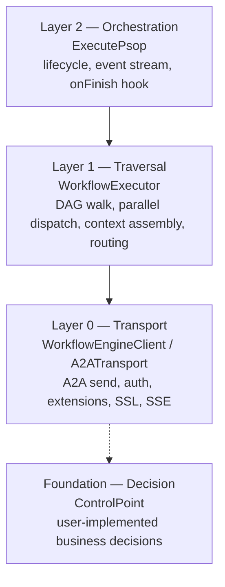
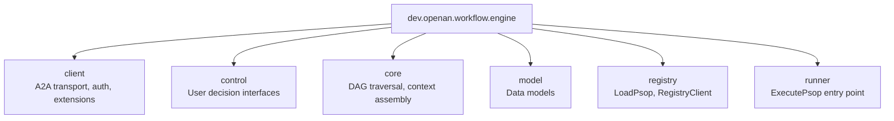

# A2A-T Workflow Execution Engine (Java)

[](LICENSE)
[](https://adoptium.net/)
[](https://maven.apache.org/)

A standalone SDK for executing multi-agent workflows over the [A2A protocol](https://a2aproject.github.io/a2a-java/) with [A2A-T](https://projects.tmforum.org/a2aproject/telecommunication/extensions/) telecom extensions.

The engine handles all protocol mechanics: A2A message transport, SSE streaming, Task-T prompt generation, Negotiation-T auto-loop, authentication, and TLS. You implement only business decisions.

## Features

- **A2A-T Extension Support**: Task-T (structured task prompts), Negotiation-T (auto negotiation loop), Authorization-T (pre-positioned whitelist), Notification-T (long-lived SSE subscription)
- **DAG Workflow Execution**: Parallel dispatch, self-loop steps, conditional routing
- **Multi-Protocol Transport**: REST, JSON-RPC, and gRPC auto-selected from AgentCard
- **Authentication**: Bearer token login with TTL cache, AES-256-GCM encrypted credentials, custom `AuthProvider`
- **HTTPS/TLS**: Configurable trust store, self-signed cert support for development
- **Protocol Logging**: Full request/response header and body dumps for debugging

## Quick Start

### 1. Add Maven dependency

```xml
<dependency>
    <groupId>dev.openan.workflow.sdk</groupId>
    <artifactId>workflow-engine</artifactId>
    <version>1.0.0</version>
</dependency>
```

For Spring Boot server-side integration:

```xml
<dependency>
    <groupId>dev.openan.workflow.sdk</groupId>
    <artifactId>spring-boot-starter</artifactId>
    <version>1.0.0</version>
</dependency>
```

### 2. Execute a workflow

```java
import java.util.concurrent.*;

// 1. Load workflow (PSOP) from orchestration center
Workflow workflow = LoadPsop.load(
        "https://127.0.0.1:5001", "psop-id", null, false);

// 2. Load agent cards
RegistryClient registry = new RegistryClient("https://127.0.0.1:5000", false);
List<AgentCard> agentCards = registry.fetchAgentCards();

// 3. Create transport + engine client
A2ATransport transport = new A2ATransport(agentCards, null,
        WorkflowEngineClientConfig.builder()
                .sslVerify(false)
                .a2atEnvPath(".env")
                .credentialsConfigPath("credentials.json")
                .build());
WorkflowEngineClient client = new DefaultWorkflowEngineClient(transport);

// 4. Implement ControlPoint (business decisions only)
ControlPoint controlPoint = new DefaultControlPoint() {
    @Override
    public CompletableFuture<TaskResponse> onTask(
            TaskRequest request, WorkflowEngineClient engineClient) {
        return engineClient
                .sendMessage(request.getAgentName(), request.getMessage())
                .thenApply(r -> TaskResponse.builder()
                        .success(true)
                        .output(r.getText())
                        .build());
    }
};

// 5. Execute
ExecutionResult result = ExecutePsop.builder()
        .psop(workflow)
        .agentCards(agentCards)
        .controlPoint(controlPoint)
        .engineClient(client)
        .runtimeIntent("Diagnose fault")
        .lang("zh")
        .execute()
        .get(10, TimeUnit.MINUTES);

System.out.println("Success: " + result.isSuccess());
```


## Architecture



| Layer | Entry Point | Responsibility |
|-------|-------------|----------------|
| High | `ExecutePsop.Builder` | Event stream, lifecycle, `onFinish` persistence |
| Mid | `WorkflowExecutor` | DAG traversal, context assembly, ControlPoint dispatch |
| Low | `WorkflowEngineClient` / `A2ATransport` | A2A send, auth, extensions, SSL, SSE normalization |
| Foundation | `ControlPoint` | User-implemented business decisions (onTask, onSelfTask, onRoute, onNegotiation) |

## Package Structure



| Package | Key Classes | Description |
|---------|-------------|-------------|
| `client` | `WorkflowEngineClient`, `DefaultWorkflowEngineClient`, `ExtensionSender`, `A2ATransport`, `AuthProvider`, `AgentAuthManager`, `WorkflowEngineClientConfig`, `CredentialCrypto`, `AgentCardJacksonModule` | A2A transport, auth, extensions (package-private internals) |
| `control` | `ControlPoint`, `DefaultControlPoint`, `EventCallback`, `EventType`, `NegotiationStrategy` | User-facing decision interfaces |
| `core` | `WorkflowExecutor`, `ContextBuilder` | DAG traversal, context assembly |
| `model` | `Workflow`, `WorkflowStep`, `Task`, `TaskRequest`, `TaskResponse`, `StepType`, `JumpCondition`, `RouteDecision`, `ExecutionResult`, `SendMessageResult`, `TaskStatus`, `WorkflowSearchResult` | Data models |
| `registry` | `LoadPsop`, `RegistryClient` | PSOP loading and AgentCard registry |
| `runner` | `ExecutePsop` | Entry point for workflow execution |

> **Note:** `LlmHelper` lives in the **samples** module (`dev.openan.workflow.engine.examples`), not in the `client` package. The workflow engine itself does not call an LLM directly.

## Documentation

### English

- [Integration Guide](docs/en/INTEGRATION_GUIDE.md) - Setup, configuration, secondary development
- [API Reference](docs/en/API_REFERENCE.md) - Public interface and class documentation
- [Design Document](docs/en/DESIGN.md) - Architecture, module structure, design decisions
- [Developer Guide](docs/en/DEVELOPER_GUIDE.md) - Internal architecture, contribution, debugging
- [Notification-T Design Analysis](docs/en/notification-t-design-analysis.md) - Long-lived SSE design

### 中文

- [集成指南](docs/zh/INTEGRATION_GUIDE.md) - 安装、配置、二次开发
- [API 参考](docs/zh/API_REFERENCE.md) - 公共接口和类文档
- [架构设计](docs/zh/DESIGN.md) - 架构、模块结构、设计决策
- [开发者指南](docs/zh/DEVELOPER_GUIDE.md) - 内部架构、贡献、调试
- [Notification-T 设计分析](docs/zh/notification-t-design-analysis.md) - 长连接 SSE 设计选型
- [业务流](docs/zh/业务流.md) - SPN 跨城诊断业务流程
- [调用过程](docs/zh/调用过程.md) - 端到端报文交互示例
- [工作台集成指南](docs/zh/工作台集成指南.md) - 工作台 Spring Boot 集成完整指南

## Modules

| Module | Description |
|--------|-------------|
| `workflow-engine` | Core SDK: workflow execution, A2A transport, extensions, auth |
| `spring-boot-starter` | Spring Boot auto-configuration for A2A server side |
| `samples` | Demo applications (embedded + Spring Boot variants) |

## License

[Apache License 2.0](LICENSE)
