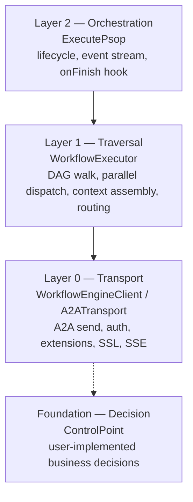
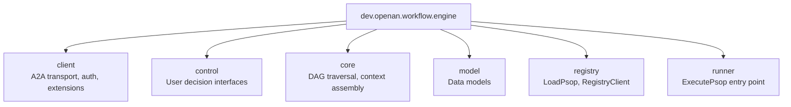

# A2A-T Workflow Execution Engine (Java)

[](LICENSE)
[](https://adoptium.net/)
[](https://maven.apache.org/)

A standalone SDK for executing multi-agent workflows over the [A2A protocol](https://a2aproject.github.io/a2a-java/)
with [A2A-T](https://projects.tmforum.org/a2aproject/telecommunication/extensions/) telecom extensions.

The engine handles workflow scheduling, A2A envelopes, transport, task waiting, authentication and TLS. Host callbacks
return final content and own A2A-T generation, schemas, semantic validation and LLM calls.

## Features

- **A2A-T Extension Support**: Task-T (structured task prompts), Negotiation-T (stateless auto negotiation loop),
  Authorization-T (independent whitelist operation), Notification-T (independent long-lived SSE subscription)
- **Content-neutral callbacks**: final MessageContent, complete ReceivedMessage, local TaskResult and explicit
  NegotiationReply.Send/Stop
- **Minimal content dependency**: only a2a-t-core in the engine; generation and template queries belong to the host's
  a2a-t-client
- **DAG Workflow Execution**: Parallel dispatch, self-loop steps, conditional routing
- **Multi-Protocol Transport**: REST, JSON-RPC, and gRPC auto-selected from AgentCard
- **Authentication**: Bearer token login with TTL cache, AES-256-GCM encrypted credentials, custom `AuthProvider`
- **HTTPS/TLS**: Configurable trust store, self-signed cert support for development
- **Protocol Logging**: actual HTTP/JSON-RPC boundaries, gRPC metadata/protobuf and dev vendor SDK observations; bodies
  enabled at DEBUG, mandatory redaction

The SPN sample treats the protocol document as an input, not as executable truth. The pinned A2A-T SDK templates, slot
schemas, canonical URIs, and validation results are authoritative. Protocol generation and validation fail closed; raw
text is never sent under an A2A-T URI as a fallback.

In `SpringSpnDemo`, WAIMO sends a Task-T complaint to the workbench. The workbench loads the PSOP, dispatches two
city-specific OMC diagnoses in parallel, joins both branches exactly once, and returns the real merged result. Outbound
OMC calls support both `direct` and Eastcom `order` modes (`order` is the production-oriented default). Task-T,
Authorization-T, and Notification-T each use an independent transport/runtime/context. Authorization and Notification
are independently triggered workbench operations rather than DAG nodes; Notification keeps an explicit long-lived
subscription until the recovery result, cancellation, or shutdown.

## Quick Start

### 1. Add Maven dependency

A2A-T SDK `1.1.0` is published to Maven Central. Maven resolves it automatically; no SDK source checkout or local SDK
build is required. The engine depends only on
`a2a-t-core`; hosts using content generation explicitly add `a2a-t-client:1.1.0`
(and `a2a-t-server:1.1.0` for receiving-side validation). See
the [A2A-T SDK dependency guide](docs/zh/A2AT-SDK-DEPENDENCY.md) for IDEA setup and upgrade checks.

```xml
<dependency>
    <groupId>dev.openan.workflow.sdk</groupId>
    <artifactId>workflow-engine</artifactId>
    <version>1.0.0</version>
</dependency>
```

For Spring Boot server-side integration:

```xml
<dependency>
    <groupId>dev.openan.workflow.sdk</groupId>
    <artifactId>spring-boot-starter</artifactId>
    <version>1.0.0</version>
</dependency>
```

### 2. Execute a workflow

```java
import java.util.concurrent.*;

// 1. Load workflow (PSOP) from orchestration center
Workflow workflow = LoadPsop.load(
        "https://127.0.0.1:5001", "psop-id", null, false);

// 2. Load agent cards
RegistryClient registry = new RegistryClient("https://127.0.0.1:5000", false);
List<AgentCard> agentCards = registry.fetchAgentCards();

// 3. Create transport + engine client
A2ATransport transport = new A2ATransport(agentCards, null,
        WorkflowEngineClientConfig.builder()
                .sslVerify(true)
                .credentialsConfigPath("credentials.json")
                .build());
WorkflowEngineClient client = new DefaultWorkflowEngineClient(transport);

// 4. Ordinary A2A content; host SDK generation is needed for Task-T.
ControlPoint controlPoint = ControlPoint.builder()
    .onTask(request -> CompletableFuture.completedFuture(MessageContent.text(request.getInstruction())))
    .build();
// Implement onSelfTask/onRoute/onNegotiation if required; see docs/en/BUSINESS_CALLBACKS.md.

// 5. Execute
ExecutionResult result = ExecutePsop.builder()
        .psop(workflow)
        .agentCards(agentCards)
        .controlPoint(controlPoint)
        .engineClient(client)
        .runtimeIntent("Diagnose fault")
        .lang("zh")
        .execute()
        .get(10, TimeUnit.MINUTES);

System.out.println("Success: " + result.isSuccess());
```

Final content callbacks, complete dependency inputs and negotiation
Send/Stop: [English](docs/en/BUSINESS_CALLBACKS.md) / [中文](docs/zh/BUSINESS_CALLBACKS.md).

## Architecture



| Layer      | Entry Point                             | Responsibility                                                                   |
|------------|-----------------------------------------|----------------------------------------------------------------------------------|
| High       | `ExecutePsop.Builder`                   | Event stream, lifecycle, `onFinish` persistence                                  |
| Mid        | `WorkflowExecutor`                      | DAG traversal, context assembly, ControlPoint dispatch                           |
| Low        | `WorkflowEngineClient` / `A2ATransport` | A2A send, auth, extensions, SSL, SSE normalization                               |
| Foundation | `ControlPoint`                          | User-implemented business decisions (onTask, onSelfTask, onRoute, onNegotiation) |

## Package Structure



| Package    | Key Classes                                                                                                                                                                                              | Description                                                 |
|------------|----------------------------------------------------------------------------------------------------------------------------------------------------------------------------------------------------------|-------------------------------------------------------------|
| `client`   | `WorkflowEngineClient`, `DefaultWorkflowEngineClient`, `ExtensionSender`, `A2ATransport`, `AuthProvider`, `AgentAuthManager`, `WorkflowEngineClientConfig`, `CredentialCrypto`, `AgentCardJacksonModule` | A2A transport, auth, extensions (package-private internals) |
| `control`  | `ControlPoint`, `DefaultControlPoint`, `EventCallback`, `EventType`, `NegotiationStrategy`                                                                                                               | User-facing decision interfaces                             |
| `core`     | `WorkflowExecutor`, `ContextBuilder`                                                                                                                                                                     | DAG traversal, context assembly                             |
| `model`    | `Workflow`, `WorkflowStep`, `Task`, `TaskRequest`, `MessageContent`, `TaskResult`, `NegotiationRequest`, `NegotiationReply`, `ExecutionResult`                                                           | Data models                                                 |
| `registry` | `LoadPsop`, `RegistryClient`                                                                                                                                                                             | PSOP loading and AgentCard registry                         |
| `runner`   | `ExecutePsop`                                                                                                                                                                                            | Entry point for workflow execution                          |

> **Note:** `LlmHelper` lives in the **samples** module (`dev.openan.workflow.engine.examples`), not in the `client`
> package. The workflow engine itself does not call an LLM directly.

## Documentation

### English

- [Integration Guide](docs/en/INTEGRATION_GUIDE.md) - Setup, configuration, secondary development
- [API Reference](docs/en/API_REFERENCE.md) - Public interface and class documentation
- [Design Document](docs/en/DESIGN.md) - Architecture, module structure, design decisions
- [Developer Guide](docs/en/DEVELOPER_GUIDE.md) - Internal architecture, contribution, debugging

### 中文

- [A2A-T SDK 依赖说明](docs/zh/A2AT-SDK-DEPENDENCY.md) - Maven Central 正式版本及 IDEA 同步说明
- [工作台集成指南](docs/zh/工作台集成指南.md) - 工作台接入执行引擎的主交付文档
- [指令平台适配指南](docs/zh/指令平台适配指南.md) - 东信 Order 转发配置、实现边界与联调验收
- [SpringSpnDemo 调用链路](docs/zh/SpringSpnDemo调用链路.md) - 直连与 Order 双模式端到端调用链
- [业务流](docs/zh/业务流.md) - SPN 跨城诊断和四类 A2A-T 协议边界
- [集成指南](docs/zh/INTEGRATION_GUIDE.md) - 通用安装、配置和二次开发
- [API 参考](docs/zh/API_REFERENCE.md) - 公共接口和类文档
- [架构设计](docs/zh/DESIGN.md) - 架构、模块结构、设计决策
- [开发者指南](docs/zh/DEVELOPER_GUIDE.md) - 内部架构、贡献、调试
- [工作台 AgentScope 结合方案](docs/zh/工作台AgentScope结合方案.md) - 可选的业务推理框架结合方案，不是 SDK 接入前置条件

工作台和东信平台团队按上述前五份中文文档顺序阅读即可完成场景接入。代码检视报告、 已完成的迁移计划和旧协议抓包已从交付目录移除，避免把历史问题或旧报文当成当前接口。

## Modules

| Module                | Description                                                   |
|-----------------------|---------------------------------------------------------------|
| `workflow-engine`     | Core SDK: workflow execution, A2A transport, extensions, auth |
| `spring-boot-starter` | Spring Boot auto-configuration for A2A server side            |
| `samples`             | Demo applications (embedded + Spring Boot variants)           |

## License

[Apache License 2.0](LICENSE)

### Inspect negotiation in the local Demo

Running the local SpringSpnDemo without VM options now negotiates missing City1 input; City2 diagnoses directly. This is
a local sample scenario, not an engine default. To use complete inputs in both cities, add this IDEA **VM option**:

```text
-Da2at.samples.negotiation=false
```

By default only City1 loses its Task-T task object. Add `-Da2at.samples.negotiation.city=city2` or `both`
to exercise City2 or both cities. The host retains city-scoped authoritative input and the complaint context is
preserved. Expect DEMO_NEGOTIATION → INPUT_REQUIRED/PROPOSE → onNegotiation → ACCEPT → both diagnoses → one aggregate.
External-OMC mode defaults to no injection and rejects an explicit true switch. The Demo passes its setting into the
current Spring application context without modifying JVM-wide properties. Protocol observations are in the console and
`logs/spn-demo.log` relative to the run directory.

Run `SpringSpnDemoE2ETest` (direct) and, on dev, `SpringSpnDemoOrderE2ETest` sequentially. Each tests the no-VM-option
single-city default, explicit disable/enable and both-city negotiation with current SDK resources and an offline LLM
provider. This is local protocol E2E evidence, not real model/platform/OMC validation.
