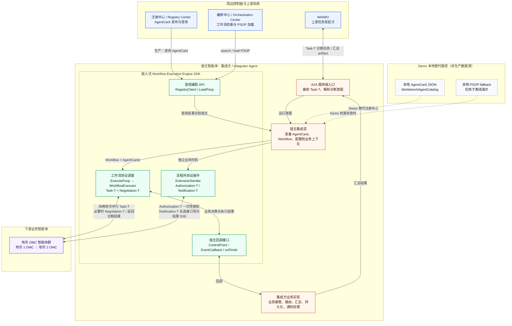
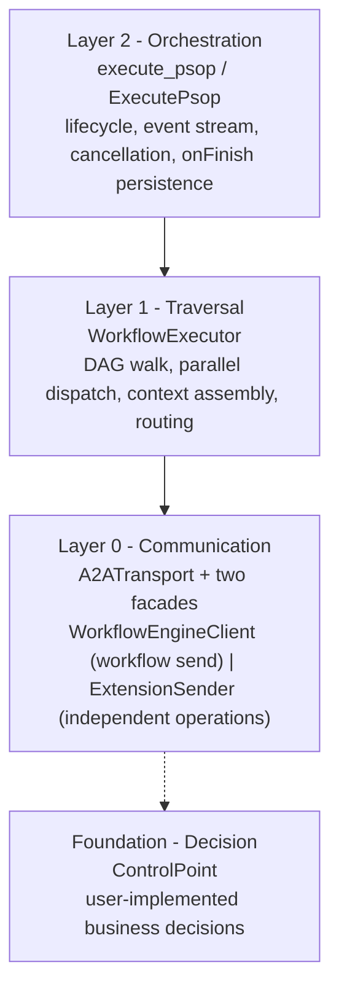
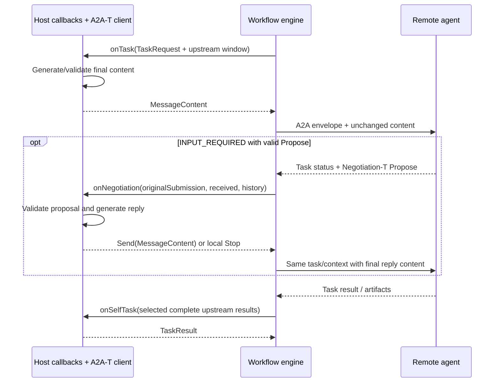
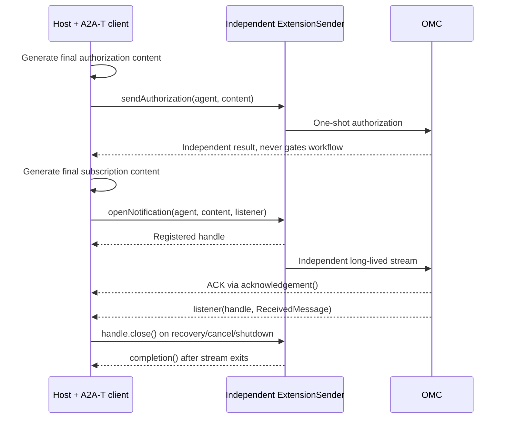

# A2A-T Engine SDK - Design

> Architecture and design rationale for the A2A-T Workflow Execution Engine.
> This document describes the system as shipped in v1.0. It is written for
> engineers integrating or extending the SDK, not as a walkthrough of any
> particular bug-fix history.

---

## 1. Overview

The SDK is an embedded workflow protocol scheduler, not a separately deployed business service. The host supplies final
content; the engine owns DAG execution, parallel scheduling, A2A envelopes, authentication, transport, waiting and
result association. Host callbacks choose whether/how to invoke A2A-T natural-language or structured content APIs.
Templates, schemas, LLMs and semantic validation belong to the host. The engine uses a2a-t-core only for canonical
negotiation context and metadata copying, not content generation.

| Engine responsibility                                           | Host responsibility                                           |
|-----------------------------------------------------------------|---------------------------------------------------------------|
| DAG, task/context association, concurrency and route validation | Final content, routing policy and local analysis              |
| Select complete upstream results with contextFrom               | Consume evidence and map downstream business input            |
| A2A authentication and transport mechanics                      | Credential source, AuthProvider and deployment                |
| Independent sends, subscription handles and lifecycle           | Authorization policy, subscription content and closure timing |

## 2. Host Integration and Surrounding Systems



The SDK in this diagram is a library embedded in the host-agent process, not a separately deployed orchestration
service. In `SpringSpnDemo`, the transport integrator is the host agent:

1. WAIMO invokes the integrator's A2A server endpoint with a Task-T diagnosis request.
2. The integrator prepares execution inputs. In production it obtains downstream AgentCards from the registry center and
   searches/loads a PSOP from the orchestration center. The SDK offers optional
   `RegistryClient` and `LoadPsop` helpers, while discovery timing, caching, and failure policy remain host
   responsibilities.
3. The integrator passes the `Workflow`, AgentCards, runtime intent, and business callbacks to
   `ExecutePsop`. The engine walks the DAG, dispatches both city tasks in parallel, and handles Negotiation-T when
   needed. `ControlPoint` returns control to the integrator for local aggregation, routing, and clarification decisions.
4. The integrator returns the aggregate as a Task-T artifact and terminal status to WAIMO.
5. Authorization-T and Notification-T are invoked by the integrator at independent business times through
   `ExtensionSender`. They are outside the PSOP DAG and do not share a transport, runtime, or context with workflow
   tasks.

For offline execution, the demo loads AgentCards from the classpath through `WorkbenchAgentCatalog`
and uses a local PSOP fallback only if orchestration-center search or load fails. These are sample substitutes, not
production discovery or disaster-recovery rules. The editable diagram source is
[`docs/diagrams/workflow-engine-surrounding-systems.mmd`](../diagrams/workflow-engine-surrounding-systems.mmd).

---

## 3. Layered Architecture

The SDK is structured in four layers. Each layer builds on the one below; each has a single responsibility and a clear
entry point.



### 3.1 Layer 0 - Communication

A2ATransport uses A2A SDK REST, JSON-RPC and gRPC bindings for authentication, delivery and complete response assembly.
WorkflowEngineClient accepts MessageContent and manages task association and negotiation continuation. ExtensionSender
provides independent sendAuthorization and openNotification operations. The implementations are reusable; task,
authorization and notification do not share transport/runtime/context instances. ProtocolResponses assembles artifact
deltas by identity and ReceivedMessage preserves metadata at each level.

### 3.2 Layer 1 - Traversal

**`WorkflowExecutor`** walks the DAG. At each step it selects typed upstream results according to `contextFrom`
(`ContextBuilder`), dispatches subtasks concurrently, applies the step's success policy, and determines the next step
(s). It delegates every *decision* to
`ControlPoint` and every *send* to `WorkflowEngineClient`.

TaskRequest separates current input from workflowInput. ContextBuilder selects complete upstream views and convenience
outputs; it never formats or generates downstream content. The host decides how to consume them.

Step dispatch rules:

- Steps whose predecessors are all satisfied are collected and dispatched in parallel (`CompletableFuture`), so steps at
  the same layer run concurrently.
- Subtasks within a step also run in parallel.
- `ALL_SUCCESS` - all subtasks must succeed.
- `ANY_SUCCESS` - the first successful subtask wins; the rest are cancelled.
- `SELF_LOOP` - the task is handled locally via `onSelfTask`, with no A2A-T message sent to the agent.

### 3.3 Layer 2 - Orchestration

**`ExecutePsop`** is the high-level runner. It wraps the executor with a lifecycle (start / complete / error / close),
event serialization, client-disconnect cancellation, and an
`onFinish` persistence hook. Most integrations use this layer.

---

## 4. Decision Interfaces

```java
interface ControlPoint {
    CompletableFuture<MessageContent> onTask(TaskRequest request);
    CompletableFuture<TaskResult> onSelfTask(TaskRequest request);
    CompletableFuture<RouteDecision> onRoute(RouteRequest request);
    CompletableFuture<NegotiationReply> onNegotiation(NegotiationRequest request);
}
```

onTask returns final parts/metadata/extensions; the engine sends them without generating or rewriting content.
onSelfTask returns local TaskResult, onRoute selects an allowed candidate, and onNegotiation returns Send or Stop.
Unimplemented callbacks fail explicitly. No echo-success, first-branch choice or automatic consent.
See [Business callback contract](BUSINESS_CALLBACKS.md) for fields and working examples.

## 5. A2A-T Extension Model

Task-T: the host generates final content; the engine envelopes and sends it. AgentCard declarations do not trigger
generation.

Negotiation-T:

Only a remote `INPUT_REQUIRED` carrying valid Negotiation-T Propose enters `onNegotiation`. Terminal responses never
restart negotiation; ordinary `INPUT_REQUIRED` fails explicitly. The host validates/interprets the proposal and
generates the final Accept/Reject/Abort with its own A2A-T client. Use `A2atMessages.contextOf(request.received())` to
obtain the received context; reply with the same id, round and maxRounds. The last allowed round can still be answered.
Do not call nextRound for an ending reply or return a new Propose.

Return `new NegotiationReply.Send(content)` to send that exact content. Return `new NegotiationReply.Stop(code, reason)`
to stop locally without a generated Abort. Repeated task/session/round events do not repeat the callback or submission.
Unchanged waiting state is observed with getTask.
`maxNegotiationExchanges` (default 3) bounds local interactions, independently of the SDK context's maxRounds. Timeout,
exhausted budget or a missing handler fails locally; no implicit Accept or synthesized Abort. Accept/Reject ACKs in
SUBMITTED/WORKING remain pending and are observed without resending the command. A business-sent Abort is never
diagnosis success, even if the remote acknowledges it with COMPLETED.

Authorization-T and Notification-T are independent of the DAG. The host generates content and uses dedicated senders;
failure does not affect the workflow. Whitelists only control optional OMC recovery. Subscriptions stay open until the
host closes them.

## 6. Condition Routing

A step's `next` list holds `JumpCondition(step, condition)` entries. The routing rule is:

- **No `next`** - terminal; the step completes the branch.
- **All conditions empty** - unconditional fan-out: dispatch every non-terminal next step in parallel.
- **Has conditions** - conditional: call `ControlPoint.onRoute`, which returns a single `RouteDecision.nextStep`. The
  engine enforces that the returned step is among the declared conditions; an invalid return fails the workflow with an
  error.

This makes conditional branches an N-choose-1 selection and keeps unconditional fan-out as automatic parallel dispatch.

---

## 7. Event Model

Events are emitted to an optional `EventCallback` as stable string types (`EventType`). They are grouped by origin:

- **Runner lifecycle** - `start`, `complete`, `close`
- **Step / task execution** - `step_start`, `step_complete`, `task_request`,
  `task_response`, `task_status_changed`, `route_decision`,
  `workflow_complete`
- **Agent traffic** - `agent_request`, `agent_response`,
  `agent_status_update`, `agent_artifact_update`, `agent_message_event`
- **In-workflow A2A-T extensions** - `negotiation_request`, `negotiation_resolved`,
  `negotiation_failed`
- **Failure** - `error`, emitted on step failure by the executor and on final failure by the runner

`authorization_request`, `authorization_resolved`, and `notification` currently remain reserved
`EventType` constants; the workflow event stream does not emit them. Independent authorization results are handled
through the `ExtensionSender` result, and subscription events through the
`NotificationSubscription` callback.

---

## 8. Interaction Sequences





## 9. Dependencies

workflow-engine uses A2A Java `1.2.0.Final` (REST/JSON-RPC/gRPC), a matching gRPC runtime,
`net.openan.a2a-t.sdk:a2a-t-core:1.1.0`, Jackson and SLF4J. Pure engine consumers do not transitively receive A2A-T
client/server, LLM, prompt or resources. samples/hosts explicitly depend on a2a-t-client, and OMC receivers additionally
use a2a-t-server. Registry/orchestration discovery is host-owned; RegistryClient/LoadPsop are optional helpers.
Templates and slot schemas come from the pinned SDK jar, not sample resource overrides.

## 10. Design Decisions Summary

Final content is separate from protocol scheduling; hosts do not maintain A2A envelopes. Local multiple outputs and
complete remote evidence enter the selected upstream window without losing metadata or flattening arrays. Business owns
negotiation reply content; the engine owns association, deduplication and bounded waiting. Stop and Abort are distinct.
Independent authorization/notification never gate the workflow; transport runtimes share the same callback contract. Protocol logs
observe actual boundaries with mandatory redaction; see [Integration guide](INTEGRATION_GUIDE.md).
