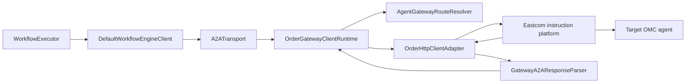

# Eastcom Instruction-Platform Integration Guide

> Applies to the `dev` branch with workflow engine `1.0.0`, A2A-T SDK `1.1.0`, A2A Java SDK
> `1.2.0.Final`, and Eastcom `order-shaded-client:1.1.18`. This guide describes the current
> implementation only; it does not cover legacy A2A-T or Order APIs.

## Fastest integration path

1. Use the Maven Central A2A-T artifacts described in the [Developer Guide](DEVELOPER_GUIDE.md), and obtain
   `order-shaded-client:1.1.18` from the vendor or the enterprise artifact repository.
2. First run Task-T, conditional Negotiation-T, one-shot Authorization-T, and the independent long-lived
   Notification-T subscription in `A2A_TRANSPORT_MODE=direct`.
3. Configure the actual platform endpoint, account, and Agent-to-NE routes; then switch to
   `A2A_TRANSPORT_MODE=order`. Do not change the business `ControlPoint`, AgentCards, or A2A-T metadata.
4. Run the local Order protocol simulator before collecting evidence against the live platform.
5. Do not depend on the `samples` jar in production. Move the `gateway` package into a vendor-specific adapter
   module while keeping the workflow engine dependency vendor-neutral.

Obtain the platform host, port, account, optional client ID/secret, NE names, tenant/base path, header-forwarding
policy, SSE heartbeat/timeout, TLS requirements, and concurrent-session limits from the Eastcom administrator.
They cannot be inferred from an AgentCard.

## Runtime path



The platform establishes and forwards the channel. The workbench, workflow engine, and OMC endpoints still own
Task-T, Negotiation-T, Authorization-T, and Notification-T semantics. Extension metadata and headers travel with the
A2A request. Workflow tasks use Task-T. When an OMC returns `INPUT_REQUIRED` with a valid Negotiation-T Propose, the
engine performs a follow-up in the same logical task. The implementation does not call deprecated state-machine APIs
such as `startNegotiation`.

## Design boundaries

- `ClientRuntimeFactory` selects `order`, `mock`, or `direct`; the Spring executor does not depend on a concrete adapter.
- `ConfiguredAgentGatewayRouteResolver` maps an Agent name to an NE and fails when no route exists.
- `OrderGatewayClientRuntime` manages forwarding sessions, not workflow state.
- `GatewayA2AResponseParser` is request-local and cannot share task or context state across concurrent calls.
- `OrderHttpClientAdapter` isolates the vendor 1.1.18 API and uses public `HttpClient`/`sendSse` operations.
- `EastcomOrder118ByteBufWorkaround` is limited to the confirmed 1.1.18 outbound request-buffer ownership defect.
- Logical adapter sessions are isolated by `contextId + NE + channel` and serialized per key. `SESSION_OPEN`,
  `SESSION_REUSE`, and `SESSION_CLOSE` describe engine resources, not vendor login/logout sessions.
- `WorkbenchExtensionLifecycle` owns independent operations. Authorization is one-shot; Notification keeps its own
  transport until the expected `recovery-result`, explicit cancellation, or workbench shutdown. Neither result gates
  the Task-T workflow.

The 1.1.18 jar exposes static `HttpClient.login(serverInfo, config)`, but the HTTP integration section of the Eastcom
v1.8 document uses `HttpClient.create(serverInfo, config)` to obtain a device token and invoke device APIs. The adapter
follows that documented HTTP path and does not introduce undocumented login/logout lifecycle assumptions.

## Configuration

Copy `.env.example` to an untracked `.env`. At minimum, configure:

```dotenv
A2A_TRANSPORT_MODE=order
A2A_EMBEDDED_OMC_ENABLED=false
A2A_AGENT_CARD_LOCATIONS=file:E:/config/city1.json,file:E:/config/city2.json
A2A_SSL_VERIFY=true

EASTCOM_ORDER_SIMULATOR_ENABLED=false
EASTCOM_ORDER_HOST=10.x.x.x
EASTCOM_ORDER_PORT=12345
EASTCOM_ORDER_USERNAME=your-platform-user
EASTCOM_ORDER_PASSWORD=your-platform-password
EASTCOM_ORDER_CLIENT_ID=your-client-id
EASTCOM_ORDER_CLIENT_SECRET=
EASTCOM_ORDER_DEFAULT_NE=
EASTCOM_ORDER_CITY1_NE=city1-omc
EASTCOM_ORDER_CITY2_NE=city2-omc
EASTCOM_ORDER_LOGIN_TIMEOUT_SECONDS=15
EASTCOM_ORDER_TIMEOUT_SECONDS=600

EASTCOM_ORDER_OMC_AUTH_ENABLED=true
EASTCOM_ORDER_OMC_CREDENTIALS_PATH=classpath:spn_agent_credentials.json
EASTCOM_ORDER_OMC_LOGIN_PATH=/rest/plat/smapp/v1/oauth/token
EASTCOM_ORDER_OMC_LOGIN_METHOD=PUT
EASTCOM_ORDER_OMC_TOKEN_RESPONSE_HEADER=accessSession
EASTCOM_ORDER_OMC_REQUEST_AUTH_HEADER=Authorization
EASTCOM_ORDER_OMC_REQUEST_AUTH_SCHEME=Bearer
EASTCOM_ORDER_OMC_TOKEN_TTL_SECONDS=3600
EASTCOM_ORDER_OMC_USERNAME_FIELD=userName
EASTCOM_ORDER_OMC_PASSWORD_FIELD=value
```

Operating-system environment variables and JVM properties take precedence over `.env`. Order mode fails at startup
when the platform host, port, user, password, client ID, or every NE route is absent. Production deployment values must
come from the platform administrator.

## Starting the demo

Direct baseline:

```powershell
$env:A2A_TRANSPORT_MODE = 'direct'
$env:EASTCOM_ORDER_SIMULATOR_ENABLED = 'false'
mvn -B -pl samples -am -DskipTests install
mvn -B -f samples/pom.xml spring-boot:run `
  "-Dspring-boot.run.main-class=dev.openan.workflow.engine.examples.demo.SpringSpnDemo" `
  "-Dspring-boot.run.arguments=--a2a.transport-mode=direct"
```

Live Eastcom platform (the default dev path):

```powershell
mvn -B -pl samples -am -DskipTests install
mvn -B -f samples/pom.xml spring-boot:run `
  "-Dspring-boot.run.main-class=dev.openan.workflow.engine.examples.demo.SpringSpnDemo" `
  "-Dspring-boot.run.arguments=--a2a.transport-mode=order --a2a.embedded-omc-enabled=false"
```

Live Order mode does not start local `JdkHttpA2AServer` instances. The AgentCards may therefore point to remote OMC
addresses without causing the workbench host to bind those addresses. Direct local and Order-simulator runs normally
use `A2A_EMBEDDED_OMC_ENABLED=true`. AgentCard names must match workflow tasks and configured Agent-to-NE routes.

For an offline protocol-level run:

```dotenv
A2A_TRANSPORT_MODE=order
EASTCOM_ORDER_SIMULATOR_ENABLED=true
EASTCOM_ORDER_HOST=127.0.0.1
EASTCOM_ORDER_PORT=26401
EASTCOM_ORDER_USERNAME=sim-user
EASTCOM_ORDER_PASSWORD=sim-password
EASTCOM_ORDER_CLIENT_ID=sim-client
EASTCOM_ORDER_CLIENT_SECRET=sim-secret
EASTCOM_ORDER_CITY1_NE=sim-city1
EASTCOM_ORDER_CITY2_NE=sim-city2
EASTCOM_ORDER_SIMULATOR_CITY1_TARGET_URL=https://127.0.0.1:26335
EASTCOM_ORDER_SIMULATOR_CITY2_TARGET_URL=https://127.0.0.1:26336
EASTCOM_ORDER_SIMULATOR_CONNECT_TIMEOUT_SECONDS=30
EASTCOM_ORDER_SIMULATOR_READ_TIMEOUT_SECONDS=30
```

To validate the adapter against a remote OMC while retaining the local platform simulator, disable embedded OMCs and
set the two simulator target URLs to the real A2A service base URLs. Simulator-managed NE credentials are independently
configurable through `EASTCOM_ORDER_SIMULATOR_CITY1_USERNAME/PASSWORD` and the City2 equivalents. They support `enc:`
ciphertext using `A2AT_CRED_KEY`.

Credential profiles may use `${ne:username}` and `${ne:password}` placeholders. An explicit profile value takes
precedence. Routing and substitution use the request's `deviceName`; an unknown NE is rejected. Conflicting duplicate
NE addresses or credentials fail at startup. Different logical NEs may intentionally share one target URL.

Startup safeguards reject a remote `EASTCOM_ORDER_HOST` when the local simulator is enabled. Embedded OMC startup also
rejects AgentCards whose effective addresses are not local. The application never silently changes the selected mode.
The simulator bypasses the live Eastcom platform and cannot prove live login, NE routing, header forwarding, rate-limit,
or long-connection behavior.

### A2A errors and task failures

Before task creation, the platform must preserve the remote non-2xx status, `application/a2a+json` body and relevant
headers. The adapter parses the standard top-level `google.rpc.Status` envelope and exposes it as
`RemoteA2AErrorException`. When the vendor callback reports status `0`, the envelope `error.code` supplies the status;
when both are present, the observed HTTP status takes precedence. A non-standard non-2xx response falls back to
`a2a.http.<status>`. It is never converted into a task event, negotiation Propose or automatic retry. See
[A2A errors and task failures](INTEGRATION_GUIDE.md#14-a2a-errors-and-task-failures).

For a non-2xx streaming response, the adapter records the response headers, collects all vendor body callbacks and
parses the complete error body once the SDK call returns. This is required because callback boundaries may split one
JSON envelope. Successful SSE responses remain incremental and continue to deliver events as frames arrive.

After task creation, HTTP 200 with `TASK_STATE_FAILED` remains an ordinary A2A task result. The adapter preserves its
status message, metadata and artifacts instead of reclassifying extension business content as a protocol error.

Failure observed by the caller and cancellation observed by the platform are separate facts. The simulator stops the
affected forward on local connection closure and records `FORWARD_CANCEL_REQUESTED` / `FORWARD_CANCELLED`, without
closing another NE call or Notification-T subscription. Confirm live platform cancellation behavior in acceptance item
L-09; `STREAM_EXIT` alone does not prove that an OMC task slot was released.

### SDK 1.1.18 request-buffer workaround

`order-shaded-client:1.1.18` allocates an outbound pooled `ByteBuf`; its bridge copies and consumes the message without
releasing the original buffer. This can produce:

```text
ResourceLeakDetector - LEAK: ByteBuf.release() was not called
Created at: WrapperHttpClient.lambda$null$9(WrapperHttpClient.java:164)
```

`EastcomOrder118ByteBufWorkaround` installs a sharable outbound handler immediately before the vendor bridge, lets the
bridge copy the request, then releases the consumed original in `finally`. It does not replace the jar, disable leak
detection, or release response buffers. If the expected bridge is absent, startup fails rather than risking a double
release. Remove this workaround after upgrading to a vendor-fixed version and rerun Order E2E and long-running tests
with Netty leak detection set to `paranoid`.

The `mock` mode retains `OrderGatewayClientRuntime` but replaces the unavailable vendor connection with
`MockOrderHttpSessionClient`. It verifies routing, request construction, streaming parsing, terminal-state recognition,
timeouts, and logical cleanup, but it does not exercise the live RSocket stack.

## Order SDK call semantics

### HttpClient usage

The production adapter uses the public v1.8 HTTP API:

1. `HttpClient.create(serverInfo, config)` creates a client. `ServerInfo` carries platform credentials and
   `HttpRequestConfig.builder().deviceName(ne).build()` selects the NE.
2. `responseTimeout(Duration)` sets the request budget.
3. `post().uri(path).header(name, value).body(body).send()` performs a blocking request and returns status, headers,
   and response content.
4. `sendSse(SseListener)` exposes response status/headers and text chunks. The adapter incrementally assembles SSE
   frames across arbitrary callback boundaries.
5. Target HTTPS is an OMC routing attribute handled by the platform; it is not TLS for the client-to-platform RSocket
   connection.

For each send, the runtime resolves AgentCard name to NE and URI/tenant, serializes `MessageSendParams` as A2A protobuf
JSON, preserves `ClientCallContext` headers, and selects `/message:send` or `/message:stream` from AgentCard streaming
capability. Streaming events are delivered as they arrive. A terminal A2A state completes the logical parse, while the
vendor `sendSse` call waits for natural platform stream completion. Timeout values are configured in seconds and passed
to the vendor SDK in milliseconds.

Standard task management uses the same route and authentication: `GET /tasks` forwards filters and pagination tokens,
while `POST /tasks/{id}:cancel` cancels a selected task. These calls use independent short-lived Order sessions, so demo
preflight cleanup cannot reuse or close workflow and Notification-T channels. The live platform must preserve query
parameters and forward both methods; validate this before relying on cleanup to prevent active-task capacity errors.

Task-T and Negotiation-T follow-ups are separate self-contained HTTP calls with the same logical A2A conversation.
`OrderHttpClientAdapter.close()` is a logical no-op because the public HTTP API exposes no instance logout.

### OMC bearer authentication

Order mode has two independent credential layers:

1. `EASTCOM_ORDER_USERNAME/PASSWORD/CLIENT_ID/CLIENT_SECRET` authenticate the workbench client to the instruction platform.
2. The OMC login profile supplies the OMC login path, method, user/password fields, request body, token path, and TTL.
   `EastcomTokenService` forwards this login through the same NE-specific Eastcom `HttpClient` route.

Token extraction checks profile `order_token_header` first, then the JSON body `token_field`; both default to
`accessSession`. `EastcomAuthProvider.applyAuth` caches/refetches the token by Agent and writes
`Authorization: Bearer <token>` (or configured equivalents) before each A2A-T send. The log records token source and
refresh lifecycle, never the plaintext authorization value; protocol logs forcibly redact authentication headers.

If the host registers an `AuthProvider` bean named `workflowOmcAuthProvider`, `ClientRuntimeFactory` uses it and neither
creates `EastcomTokenService` nor reads `EASTCOM_ORDER_OMC_CREDENTIALS_PATH`. Otherwise the demo creates its built-in
provider. Order mode passes no built-in engine credentials file; direct mode uses built-in credentials with no custom
provider, preventing duplicate `Authorization` sources. Registering the host bean while disabling
`EASTCOM_ORDER_OMC_AUTH_ENABLED` is a startup configuration error.

```java
@Bean("workflowOmcAuthProvider")
AuthProvider workflowOmcAuthProvider(TokenService tokenService) {
    return (agentName, agentCard, headers) -> {
        String token = tokenService.getOrRefresh(agentName);
        headers.put("Authorization", "Bearer " + token);
    };
}
```

### Negotiation-T conversation reuse

`INPUT_REQUIRED` terminates the current SSE request. The follow-up is a new `/message:stream` request with the same
`contextId` and returned `taskId`, so it remains the same logical A2A task without reusing the physical SSE connection.
`ConversationScopedA2AJavaClientRuntime` separates per-request completion from conversation cleanup. The Order runtime
serializes operations under `contextId + NE + channel`; the workflow client closes the logical conversation after final
completion or failure.

Notification-T uses a separate notification channel and transport. Authorization-T is also independent but one-shot.
Expected negotiation logs are `SESSION_OPEN`, `SESSION_REUSE`, and finally
`SESSION_CLOSE reason=conversation_complete`. They do not indicate vendor login counts. A missing `contextId` degrades
to a one-request resource because safe round association is impossible.

## Live-platform acceptance matrix

| ID   | Confirm with Eastcom / OMC                                       | Current client behavior                                                    | Acceptance criterion                                                                              |
|------|------------------------------------------------------------------|----------------------------------------------------------------------------|---------------------------------------------------------------------------------------------------|
| L-01 | SSE chunks are forwarded immediately                             | Incremental SSE framing across arbitrary chunks                            | WORKING/artifacts arrive before COMPLETED with acceptable delay                                   |
| L-02 | First/subsequent item status, headers, cookies                   | Requires 2xx when status is present; later status `0` is tolerated         | Real frames cannot be misclassified                                                               |
| L-03 | Stream closes promptly after terminal state                      | Preserves terminal event and waits for natural Flux completion             | Stream closes within the agreed interval                                                          |
| L-04 | Idle limit and heartbeat syntax                                  | Ignores empty heartbeats as business events                                | Subscription survives the agreed idle interval                                                    |
| L-05 | Blocking `/message:send` response forms                          | Parses A2A Message or Task and rejects standard A2A errors                 | Message, Task, and failure cases are covered                                                      |
| L-06 | Base path and tenant override rules                              | Request tenant overrides AgentInterface tenant                             | Default, override, and empty tenant route correctly                                               |
| L-07 | A2A/auth header forwarding                                       | Sends content, accept, version, extension, and call-context headers        | OMC receives required headers without platform replacement                                        |
| L-08 | Timeout origin and cancellation signal                           | Converts seconds to vendor timeout; propagates failure                     | Timing matches configuration and no call is left behind                                           |
| L-09 | Caller interruption/close propagation                            | Cancels the affected logical conversation                                  | Platform and OMC stop the affected call only                                                      |
| L-10 | Multi-Agent/NE concurrency limits                                | Isolates by `contextId + NE + channel`                                     | No NE/task/context crossover or connection growth                                                 |
| L-11 | Platform, OMC, network, half-open errors                         | Non-2xx, empty, parse, and stream errors fail the send                     | Retryability and correlation are observable without secrets                                       |
| L-12 | Frame/response size, UTF-8, SSE delimiters                       | Supports split UTF-8 and LF/CRLF frame delimiters                          | Chinese and large artifacts are not corrupted or truncated                                        |
| L-13 | TLS/mTLS requirements                                            | Target HTTPS comes from AgentInterface; vendor SDK owns platform transport | Certificate validation and rotation are agreed                                                    |
| L-14 | Idle/restart reconnect behavior                                  | Creates/sends only through public `HttpClient`                             | Next request succeeds after idle, sleep, or platform restart                                      |
| L-15 | Negotiation follow-up routing                                    | Uses same context/task in a new self-contained call                        | Follow-up reaches the same A2A task exactly once                                                  |
| L-16 | HttpClient reuse and connection-pool lifecycle                   | Serializes per key; installs 1.1.18 buffer workaround                      | Vendor confirms ownership; long-run resources stay bounded                                        |
| L-17 | Notification reconnect/idempotency                               | Does not auto-resubscribe under unknown semantics                          | Vendor defines subscription ID, deduplication, and backoff                                        |
| L-18 | `GET /tasks` pagination and `POST /tasks/{id}:cancel` forwarding | Uses short-lived authenticated sessions and preserves query/path encoding  | All visible active tasks are listed and canceled without affecting workflow or notification lanes |

### Evidence requirements

For each live case, record Agent, NE, streaming flag, tenant, request ID, task ID, context ID, event timestamps at OMC,
platform, `STREAM_FRAME`, and event sink, plus frame sequence/status/header names/body size. Redact sensitive values.
Record connection cleanup on all three sides and identify ownership for every failure.

Cover streaming success, input/auth required, failed/canceled/disconnected, blocking Message/Task/A2A error, idle and active
timeouts, caller cancellation, two Agents on different NEs, and tenant override. A final result alone is insufficient;
L-01 requires event-level timing evidence.

## Protocol logs

Set logger `PROTOCOL` to DEBUG. `ORDER_FORWARD_REQUEST` is the request supplied to the vendor SDK;
`ORDER_SDK_RESPONSE` is the status, multi-value headers, and text observed from its callbacks. `sdk-sse-text` is a
successful SSE display assembled from strings; `sdk-json-text` is a complete non-2xx response body assembled from the
same callbacks. The original platform-to-OMC bytes are not observable and must not be described as a packet capture.
`A2A-Version` is logged only when present on the real request.

```properties
logger.protocol.name=PROTOCOL
logger.protocol.level=DEBUG
logger.protocol.additivity=true
WORKFLOW_ENGINE_PROTOCOL_INCLUDE_BODY=true
WORKFLOW_ENGINE_PROTOCOL_MAX_BODY_CHARS=100000
```

Authentication headers, cookies, tokens, and recognized password fields are always redacted. Body observation is
bounded and can be disabled. Oversized SSE frames are dropped until the next delimiter and marked `dropped-capacity`.
Logging failures never change delivery. Request IDs and local execution/task/attempt/Agent/context/channel fields are
diagnostic context, not protocol metadata.

### Negotiation and pretty display

The local SpringSpnDemo defaults to City1 missing one required Task-T parameter and City2 complete, so one path
negotiates. Disable it with `-Da2at.samples.negotiation=false`; select `city2` or `both` through
`-Da2at.samples.negotiation.city`. External OMC mode refuses injected missing data unless explicitly supported by the
demo configuration.

Negotiation activation appears in `A2A-Extensions: .../Negotiation-T/v1`, the metadata URI, and
`negotiationContext`; there is no separate Negotiation-T HTTP header. Pretty mode indents JSON and shows SSE JSON
without adding `data:` to every display line. It does not change transmitted bytes. Set
`WORKFLOW_ENGINE_PROTOCOL_PRETTY=false` for the bounded redacted raw display.

Run direct and Order simulator regression tests sequentially to avoid port conflicts:

```powershell
mvn -q -pl samples -am "-Dtest=SpringSpnDemoE2ETest" "-Dsurefire.failIfNoSpecifiedTests=false" test
mvn -q -pl samples -am "-Dtest=SpringSpnDemoOrderE2ETest" "-Dsurefire.failIfNoSpecifiedTests=false" test
```

These tests use the current templates, validators, HTTP/SSE path, and an offline model provider. They are not evidence
of live model, Eastcom platform, or OMC behavior.

## Dependency

```xml
<dependency>
    <groupId>com.eastcom.apollo</groupId>
    <artifactId>order-shaded-client</artifactId>
    <version>1.1.18</version>
</dependency>
```

When the enterprise repository does not provide it:

```bash
mvn install:install-file \
  -Dfile=order-shaded-client-1.1.18.jar \
  -DgroupId=com.eastcom.apollo \
  -DartifactId=order-shaded-client \
  -Dversion=1.1.18 \
  -Dpackaging=jar
```

## Relevant code

| File | Responsibility |
|------|----------------|
| `samples/.../gateway/ClientRuntimeFactory.java` | Select runtime and assemble Order configuration |
| `samples/.../gateway/OrderGatewayClientRuntime.java` | Eastcom forwarding runtime |
| `samples/.../gateway/OrderHttpClientAdapter.java` | Public vendor `HttpClient`/`sendSse` adapter |
| `samples/.../gateway/ConfiguredAgentGatewayRouteResolver.java` | Agent-to-NE routing |
| `samples/.../gateway/GatewayA2AResponseParser.java` | Blocking and incremental SSE parsing |
| `samples/.../gateway/EastcomOrderSimulatorServer.java` | Local 1.1.18 RSocket-RPC protocol simulator |
| `workflow-engine/.../client/A2ATransport.java` | Shared transport and subscription lifecycle |
| `workflow-engine/.../core/WorkflowExecutor.java` | DAG traversal and workflow validation |

## Business callback boundary

Order changes transport only. It does not change `onTask`, `onSelfTask`, `onRoute`, or `onNegotiation`. The host returns
final `MessageContent`; the engine sends it. Negotiation returns `Send(content)` or local `Stop` while the engine owns
task/context/round association. Complete `ReceivedMessage` metadata and ordered multi-value content are retained. Vendor
types remain confined to the dev adapter and never enter the public engine model/control API. See
[Business Callback Contract](BUSINESS_CALLBACKS.md).
