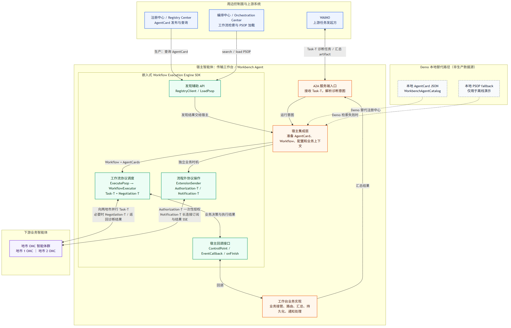
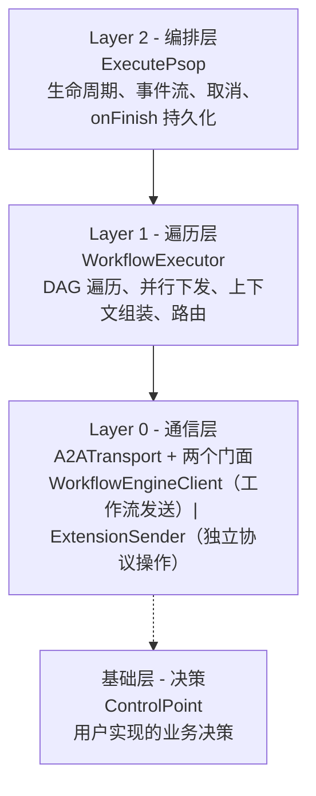
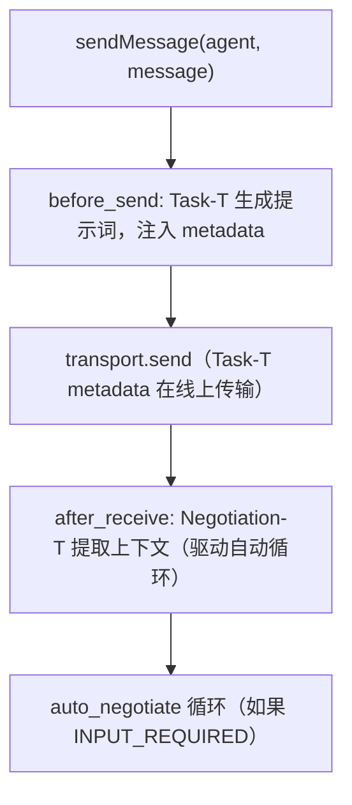
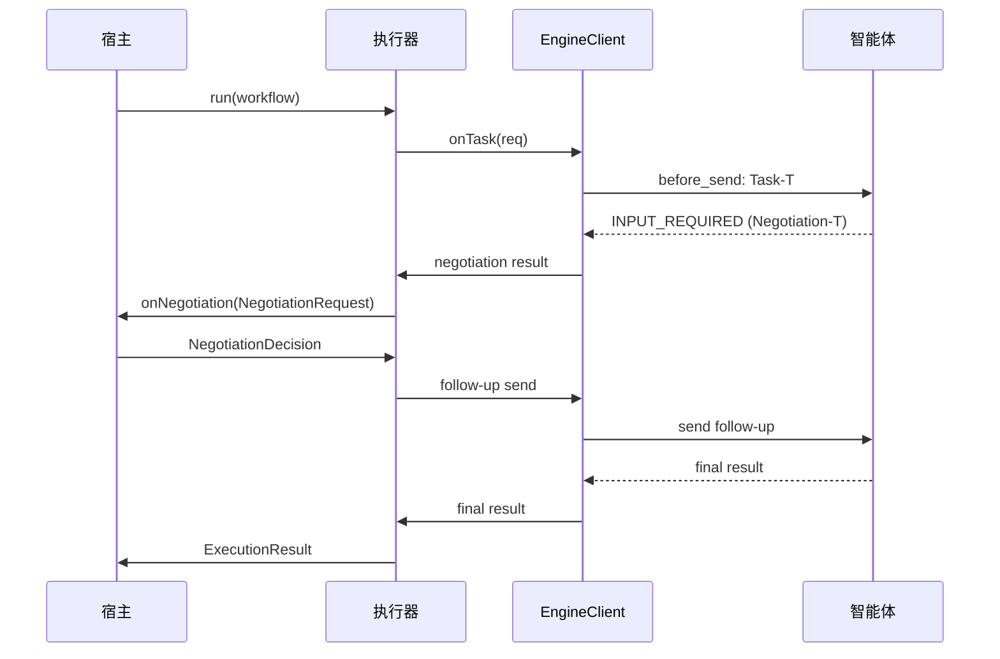
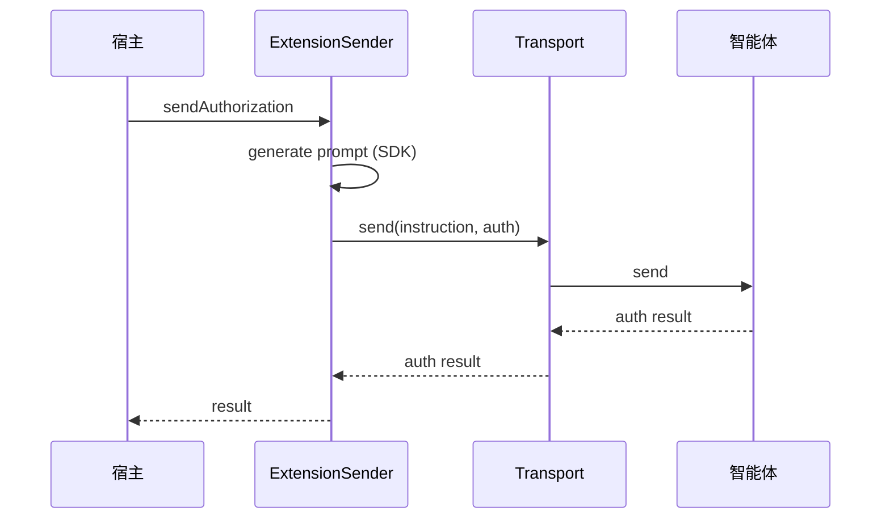
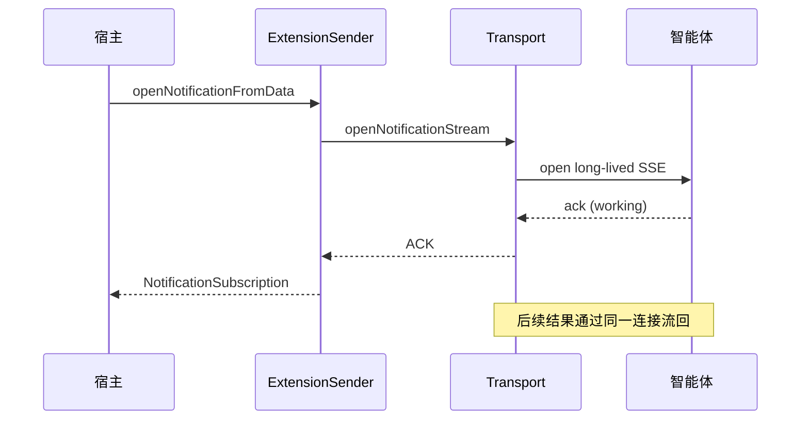

# A2A-T 工作流执行引擎 - 架构设计

> A2A-T 工作流执行引擎的架构设计与设计原理。
> 本文档描述 v1.0 发布版本。面向集成或扩展 SDK 的工程师

---

## 1. 概述

A2A-T 工作流执行引擎让宿主智能体通过 A2A 协议和 A2A-T 电信扩展执行多步骤工作流。
工作流是一个有向无环图（DAG），每个步骤向远程智能体下发一个或多个任务，并路由到下一步。
SDK 负责协议机制（消息发送、流式传输、认证、Task-T 提示词生成、Negotiation-T 自动协商循环），
暴露少量决策接口由宿主实现业务逻辑。

核心设计原则：**SDK 负责协议机制，宿主负责业务决策**。

| SDK 负责（协议机制）                                      | 宿主负责（业务决策）           |
|----------------------------------------------------------|-------------------------------|
| A2A 消息发送、流式传输、SSE 规范化                        | 是否发送任务、何时发送         |
| 智能体认证（Bearer、自定义 Header）                       | 凭证配置                       |
| A2A-T 扩展（Task-T、Negotiation-T、Authorization-T、Notification-T） | 授权审批、通知处理             |
| DAG 遍历、上下文组装、状态管理                            | 分支路由决策                   |
| 事件发射                                                  | 事件处理                       |

---

## 2. 周边系统依赖与宿主集成

上图中的 SDK 是**嵌入宿主智能体进程的库**，不是独立部署的编排服务。当前
`SpringSpnDemo` 的宿主是传输工作台智能体，实际责任链如下：

1. WAIMO 通过 A2A Task-T 调用工作台的服务端入口。
2. 工作台准备执行输入：生产环境从注册中心获取下游 AgentCard，并根据任务意图从编排中心
   搜索、加载 PSOP；SDK 提供可选的 `RegistryClient` 和 `LoadPsop` 辅助 API，但何时发现、如何缓存、
   失败策略均由宿主决定。
3. 工作台把 `Workflow`、AgentCard、运行意图和业务回调交给 `ExecutePsop`。执行引擎遍历 DAG，
   并行向两个地市 OMC 下发任务，并在必要时处理 Negotiation-T；工作台通过 `ControlPoint` 接管
   本地汇总、路由和澄清等业务操作。
4. 工作台把汇总结果作为 Task-T artifact 和完成状态返回 WAIMO。
5. Authorization-T 与 Notification-T 由工作台在各自业务时机通过 `ExtensionSender` 单独触发，
   不属于 PSOP DAG，也不与工作流任务复用 transport/runtime/context。

Demo 为保证离线可运行，`WorkbenchAgentCatalog` 从 classpath 加载 AgentCard；仅在编排中心搜索或
加载失败时使用本地 PSOP fallback。这两项是样例替代路径，不代表生产环境的数据来源或容灾策略。
图的可编辑源文件见
[`docs/diagrams/workflow-engine-surrounding-systems.mmd`](../diagrams/workflow-engine-surrounding-systems.mmd)。

---

## 3. 分层架构

SDK 分为四层，每层构建在下一层之上，单一职责，入口清晰。

### 3.1 Layer 0 - 通信层

**`A2ATransport`** 是共享通信层，只负责一件事：把字节发到远程智能体再收回来。
它拥有 A2A SDK 客户端运行时、认证管理器和拦截器、智能体卡片映射、流式响应消费者。
暴露两个发送原语：`send`（收集并返回）和 `sendNotificationStream`（长连接 SSE），
以及将原始 SDK 事件流转换为文本、任务状态和元数据的静态提取器。

**两个门面构建在 transport 之上，各司其职：**

- **`WorkflowEngineClient`** — 工作流执行发送路径。拥有 Task-T 提示词生成（发送前）、
  Negotiation-T 自动循环（接收后）、全局 `EventCallback`、`ControlPoint` 装配。
  这是执行器在工作流执行期间调用的门面。
- **`ExtensionSender`** — 独立协议操作门面。在工作台选定的业务时机发送一次性 Authorization-T 请求或建立长连接 Notification-T 订阅。
  绕过 Task-T 生成和协商循环，不通过全局回调发射事件 — 返回的结果就是回调。

#### 为什么复用 transport 实现 + 两个门面？

工作流发送路径和独立扩展路径都需要相同的通信层机制：HTTP 客户端、TLS 配置、
认证拦截器、智能体卡片解析、SSE 解析。把这些机制放在任一门面上要么 (a) 强制只想做独立协议操作的
调用方持有完整工作流门面，要么 (b) 在两个类中重复通信代码。复用 `A2ATransport` 实现 + 两个门面的设计
避免了这两个问题。类实现可复用，实例不复用：Task-T、Authorization-T、Notification-T
必须各自创建 transport/runtime/context。Task-T 使用任务级实例，Authorization-T 一次请求后释放，
Notification-T 使用工作台级长连接实例。

### 3.2 Layer 1 - 遍历层

**`WorkflowExecutor`** 遍历 DAG。在每个步骤组装上游上下文（`ContextBuilder`），
并发下发子任务，应用步骤成功策略，确定下一步。所有决策委托给 `ControlPoint`，
所有发送委托给 `WorkflowEngineClient`。

步骤下发规则：
- 前驱步骤全部完成的步骤被收集并并行下发
- 同一层的步骤并发执行
- `ALL_SUCCESS` — 所有子任务必须成功
- `ANY_SUCCESS` — 第一个成功的子任务胜出，其余取消
- `SELF_LOOP` — 任务由 `onSelfTask` 本地处理，不发送 A2A-T 消息

### 3.3 Layer 2 - 编排层

**`ExecutePsop`** 是高层运行器。包装执行器，提供生命周期管理（启动/完成/错误/关闭）、
事件序列化、客户端断连取消、`onFinish` 持久化钩子。大多数集成使用这一层。

---

## 4. 决策接口

SDK 暴露两个用户实现的接口，按职责拆分。

### 4.1 ControlPoint — 流程决策

驱动工作流前进。每个方法由执行器或自动协商循环调用，做恰好一个决策：

| 方法             | 调用方       | 决策                                       |
|------------------|-------------|-------------------------------------------|
| `onTask`         | 执行器       | 提交自然语言或结构化 `TaskSubmission`       |
| `onSelfTask`     | 执行器       | 本地处理自环任务（不走 A2A-T）              |
| `onRoute`        | 执行器       | 在条件步骤选择分支                          |
| `onNegotiation`  | 客户端自动循环 | 在 INPUT_REQUIRED 时返回强类型业务决策       |

Authorization-T 和 Notification-T 是工作台独立触发的协议操作，不是工作流 DAG 节点。

---

## 5. A2A-T 扩展模型

支持四个 A2A-T 扩展，按生命周期分为两组。

### 5.1 工作流内扩展

参与每次 `sendMessage` 生命周期，通过扩展处理器链（`ExtensionRegistry` 自动注册）：

- **Task-T** — 发送时，调用 A2A-T SDK 从结构化数据、已知模板的自然语言或待识别场景的
  自然语言生成规范任务提示词并注入消息 metadata。协商后续和调用方预设提示词时跳过。
  接收方再用同一模板的 SDK validate-and-fill 校验和提取业务字段。
- **Negotiation-T** — 接收时，当智能体返回 `INPUT_REQUIRED` 并声明该扩展，
  提取协商上下文和消息。这驱动自动循环：引擎调用 `ControlPoint.onNegotiation` 获取
  `NegotiationDecision`，按 action 与 input 类型选择 SDK fromText/fromData API，重发后续消息。

### 5.2 独立生命周期扩展

在工作台选定的业务时机通过 `ExtensionSender` 触发，并与单次工作流 transport 解耦：

- **Authorization-T** — 通过 SDK schema-aware 管线渲染和校验新增/修改/删除/查询请求。有效白名单是 OMC 自动抢通的前置条件。
- **Notification-T** — 通过 SDK schema-aware 管线建立结果订阅，返回 `NotificationSubscription`。ACK 与流结束分离；收到抢通结果、取消或服务关闭时显式关闭。

订阅 ACK 从 `NotificationSubscription.acknowledgement()` 获取，后续抢通事件通过订阅回调返回。
它们不进入工作流的 `ControlPoint` 或全局任务事件流。

### 5.3 扩展处理器链

`ExtensionRegistry.getHandlersForExtensions` 对内置 Task-T/Negotiation-T 要求 AgentCard 中的规范 URI
精确匹配，返回去重的处理器链。Authorization-T / Notification-T 不注册到工作流处理器链，
只由 `ExtensionSender` 及独立生命周期处理。

---

## 6. 条件路由

步骤的 `next` 列表持有 `JumpCondition(step, condition)` 条目。路由规则：

- **无 `next`** — 终端步骤，完成该分支。
- **所有条件为空** — 无条件扇出：并行下发每个非终端下一步。
- **有条件** — 条件路由：调用 `ControlPoint.onRoute`，返回单个 `RouteDecision.nextStep`。
  引擎强制要求返回的步骤在声明的条件中；无效返回值会使工作流失败并报告错误。

这使得条件分支是 N 选 1 选择，无条件扇出是自动并行下发。

---

## 7. 事件模型

事件通过可选的 `EventCallback` 以稳定字符串类型（`EventType`）发射，按来源分组：

- **运行器生命周期** — `start`、`complete`、`close`
- **步骤/任务执行** — `step_start`、`step_complete`、`task_request`、`task_response`、
  `task_status_changed`、`route_decision`、`workflow_complete`
- **智能体流量** — `agent_request`、`agent_response`、`agent_status_update`、
  `agent_artifact_update`、`agent_message_event`
- **工作流内 A2A-T 扩展** — `negotiation_request`、`negotiation_resolved`、`negotiation_failed`
- **失败** — `error`，由执行器在步骤失败时和运行器在最终失败时发射

`authorization_request`、`authorization_resolved` 和 `notification` 目前只是 `EventType` 中的保留常量，
工作流事件流不会发射它们。独立授权结果由 `ExtensionSender` 的返回值处理，订阅事件由
`NotificationSubscription` 回调处理。

---

## 8. 交互序列

### 8.1 带协商的工作流执行

### 8.2 独立下发授权

### 8.3 Notification 订阅

---

## 9. 依赖

**本 SDK：** `org.a2aproject.sdk:a2a-java-sdk-client`（A2A 协议）、
`net.openan.a2at.sdk:a2a-t-client`（A2A-T 扩展）、Jackson、SLF4J、Lombok。

SDK 不要求编排中心或注册中心客户端成为底层协议发送的硬依赖；宿主也可以直接传入本地构造的
`Workflow` 和 AgentCard。但在标准生产集成中，宿主通常通过 SDK 的 `LoadPsop`、`RegistryClient`
或自己的服务客户端访问编排中心和注册中心，再把发现结果交给执行引擎。

---

## 10. 设计决策总结

1. **复用 transport 实现，两个门面** — 通信层机制在 `A2ATransport` 上写一次；
   `WorkflowEngineClient` 和 `ExtensionSender` 各自拥有一个编排职责，委托通信工作，
   并可使用任务级或工作台级 transport 生命周期。
   避免强制门面耦合和通信代码重复。

2. **工作流内扩展 vs 独立生命周期扩展** — Task-T 和 Negotiation-T 是 `sendMessage` 链的一部分；
   Authorization-T 是工作台独立触发的一次性请求，Notification-T 是工作台级长连接订阅。
   注册表只自动注册工作流内的一对。

3. **自动协商循环** — 引擎拥有重发循环，宿主只提供强类型决策（`onNegotiation`），
   不需要关心重发的协议机制。

4. **条件路由语义** — 空条件意味着扇出（并行），条件分支意味着通过 `onRoute` 做 N 选 1。
   保持路由模型可预测。
