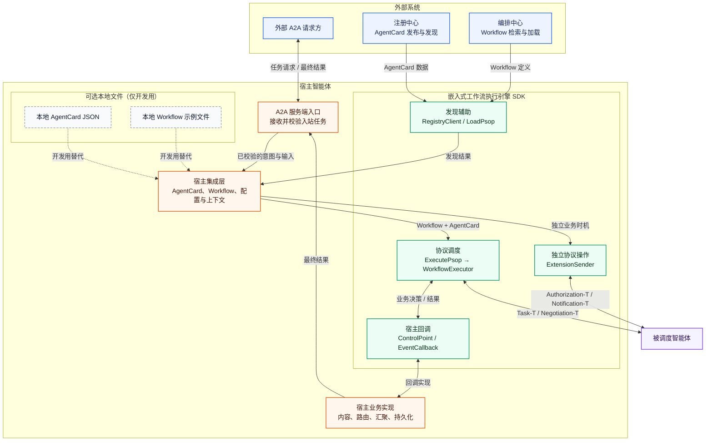
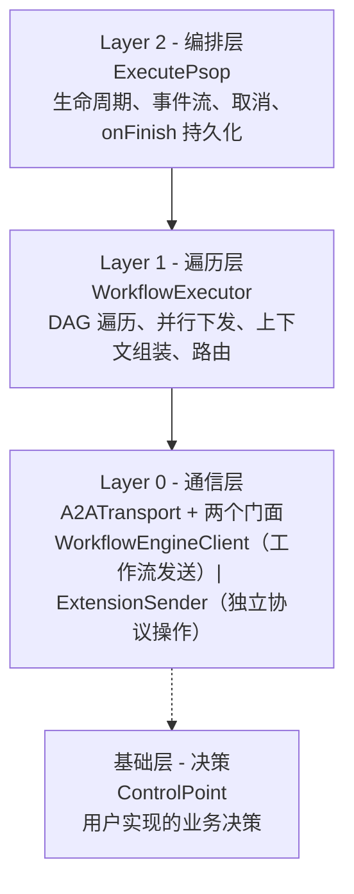
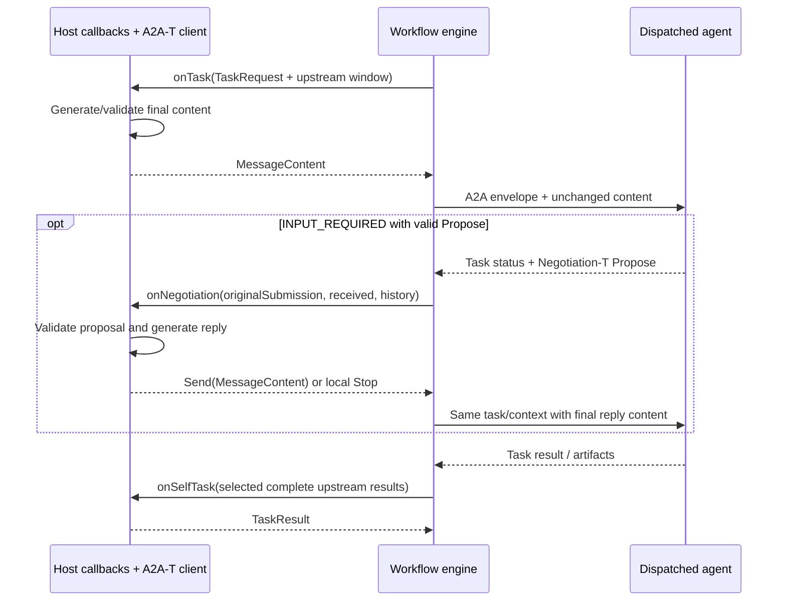
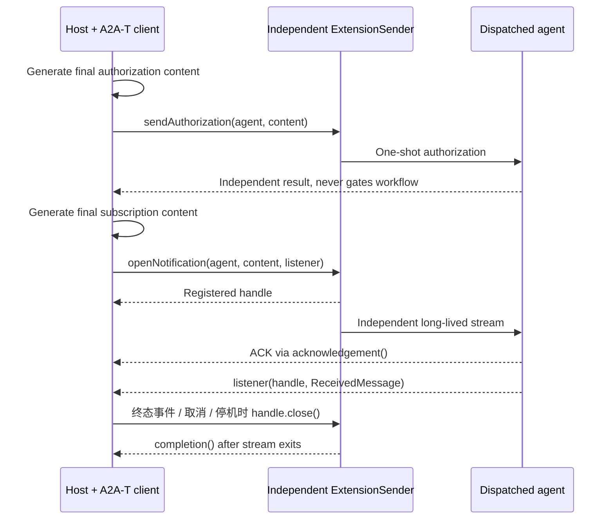

# A2A-T 工作流执行引擎 - 架构设计

> A2A-T 工作流执行引擎的架构设计与设计原理。
> 本文档描述 v1.0 发布版本。面向集成或扩展 SDK 的工程师

---

## 1. 概述

SDK 是集成在宿主智能体进程中的工作流协议调度库，不是独立业务平台。 宿主提供最终内容，引擎管理 DAG、并行调度、标准 A2A
信封、认证、传输、等待和结果关联。 业务回调决定是否调用 A2A-T 的自然语言／结构化内容接口，模板、schema、LLM 与语义校验均归宿主。
引擎只通过 a2a-t-core 读取规范协商上下文和复制扩展 metadata，不包含内容生成管线。

| 引擎职责                             | 宿主职责                               |
|--------------------------------------|----------------------------------------|
| DAG、任务／会话关联、并行与路由校验  | 内容生成、业务路由决策、本地汇总       |
| 按 contextFrom 选择完整上游结果      | 决定如何使用这些来源、映射下游输入     |
| A2A 认证与传输机制                   | 凭据来源、AuthProvider、部署配置       |
| 独立授权发送、订阅 handle 和生命周期 | 授权策略、订阅内容、通知消费和关闭时机 |

## 2. 周边系统依赖与宿主集成



上图中的 SDK 是 **嵌入宿主智能体进程的库**，不是独立部署的编排服务：

1. 宿主智能体接收并校验入站 A2A 任务，准备执行意图和业务输入。
2. 宿主智能体从注册中心获取被调度智能体的 AgentCard，并从编排中心加载 `Workflow`。
   `RegistryClient` 和 `LoadPsop` 是可选辅助 API；发现时机、缓存与失败策略仍由宿主智能体负责。
3. 宿主智能体把 `Workflow`、AgentCard、运行意图和回调交给 `ExecutePsop`。引擎遍历 DAG、并行下发就绪任务，并在需要时处理 Negotiation-T；`ControlPoint` 返回业务内容、本地结果、路由决策和协商回复。
4. 宿主智能体消费 `ExecutionResult`，返回或持久化最终业务结果。
5. Authorization-T 与 Notification-T 由宿主智能体在独立业务时机通过 `ExtensionSender` 触发，不属于 DAG，也不与工作流任务复用 transport/runtime/context。

本地 AgentCard 和 Workflow 只是开发测试资源，不代表生产发现或容灾策略。图的可编辑源文件见
[`docs/diagrams/workflow-engine-surrounding-systems.mmd`](../diagrams/workflow-engine-surrounding-systems.mmd)。

---

## 3. 分层架构

SDK 分为四层，每层构建在下一层之上，单一职责，入口清晰。



### 3.1 Layer 0 - 通信层

A2ATransport 使用 A2A SDK 的 REST、JSON-RPC、gRPC 绑定，负责认证头、实际传输和完整响应组装。 WorkflowEngineClient 接收
MessageContent 并管理远端任务和必要的协商续发。 ExtensionSender 负责流程外 sendAuthorization 与 openNotification。
三种协议操作复用实现而不共用 transport/runtime/context 实例。 ProtocolResponses 按 artifact 身份合并流式增量，ReceivedMessage
保留各层 metadata。

### 3.2 Layer 1 - 遍历层

**`WorkflowExecutor`** 遍历 DAG。在每个步骤按 `contextFrom` 选择强类型上游结果（`ContextBuilder`），
并发下发子任务，应用步骤成功策略，确定下一步。所有决策委托给 `ControlPoint`， 所有发送委托给 `WorkflowEngineClient`。

TaskRequest 当前输入与 workflowInput 分离。上游完整视图和便利 outputs 由 contextFrom 选择， 不会自动拼接、生成或套用业务
schema；业务自行决定怎么消费。详见 [回调契约](BUSINESS_CALLBACKS.md)。

- 前驱步骤全部完成的步骤被收集并并行下发
- 同一层的步骤并发执行
- `ALL_SUCCESS` — 所有子任务必须成功
- `ANY_SUCCESS` — 第一个成功的子任务胜出，其余取消
- `SELF_LOOP` — 任务由 `onSelfTask` 本地处理，不发送 A2A-T 消息

### 3.3 Layer 2 - 编排层

**`ExecutePsop`** 是高层运行器。包装执行器，提供生命周期管理（启动/完成/错误/关闭）、 事件序列化、客户端断连取消、`onFinish`
持久化钩子。大多数集成使用这一层。

---

## 4. 决策接口

```java
interface ControlPoint {
    CompletableFuture<MessageContent> onTask(TaskRequest request);
    CompletableFuture<TaskResult> onSelfTask(TaskRequest request);
    CompletableFuture<RouteDecision> onRoute(RouteRequest request);
    CompletableFuture<NegotiationReply> onNegotiation(NegotiationRequest request);
}
```

onTask 返回最终 parts/metadata/extensions，引擎封装发送，不再生成或改写内容。 onSelfTask 返回本地 TaskResult；onRoute
选择允许的候选；onNegotiation 返回 Send 或 Stop。 未实现的回调明确失败，不回显成功、不选首分支、不自动同意。
字段与完整示例见 [业务回调集成契约](BUSINESS_CALLBACKS.md)。

## 5. A2A-T 扩展模型

Task-T：宿主生成最终内容，引擎只封装并发送。AgentCard 声明扩展不触发生成。

Negotiation-T：

只有远端 `INPUT_REQUIRED` 携带有效 Negotiation-T Propose 才进入 `onNegotiation`。 终态不会重启协商，普通 INPUT_REQUIRED
明确报告不支持的交互。 宿主自行校验、理解 Propose，并用自己的 A2A-T client 生成最终 Accept/Reject/Abort。 通过
`A2atMessages.contextOf(request.received())` 取得收到的上下文； 结束回复保持相同 id、round、maxRounds，最后允许的一轮仍可回答，不自行
nextRound 或返回新 Propose。

返回 `new NegotiationReply.Send(content)` 发送最终内容； 返回 `new NegotiationReply.Stop(code, reason)` 只在本地停止，不生成
Abort。 同一任务／会话／轮次的重复等待事件不会重复回调、重复提交；未变化状态通过 getTask 观察。
`maxNegotiationExchanges` 默认 3，是独立于 SDK context.maxRounds 的本地交互资源预算。 超时、预算耗尽、回调缺失均明确失败，不默认
Accept，也不自动生成 Abort。 Accept/Reject 的 SUBMITTED/WORKING ACK 仍需等待任务结果，不重发原命令。 业务发送 Abort 后，即使远端用
COMPLETED 确认，也不能判为任务成功。

Authorization-T 和 Notification-T 是独立业务操作，不属于 DAG。宿主生成内容并使用独立发送器；失败不影响工作流。授权策略只控制自身的业务操作，订阅保持到宿主主动关闭。

## 6. 条件路由

步骤的 `next` 列表持有 `JumpCondition(step, condition)` 条目。路由规则：

- **无 `next`** — 终端步骤，完成该分支。
- **所有条件为空** — 无条件扇出：并行下发每个非终端下一步。
- **有条件** — 条件路由：调用 `ControlPoint.onRoute`，返回单个 `RouteDecision.nextStep`。
  引擎强制要求返回的步骤在声明的条件中；无效返回值会使工作流失败并报告错误。

这使得条件分支是 N 选 1 选择，无条件扇出是自动并行下发。

---

## 7. 事件模型

事件通过可选的 `EventCallback` 以稳定字符串类型（`EventType`）发射，按来源分组：

- **运行器生命周期** — `start`、`complete`、`close`
- **步骤/任务执行** — `step_start`、`step_complete`、`task_request`、`task_response`、
  `task_status_changed`、`route_decision`、`workflow_complete`
- **智能体流量** — `agent_request`、`agent_response`、`agent_status_update`、
  `agent_artifact_update`、`agent_message_event`
- **工作流内 A2A-T 扩展** — `negotiation_request`、`negotiation_resolved`、`negotiation_failed`
- **失败** — `error`，由执行器在步骤失败时和运行器在最终失败时发射

`authorization_request`、`authorization_resolved` 和 `notification` 目前只是 `EventType` 中的保留常量，
工作流事件流不会发射它们。独立授权结果由 `ExtensionSender` 的返回值处理，订阅事件由
`NotificationSubscription` 回调处理。

---

## 8. 交互序列





## 9. 依赖

workflow-engine：A2A Java `1.2.0.Final`（REST/JSON-RPC/gRPC）、匹配的 gRPC runtime、
`net.openan.a2a-t.sdk:a2a-t-core:1.1.0`、Jackson、SLF4J。 纯引擎消费者不会传递引入 A2A-T client/server、LLM、prompt 或
resources。宿主智能体显式依赖 a2a-t-client，校验接收内容的被调度智能体服务另依赖 a2a-t-server。注册中心和编排中心由宿主调用，可选择
RegistryClient/LoadPsop 辅助接口或自己的实现。 模板和 slot schema 来自锁定 SDK jar，样例不覆盖同名资源。

## 10. 设计决策总结

最终内容与协议调度分离，宿主不自行维护 A2A 信封。 本地多输出和远端完整证据统一进入下游窗口，不丢失 metadata、不拍平数组。
协商回复内容归业务，任务关联／去重／有界等待归引擎；本地 Stop 与协议 Abort 分离。 独立授权和通知不成为工作流前提，业务回调与传输实现分离。 协议日志在实际边界采集并强制脱敏，详情见 [集成指南](INTEGRATION_GUIDE.md)。
