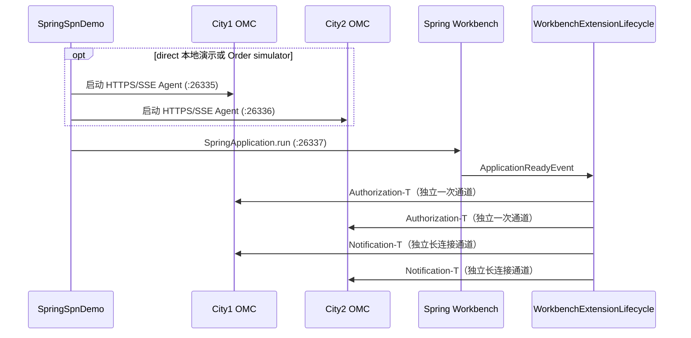
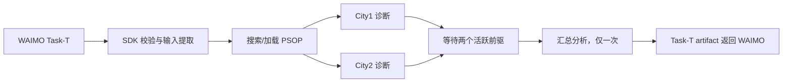

# SpringSpnDemo 当前调用链路

> 校准日期：2026-08-30。以 `dev` 当前源码、锁定的 A2A-T SDK
> `1.1.0`（commit `e42c83acce3e5ac2c245d36546ced0fa017b2b58`）和
> A2A Java SDK `1.2.0.Final` 为准。
> 直连与东信 Order 是当前必须同时支持的两条南向线路，不是新旧版本兼容模式。

## 1. 业务结果

WAIMO 通过 Task-T 向传输工作台下发投诉诊断任务。工作台使用 A2A-T SDK 校验并提取 诊断参数，搜索/加载 PSOP，向两个地市 OMC
并行下发诊断任务。两路都完成后， join 节点只执行一次汇总，工作台把真实汇总文本放入 Task-T artifact 返回 WAIMO。

Authorization-T 和 Notification-T 不是上述 DAG 的步骤。Spring 工作台生命周期在独立时机 预置白名单并建立抢通结果订阅。

## 2. 启动顺序



真实 Order 模式默认 `embeddedOmc=false`，跳过两个本地 JDK Server；目标 OMC 由东信平台 按 NE 路由。`credentials.json` 的登录
URL 与 AgentCard 的服务 URL 都不会被拿来绑定本机地址。 直连本地演示和 Order simulator 保持 `embeddedOmc=true`。

`SpringWorkbenchExtensionLifecycle` 为 Authorization-T 和 Notification-T 分别调用
`ClientRuntimeFactory.create()`，并拒绝两者复用同一 runtime 实例。Authorization transport 在操作结束后关闭（包括失败）；Notification
transport 保留到订阅完成、取消或 Spring 容器关闭。

## 3. 北向 WAIMO 请求

`SpringSpnDemo.sendTaskToWorkbench()` 创建专用北向 transport，调用 宿主 A2ATClient.generateTaskPromptFromDataWithSchema 和
A2atMessages.from，再调用 sendMessage (agent, finalContent)：

1. SDK schema-aware 管线将原始投诉数据渲染为 Task-T prompt。
2. A2A Java SDK 通过 `https://127.0.0.1:26337/a2a/json/message:stream` 发送。
3. Spring starter 的 `A2AController` 用规范 SSE event 返回每个 `StreamResponse`，并交给
   `SpringWorkbenchExecutor`；不要对 `id:/data:` 帧做二次文本封装。
4. `WorkbenchTaskInputParser` 根据 metadata 中的规范 Task-T URI 和 `templateUri` 调用 A2A-T server validate-and-fill；缺少
   SDK 配置或校验失败时显式失败。

schema-aware `fromData` 跳过场景识别，但 slot 映射仍可使用 SDK 配置的 LLM。

## 4. 工作流执行

工作台 onTask 用宿主 A2ATClient 生成最终 MessageContent，引擎只封装发送、保留完整响应。 onSelfTask 返回 TaskResult，多输出通过
WorkflowInput 按 contextFrom 提供，不拼 instruction。 onNegotiation 由宿主校验并生成最终回复，返回 Send (content) 或本地
Stop，不固定补同一端口。 字段见 [业务回调契约](BUSINESS_CALLBACKS.md)。



`WorkflowExecutor` 在调度前校验节点、边和环，只等待本次执行已激活的前驱。并行分支的 结果按稳定顺序合并，join 使用原子状态保证
exact-once。`WorkbenchControlPoint.onSelfTask`
对两个 OMC 返回做本地汇总；`WorkbenchOrchestrator.buildResultText` 优先取
`merge_analysis`/`merge` 输出，不用假的“成功”文本代替业务结果。

示例首先从编排中心搜索并加载 PSOP。若本地编排中心不可用，或其开发证书不满足 Java 主机名校验，示例会明确记录 `PSOP_FALLBACK`
并装载等价的三节点内存工作流；不会再拿到 fallback 标识后继续调用失败的远端加载接口。生产集成应配置含正确 SAN 的证书并使用远端
PSOP，不应把示例 fallback 当作编排中心的容灾实现。

## 5. 南向传输分支

`ClientRuntimeFactory` 支持：

| 模式     | runtime                                | 用途                                                |
|----------|----------------------------------------|-----------------------------------------------------|
| `direct` | `null` → `DefaultA2AJavaClientRuntime` | 工作台直接访问 OMC AgentCard URL                    |
| `order`  | `OrderGatewayClientRuntime`            | 通过东信 Order SDK/指令平台选择地市 NE 并转发到 OMC |
| `mock`   | `MockGatewayClientRuntime`             | 仅用于本地 HTTP 适配测试                            |

默认为 `order`。三种运行时仅改变线路，不改变 A2A/A2A-T metadata、任务状态、 Negotiation-T 轮次或业务回调契约。Order 模式的每个
agent/context 会话独立，两地市并行 诊断不得共享可变 NE 路由状态；Negotiation-T follow-up 复用同一对话。

`EASTCOM_ORDER_SIMULATOR_ENABLED=true` 只在 `order` 模式启动本地东信协议模拟器；
`direct` 模式不会占用模拟器端口，也不会意外经过东信 SDK。

## 6. Negotiation-T

OMC 仅在 Task-T 缺少必填参数或存在业务语义错误时发起协商。LLM/配置/网络故障会 直接失败，不伪装成参数协商。OMC 用 typed
propose 渲染 SDK prompt，工作台校验
`templateUri` 和 `negotiationContext={id,round,maxRounds,performative}`，再用 typed accept/reject/abort 回复。 引擎不使用
SDK 的废弃状态机接口，不存在原始文本 fallback。 两个 OMC 都消费 SDK 填充后的任务数据；Accept 也从正式 Negotiation-T
metadata 校验并合并填充字段， 不再把 parts 摘要或原始回复拼接给诊断。Reject／Abort 分别校验并结束任务，不执行诊断。 具体 SDK
入口、业务数据与拒绝策略见 [业务回调调用参考](BUSINESS_CALLBACKS.md#9-示例业务侧的-a2a-t-110-调用参考)。

本地 SpringSpnDemo 默认让 City1 的 Task-T 缺少任务对象以演示协商，City2 参数完整直接诊断。
`-Da2at.samples.negotiation=false` 可切回两城市完整输入；对接外部 OMC 默认不注入缺参。

## 7. Authorization-T 与 Notification-T

`ExtensionPrePositioner` 对每个 OMC：

1. 宿主生成白名单最终内容后调用 `sendAuthorization`；`ExtensionPrePositioner` 检查 ACK 为 `TASK_STATE_COMPLETED`。示例 OMC
   仅在已校验并应用策略后返回该状态；正式 OMC 若以 COMPLETED 承载业务失败，宿主还需按其回执契约判断结果，不能只依赖 A2A 状态。
2. 宿主生成订阅最终内容后调用 `openNotification` 建立长连接；ACK 必须为 `WORKING` 或 `COMPLETED`。
3. OMC 诊断给出抢通方案后，只在 SDK 已验证的白名单精确命中业务场景/处置类型/ 操作名称/有效期时自动执行。没有白名单时
   fail-closed。
4. 执行结果通过 Notification-T `recovery-result` artifact 上报。
5. `WorkbenchExtensionLifecycle` 用 `RecoveryNotification` 检查正式 metadata 中完整的已结束抢通结果，
   确认后从本地订阅表移除并关闭句柄，再通知外部 observer；仅名称或摘要不足以触发关闭。 observer 异常不影响流关闭。
6. 本地 Order 模拟器识别完整 SSE frame 中的 `recovery-result` 后结束该转发，确保关流 也传递到
   OMC；没有抢通结果的订阅继续保持到显式取消或工作台关闭。

Demo 在 Spring 就绪时尝试授权和订阅只是前置时机选择，不是工作流前置条件。每个 Agent 的 Authorization-T 与 Notification-T
分别执行、分别记录结果；任一操作失败都不会阻止另一操作， 也不会阻止后续投诉 Task-T 工作流。失败只意味着对应白名单未生效或对应通知通道未建立。

Authorization-T 模板支持新增、修改、删除、查询，但示例 OMC 没有持久化策略仓库，因而 只实现新增、按精确策略标识删除和查询；修改操作明确失败，不会伪装成功。示例新增使用
确定性的演示策略标识，删除其他标识会 fail-closed 并保留原策略。生产集成方应在业务回调 中持久化并实现按策略标识精确修改/删除，返回规范的
Authorization-T artifact metadata。

## 8. 关闭顺序

1. Spring context 关闭时，`SpringWorkbenchExtensionLifecycle` 关闭剩余订阅和 Notification transport。
2. 单次 `WorkbenchOrchestrator` 在 `finally` 中关闭 Task-T transport。
3. Demo 关闭 Spring context、两个 OMC server，以及当前模式启用的本地 gateway/simulator。

正常工作流完成不能作为 Notification-T 订阅关闭条件。

### 查看真实协商与协议日志

直接运行本地 SpringSpnDemo，默认 City1 缺参并协商、City2 参数完整直接诊断，无需添加 VM 参数。 Negotiation-T 扩展激活本身不强制协商；这是本地
Demo 专门设置的场景，不是引擎默认行为。 要关闭本地缺参演示、让两城市都直接诊断，在 IDEA **VM options** 增加：

```text
-Da2at.samples.negotiation=false
```

默认仅移除 City1 的 Task-T 任务对象；启用状态下增加 `-Da2at.samples.negotiation.city=city2` 或 `both`
可演示 City2 或两城市同时缺参。宿主仍保留各城市的正确输入，原投诉上下文不变。预期链路是 `DEMO_NEGOTIATION` →
`INPUT_REQUIRED / PROPOSE`
→ 工作台 onNegotiation → `ACCEPT` → 两城市完成 → 一次汇总。 非内嵌 OMC 模式默认不注入缺参，显式设置
`-Da2at.samples.negotiation=true` 也会被拒绝。 Demo 将开关传入当前 Spring 应用实例，不设置或修改 JVM 全局开关，不影响其他宿主。
协议日志在控制台及以运行目录为基准的 `logs/spn-demo.log`。 main 支持直连；dev 默认 order，两种模式使用同一业务回调。

离线重复验证（两个命令顺序执行，避免端口冲突）：

```powershell
mvn -q -pl samples -am "-Dtest=SpringSpnDemoE2ETest" "-Dsurefire.failIfNoSpecifiedTests=false" test
# 仅 dev：真实供应商 jar + 本地平台/OMC 模拟器
mvn -q -pl samples -am "-Dtest=SpringSpnDemoOrderE2ETest" "-Dsurefire.failIfNoSpecifiedTests=false" test
```

每个测试类覆盖无 VM 参数的默认单城市协商、显式关闭、显式开启及两城市同时缺参。测试使用离线 LLM provider，但实际运行当前 SDK
的 模板、校验和 HTTP/SSE；不是现网 OMC、平台或真实模型语义的验证。
