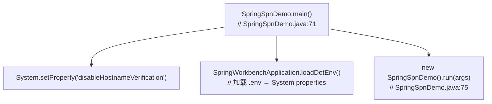
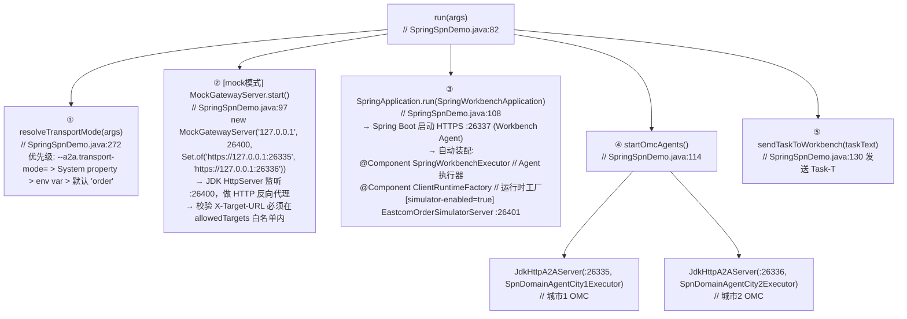
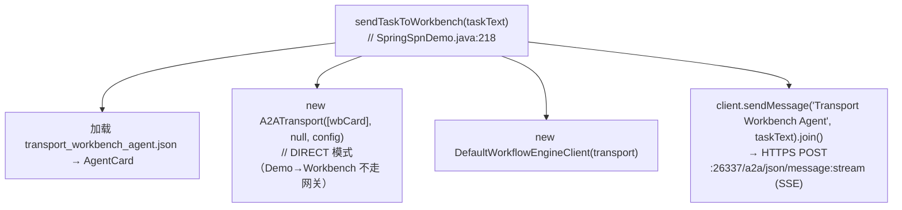
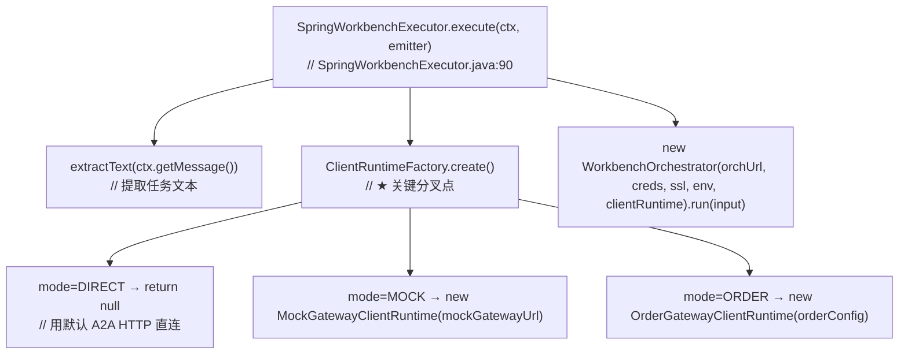
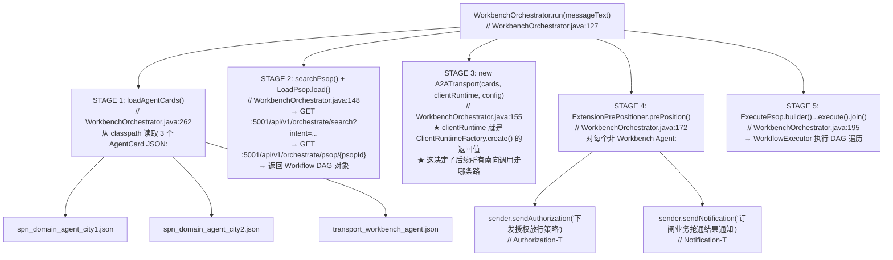
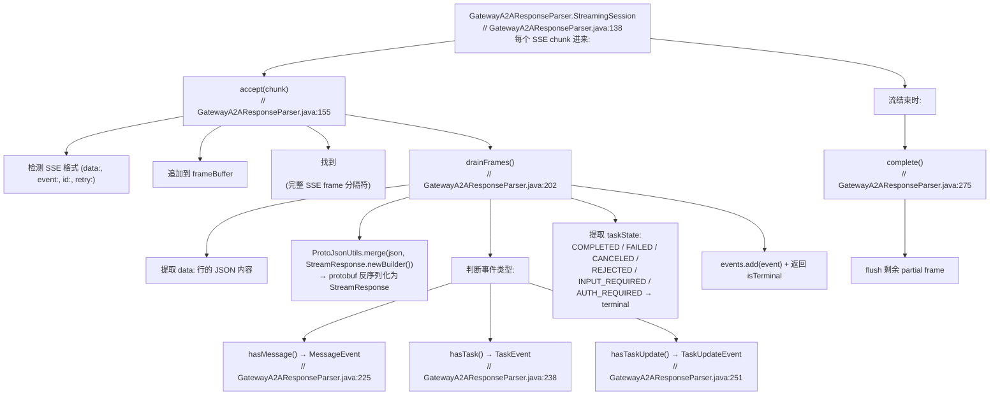
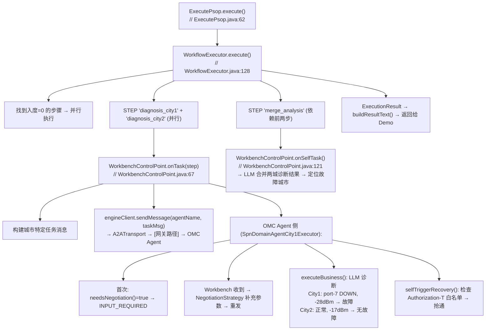

# SpringSpnDemo 完整调用链路

## 一、启动阶段

## 二、run() 四阶段启动

## 三、北向调用：Demo → Workbench Agent

## 四、Workbench Agent 接收并编排

## 五、WorkbenchOrchestrator.run() 编排流水线

## 六、南向调用：三条路径（核心分叉）

```mermaid
graph TD
    A["A2ATransport.sendMessageAsync(agentName, message, ...)<br/>// A2ATransport.java:286"]
    A --> D["如果 clientRuntime == null (DIRECT 模式)<br/>→ a2aClientRuntime = DefaultA2AJavaClientRuntime<br/>→ 直接 HTTPS POST 到 AgentCard 的 URL<br/>→ 例: https://127.0.0.1:26335/a2a/json/message:send"]
    A --> M["如果 clientRuntime == MockGatewayClientRuntime (MOCK 模式)"]
    M --> M1["OrderGatewayClientRuntime.sendMessage()<br/>// 复用生产逻辑"]
    M1 --> M2["routeResolver.resolve(agentCard)<br/>// OrderGatewayClientRuntime.java:155<br/>→ ConfiguredAgentGatewayRouteResolver<br/>→ agentName → NE名 → AgentGatewayRoute(ne, interface)"]
    M1 --> M3["MockOrderHttpSessionClient.login()<br/>// MockOrderHttpSessionClient.java:81"]
    M1 --> M4["MockOrderHttpSessionClient.init(ne)<br/>// MockOrderHttpSessionClient.java:91"]
    M1 --> M5["MockOrderHttpSessionClient.executeStreaming()<br/>// MockOrderHttpSessionClient.java:130<br/>→ HTTP POST http://127.0.0.1:26400{uriPath}<br/>Headers: X-Target-URL = targetUrl (OMC真实地址)<br/>Body: A2A SendMessageRequest JSON"]
    M5 --> M6["MockGatewayServer 收到后<br/>// MockGatewayServer.java:108"]
    M6 --> M7["校验 X-Target-URL ∈ allowedTargets"]
    M6 --> M8["开 HTTPS 连接到 targetUrl"]
    M6 --> M9["管道式转发 SSE 流 → 回传给客户端"]
    M1 --> M10["GatewayA2AResponseParser.StreamingSession.accept()<br/>// 解析事件"]
    A --> O["如果 clientRuntime == OrderGatewayClientRuntime (ORDER 模式)"]
    O --> O1["OrderGatewayClientRuntime.sendMessage()"]
    O1 --> O2["routeResolver.resolve(agentCard)<br/>→ agentName 'Spn Domain Agent City1' → NE 'city1-omc'<br/>→ agentName 'Spn Domain Agent City2' → NE 'city2-omc'"]
    O1 --> O3["StreamingOrderHttpSessionClient.login()<br/>// RSocket RPC 登录<br/>→ service.login(Flux.just(loginRequest))<br/>→ 指令平台验证 username/password/clientId/clientSecret"]
    O1 --> O4["StreamingOrderHttpSessionClient.init(ne, https)<br/>// 绑定 NE<br/>→ service.init(Flux.just(initRequest))<br/>→ 指令平台建立 session → NE 映射"]
    O1 --> O5["StreamingOrderHttpSessionClient.executeStreaming()<br/>// StreamingOrderHttpSessionClient.java:46<br/>→ service.execute(Flux.just(wireRequest))<br/>→ 指令平台根据 NE 路由，HTTP 转发到目标 OMC Agent<br/>→ 返回 RSocket 流（SSE chunks）<br/>→ .takeUntil(responseSink) 直到终态事件"]
    O1 --> O6["GatewayA2AResponseParser.StreamingSession.accept()<br/>→ 逐块解析 SSE → protobuf StreamResponse → ClientEvent"]
    O1 --> O7["StreamingOrderHttpSessionClient.logout()<br/>// 关闭 session"]
```

## 七、事件解析链路

## 八、DAG 执行：PSOP 遍历

## 九、三种模式对比

| 模式 | 南向调用路径 |
|------|-------------|
| DIRECT | Workbench ──HTTPS──→ OMC Agent (直连) clientRuntime = null |
| MOCK | Workbench → OrderGatewayClientRuntime → MockOrderHttpSessionClient → HTTP POST MockGatewayServer(:26400) → X-Target-URL 校验 + HTTPS 反代 → OMC Agent |
| ORDER | Workbench → OrderGatewayClientRuntime → StreamingOrderHttpSessionClient → RSocket RPC → 指令平台 → 平台根据 NE 路由 HTTP 转发 → OMC Agent |

## 十、关键类文件索引

| 类名 | 文件路径 | 职责 |
|------|----------|------|
| SpringSpnDemo | samples/.../demo/SpringSpnDemo.java | Demo 入口，启动各组件 |
| SpringWorkbenchApplication | samples/.../SpringWorkbenchApplication.java | Spring Boot 启动类 |
| SpringWorkbenchExecutor | samples/.../workbench/SpringWorkbenchExecutor.java | Workbench Agent 执行器 |
| ClientRuntimeFactory | samples/.../gateway/ClientRuntimeFactory.java | 运行时工厂（DIRECT/MOCK/ORDER） |
| EastcomOrderSimulatorConfiguration | samples/.../gateway/EastcomOrderSimulatorConfiguration.java | 模拟器 Spring 配置 |
| WorkbenchOrchestrator | samples/.../workbench/WorkbenchOrchestrator.java | 编排流水线 |
| ExtensionPrePositioner | samples/.../extension/ExtensionPrePositioner.java | 扩展预置（Auth/Notif） |
| WorkbenchControlPoint | samples/.../workbench/WorkbenchControlPoint.java | DAG 步骤分发 |
| NegotiationStrategy | samples/.../negotiation/NegotiationStrategy.java | 协商策略 |
| OrderGatewayClientRuntime | samples/.../gateway/OrderGatewayClientRuntime.java | 指令平台客户端 |
| MockGatewayClientRuntime | samples/.../gateway/MockGatewayClientRuntime.java | Mock 网关客户端 |
| StreamingOrderHttpSessionClient | samples/.../gateway/StreamingOrderHttpSessionClient.java | RSocket 流式会话 |
| MockOrderHttpSessionClient | samples/.../gateway/MockOrderHttpSessionClient.java | Mock HTTP 会话 |
| GatewayA2AResponseParser | samples/.../gateway/GatewayA2AResponseParser.java | SSE/protobuf 事件解析 |
| AgentGatewayRoute | samples/.../gateway/AgentGatewayRoute.java | 路由模型 |
| ConfiguredAgentGatewayRouteResolver | samples/.../gateway/ConfiguredAgentGatewayRouteResolver.java | 配置化路由解析 |
| MockGatewayServer | samples/.../gateway/MockGatewayServer.java | Mock 网关 HTTP 反代 |
| EastcomOrderSimulatorServer | samples/.../gateway/EastcomOrderSimulatorServer.java | RSocket 模拟器 |
| JdkHttpA2AServer | samples/.../server/JdkHttpA2AServer.java | OMC Agent HTTPS 服务器 |
| A2ATransport | workflow-engine/.../client/A2ATransport.java | A2A 传输层 |
| WorkflowExecutor | workflow-engine/.../core/WorkflowExecutor.java | DAG 执行引擎 |
| ExecutePsop | workflow-engine/.../runner/ExecutePsop.java | PSOP 运行器 |
| LoadPsop | workflow-engine/.../registry/LoadPsop.java | PSOP 加载/搜索 |
