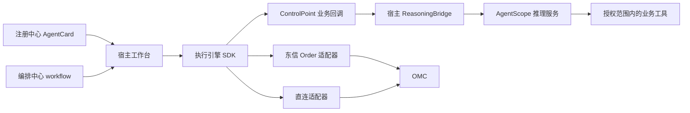

# A2A-T 执行引擎 SDK 与 AgentScope 结合方案

本文为宿主接入推理服务的设计指引，不是已实现的 AgentScope 模块；仓库没有绑定 AgentScope 版本或提供可部署的 Python 服务。
工作台需要实现桥接、模型配置、工具权限、超时、取消与持久化。接口基线见 [业务回调契约](../BUSINESS_CALLBACKS.md)。

## 1. 集成边界



跨智能体流程由设计态 DAG 与执行引擎负责；AgentScope 只处理当前回调，不再实现一套跨城市调度。 A2A
信封、认证、协议状态、响应组装由引擎处理；宿主桥接层调用 A2A-T 内容 API，向引擎返回最终内容。模板和业务 metadata
是否进入推理服务由宿主决定；认证密钥不能交给模型。 注册中心提供 AgentCard，编排中心提供 workflow，两者职责不同。

## 2. 四回调

| 回调          | 输入                                                  | 返回/职责                                          |
|---------------|-------------------------------------------------------|----------------------------------------------------|
| onTask        | TaskRequest：instruction、input、目标与 workflowInput | MessageContent：仅准备业务内容，不发送             |
| onSelfTask    | 本地任务与分组上游输出                                | TaskResult：success、outputs 数组与可选错误        |
| onRoute       | RouteRequest：前置信息、当前结果、候选分支            | RouteDecision：允许的 nextStep                     |
| onNegotiation | 当前任务、首次提交、完整收到内容及会话历史            | NegotiationReply：Send(最终内容) 或 Stop(本地终止) |

onTask 返回之后由引擎发送，并按远端终态解包；业务不处理 SendMessageResult。 selfTask 输出可以多个对象或嵌套数组，可作为后续
agent 输入；不限制为 LLM 字符串。 onRoute 只在条件分支调用，未实现则失败，不默认选择第一个。
协商从当前城市工单或权威工具取值；缺少可靠信息则拒绝/终止，不固定端口或自动同意。

## 3. Java 桥接

下列 ReasoningBridge 是宿主定义的接口，不是引擎新增 API。 导入 CompletableFuture、control.ControlPoint 和 model 包相应类型：

```java
interface ReasoningBridge {
    CompletableFuture<MessageContent> prepare(TaskRequest request);
    CompletableFuture<TaskResult> executeLocal(TaskRequest request);
    CompletableFuture<RouteDecision> route(RouteRequest request);
    CompletableFuture<NegotiationReply> negotiate(NegotiationRequest request);
}

ControlPoint controlPoint = ControlPoint.builder()
    .onTask(bridge::prepare)
    .onSelfTask(bridge::executeLocal)
    .onRoute(bridge::route)
    .onNegotiation(bridge::negotiate)
    .build();
```

bridge 是宿主实现，负责 SDK 内容生成／校验和最终 MessageContent。 不接管目标、A2A task/context 标识或认证头，不给任意上游输出强加业务
schema。

## 4. 跨语言 JSON 契约

宿主定义跨语言 DTO，明确区分业务输入和最终内容。 桥接层调用 A2A-T 自然语言／结构化接口，构造 parts、metadata、extensions 快照，
返回 Send (content) 或 Stop (code, reason)，不依赖 Jackson 猜测 sealed 类型。 结束回复保持收到 context 的
id/round/maxRounds，宿主 SDK 负责内容规则及业务错误映射。

输入保留 executionId/taskId、stepName/agentName、instruction/input 与 workflowInput。 workflowInput 保留 runtimeIntent 和
stepName → taskResults[] → outputs[]，不是完整聊天历史。 contextFrom=[] 不收集上游，null 为直接前驱，["*"]
为已有祖先结果，显式数组为指定已有结果。 contextFrom 不添加等待关系；DAG next 才控制调度。

路由返回值必须属于 candidates，不能让服务输出任意步骤名称。 本地输出始终是数组，错误以 success=false 与
error/errorCode/errorDetails 表达，不伪装成诊断输出。 HTTP 桥必须处理错误状态码、无效 JSON、空回复、超时和取消，不能将失败当作空白成功。
超时不等于远端操作停止，动网类工具的重试必须考虑幂等及人工确认。

## 5. 场景与隔离

WAIMO 下发投诉后，工作台解析输入、加载 workflow；两个城市并行诊断，最后本地汇总。 样例 onTask 使用两套城市数据，协商策略读取本次提交输入；selfTask
用 LlmHelper， 离线模式保留实际来源而不补造结论。生产应替换工单数据与模型/工具，不把样例当作通用规则。

Authorization-T 与 Notification-T 是独立预操作，不属于 workflow 因果链； 失败不阻断诊断。各自有独立
channel/runtime/context，通知持续至抢通结果、取消或宿主关闭。 不同执行需隔离业务记忆、回调和 client/transport
生命周期，不能共用一个“当前城市”变量。 认证由宿主 AuthProvider 或所选凭据路径承担，不让模型获取/输出凭据。

## 6. 验收清单

- 两城市并发时参数、协商回答和记忆不串任务。
- onTask 只返回 MessageContent，引擎发送一次并完成协议处理。
- 多输出和本地结果能进入下游内容生成；目标模板可表达业务必需事实。
- 三类协商均可接管；类型匹配、无信息、不支持操作和用户取消均明确处理。
- direct 与 Order 共用同一组业务回调，认证/路由保持在传输适配层。
- 本地和远端失败、无效 JSON、超时、取消有可观测结果。
- 另行执行真实 AgentScope、LLM、OMC 联调；仓库离线模拟测试不等价于现网验收。
