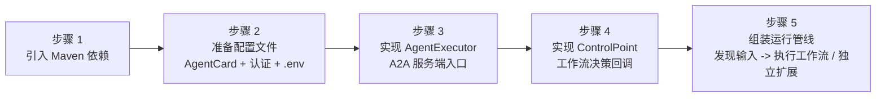
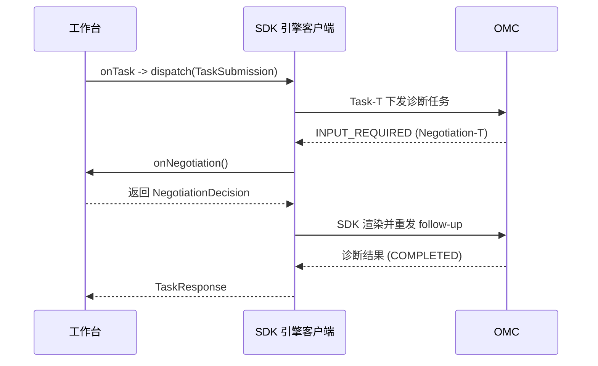
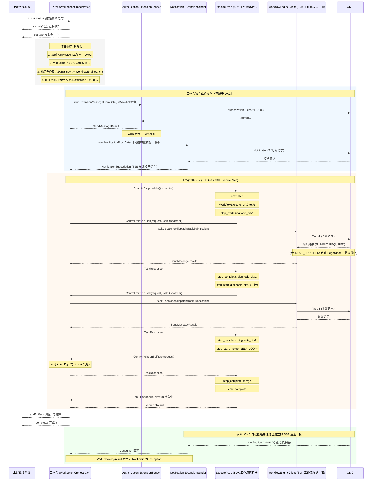

# 工作流执行引擎 SDK 工作台集成指南

> 交付基线：workflow engine `1.0.0`，A2A-T SDK
> `1.0.0-0de5a27`（commit `0de5a2751781419820436e5eb17cffc39b9db47d`），
> A2A Java SDK `1.2.0.Final`，东信 Order SDK `1.1.18`。本执行引擎是首发版本，
> 只支持该当前 A2A-T API/资源基线，不提供旧 SDK 状态机接口或旧报文 fallback。

> 工作台团队应先完成本指南的通用接入，再按[东信指令平台转发适配指南](指令平台适配指南.md)
> 配置现网 Order 路径；直连和 Order 只是南向 transport 不同，业务回调及 A2A-T 协议语义相同。

## 0. 交付包与责任边界

仅发送这份 Markdown 不等于完成 SDK 交付。交付方应同时提供以下内容：

| 交付物 | 用途 | 责任方 |
|---|---|---|
| `workflow-engine:1.0.0`、`spring-boot-starter:1.0.0` | 通用工作流协议与 Spring A2A 服务端 | 执行引擎方 |
| 固定 commit 构建的 A2A-T client/server Maven 制品 | 当前模板、schema、生成与校验 API | 执行引擎方/企业制品库 |
| `dev` 的 `samples/.../gateway` 适配源码及测试 | 东信 Order 专用转发层；生产应迁入独立适配模块 | 执行引擎方提供，工作台方集成 |
| 工作台自身 `AgentExecutor`、`ControlPoint`、持久化与业务回调 | 接收 WAIMO、任务决策、汇总和结果入库 | 工作台方 |
| 真实平台地址、账号、NE、tenant、TLS 和限流参数 | 现网东信通道部署数据 | 东信平台方 |
| OMC AgentCard、认证要求和四类协议联调用例 | 目标能力声明与端到端验收 | OMC 方/三方联合 |

`samples` 是可运行参考实现，不是工作台生产依赖。通用能力通过前两个 Maven artifact
接入；东信专用代码只存在 `dev`，应被迁入工作台自己的 adapter 模块，不能复制进通用
`workflow-engine` 核心。若交付方只提供 `main` 制品，则只能得到直连能力，不包含 Order 适配器。

对方完成接入的判定标准不是“项目能编译”，而是本文末尾检查清单全部通过，并分别取得
直连 E2E、Order 协议模拟器 E2E 和真实东信平台现场联调证据。

> 面向传输工作台研发团队。本文档以 SPN 专线故障跨城协同诊断联创场景为例，从工作台视角说明接入 Workflow 执行引擎 SDK 的完整路径。
>
> 业务基线：上游为 WAIMO；工作台接收 Task-T 后加载工作流，并行调度两地市 OMC，
> 两路完成后汇总一次并返回 WAIMO。Authorization-T 和 Notification-T 是工作台在
> 独立时机触发的协议操作，不是工作流 DAG 节点。

---

## 1. 场景全景

### 1.1 业务拓扑


工作台是运行时编排宿主，执行引擎 SDK 嵌入工作台进程，不是独立部署的服务。编排中心负责
PSOP 的存储、检索和加载，注册中心负责 AgentCard 的发布和查询；工作台负责在适当时机获取这些
输入并交给 SDK。它接收 WAIMO 通过 A2A-T 下发的原始诊断任务，并行编排下游多地市
SPN Domain Agent（OMC）执行故障根因诊断，汇总结果后上报。

`SpringSpnDemo` 为便于离线运行，默认从 classpath 加载 AgentCard，并在编排中心不可用时使用本地
PSOP fallback。真实 OMC 联调可用 `A2A_AGENT_CARD_LOCATIONS` 指定逗号或分号分隔的
`classpath:`、`file:` URI 或绝对路径；显式文件缺失或内容无效时启动立即失败。这是样例特例，
生产集成应以注册中心和编排中心为数据源，并自行定义受控的失败策略。

### 1.2 四类 A2A-T 交互

SDK 在该场景中承载四类 A2A-T 交互，对应业务流文档的四个接口:

| 序号 | A2A-T 扩展 | 业务含义 | 发起方 | 时机 |
|------|-----------|---------|--------|------|
| 1 | Task-T | 下发诊断任务 | 工作台 -> OMC | 工作流执行中 |
| 2 | Negotiation-T | 参数修正协商 | OMC <-> 工作台 | OMC 发现参数缺失时反向发起 |
| 3 | Authorization-T | 抢通白名单授权 | 工作台 -> OMC | 工作台在业务所需时独立触发 |
| 4 | Notification-T | 抢通结果订阅/上报 | 工作台 -> OMC (订阅) / OMC -> 工作台 (SSE 上报) | 工作台独立建立长连接，收到结果后关闭 |

序号 1、2 在工作流执行过程中发生，由 `WorkflowEngineClient` 承载。序号 3、4 由
`ExtensionSender` 在独立业务时机承载。三类协议使用三个独立的 `A2ATransport`、runtime、
context 和通道：Task-T 使用任务级实例，Authorization-T 一次性实例在 ACK 后释放，
Notification-T 使用工作台级长连接实例。

### 1.3 SDK 自动处理 vs 工作台实现

引擎的设计原则是: **协议机制由 SDK 承担，业务决策由工作台实现**。

| SDK 自动处理 | 工作台实现 |
|-------------|-----------|
| A2A 消息收发、SSE 流式传输、事件提取 | 是否发送任务、发送什么内容 |
| Agent 认证 (Bearer 令牌获取/刷新) | 凭证配置 (credentials.json) 或自定义 AuthProvider |
| Task-T 结构化提示词生成 (调用 A2A-T SDK) | 诊断任务的原始自然语言输入 |
| Negotiation-T 自动协商循环 (重发 follow-up) | 协商澄清内容 (onNegotiation 返回) |
| Authorization-T / Notification-T 报文构造 | 授权策略描述、订阅主题描述 |
| DAG 遍历、上下文组装、状态管理 | 分支路由决策 (onRoute 返回) |
| 事件全量产出 (EventType) | 事件处理 (EventCallback) |

---

## 2. 集成全景图

工作台集成 SDK 共需完成六步。先总后分，每步后续均有详细说明和代码示例。



职责分布:

| 组件 | 工作台实现 | SDK 提供 | 说明 |
|------|-----------|---------|------|
| `AgentExecutor` | 是 | 否 | 工作台的 A2A 服务端入口，接收 上层系统 下发的任务 |
| `ControlPoint` | 是 (4 个方法) | 接口 + 默认实现 | 工作流决策: 任务下发、自处理、路由、协商 |
| `AuthProvider` | 是 (可选) | 接口 | 自定义认证头注入；同一 Header 与 credentials.json 二选一 |
| `WorkbenchOrchestrator` | 是 | 否 | 组装编排管线的业务类 |
| `WorkflowEngineClient` | 否 | 是 | 工作流发送门面 (Task-T + 协商循环) |
| `ExtensionSender` | 否 | 是 | 独立协议操作门面 (授权 + 订阅) |
| `A2ATransport` | 否 | 是 | 通用传输类 (HTTP + 认证 + SSE)；三类协议分别建立实例 |
| `ExecutePsop` | 否 | 是 | 高层运行器 (生命周期 + 事件 + 持久化) |

---

## 3. 逐步集成

### 步骤 1: 引入 Maven 依赖

工作台项目 `pom.xml` 中添加:

```xml
<dependency>
    <groupId>dev.openan.workflow.sdk</groupId>
    <artifactId>workflow-engine</artifactId>
    <version>1.0.0</version>
</dependency>
```

如果工作台基于 Spring Boot 且需要 SDK 自动装配 A2A 服务端 (AgentCard 加载、REST 控制器、事件总线):

```xml
<dependency>
    <groupId>dev.openan.workflow.sdk</groupId>
    <artifactId>spring-boot-starter</artifactId>
    <version>1.0.0</version>
</dependency>
```

Spring Boot starter 会自动注册 `AgentCard`、`RequestHandler`、`RestHandler`、`A2AController` 等 Bean。工作台只需提供一个 `AgentExecutor` 实现类标注 `@Component` 即可。

`workflow-engine` 会传递依赖当前固定版本的 `a2a-t-client`。该 A2A-T 版本尚未发布到
Maven Central，集成方同步 Maven 前必须按 [A2A-T SDK 依赖说明](A2AT-SDK-DEPENDENCY.md)
安装到本机 `~/.m2/repository`，或由项目方把相同 GAV 和相同 commit 构建物发布到企业制品库。
不得用同一个 SNAPSHOT 坐标覆盖不同 jar。

### 步骤 2: 准备配置文件

集成需要三类配置文件。

#### 2.1 AgentCard (工作台自身的)

工作台作为 A2A 服务端，需要声明自己的 AgentCard。该文件告知 上层故障系统如何调用工作台:

```json
{
  "name": "Transport Workbench Agent",
  "description": "传输工作台智能体: 接收上层诊断任务，编排多地市 OMC 执行诊断并汇总",
  "version": "1.0.0",
  "capabilities": {
    "streaming": true,
    "extensions": [
      {"uri": "https://projects.tmforum.org/a2aproject/telecommunication/extensions/Task-T/v1", "required": false},
      {"uri": "https://projects.tmforum.org/a2aproject/telecommunication/extensions/Negotiation-T/v1", "required": false},
      {"uri": "https://projects.tmforum.org/a2aproject/telecommunication/extensions/Authorization-T/v1", "required": false},
      {"uri": "https://projects.tmforum.org/a2aproject/telecommunication/extensions/Notification-T/v1", "required": false}
    ]
  },
  "defaultInputModes": ["text/plain"],
  "defaultOutputModes": ["text/plain"],
  "skills": [
    {
      "id": "cross-city-fault-diagnosis",
      "name": "跨城故障协同诊断",
      "description": "协同多地市 OMC 执行专线故障诊断并汇总结果",
      "tags": ["SPN", "fault-diagnosis"]
    }
  ],
  "supportedInterfaces": [
    {"protocolBinding": "HTTP+JSON", "url": "https://工作台地址/a2a/json"}
  ]
}
```

下游 SPN Domain Agent 的 AgentCard 由厂商提供或从注册中心获取。工作台只需加载它们用于 SDK 通信。关键信息是 `name` (SDK 中用此名称寻址) 和 `supportedInterfaces.url` (通信地址)。

下游 AgentCard 的安全字段语义:

- `securitySchemes` 表示智能体支持的认证方式，不等于强制要求
- `securityRequirements` 表示当前对接必须满足的认证方式；缺失、`null` 或 `[]` 都表示不启用内置凭证认证
- 即使工作台通过 `AuthProvider` 获取 OMC Token，AgentCard 仍应声明真实的 `bearerAuth`
  `securityRequirements`；运行时实现与能力声明是两个维度
- 如果希望内置 credentials 认证生效，`securityRequirements` 必须非空，并引用 `securitySchemes` 中声明的方案名

由 AuthProvider 实现 Bearer 的下游 AgentCard 安全字段示例:

```json
{
  "securitySchemes": {
    "bearerAuth": {
      "httpAuthSecurityScheme": {
        "scheme": "Bearer"
      }
    }
  },
  "securityRequirements": [
    {
      "schemes": {
        "bearerAuth": {}
      }
    }
  ]
}
```

#### 2.2 认证配置

SDK 提供两种认证执行策略；同一个认证 Header 必须二选一：

| 认证方式 | 适用场景 | 配置方式 |
|---------|---------|---------|
| Credentials 认证 | Agent 提供登录接口并使用 Bearer 或自定义认证头 | 提供 credentials.json 文件 |
| 自定义 AuthProvider | 工作台自管 Token、企业 SSO、非标准认证头，或经东信 SDK 获取 OMC Token | 实现 `AuthProvider` 接口 |

**合并规则:** 同一个认证 Header 只能有一个所有者。直连由内置 Credentials 生成
`Authorization`，Order 由 `EastcomAuthProvider` 生成；只有追加不同名称的 Header 时才能组合。

##### 方式一: Credentials 认证 (credentials.json)

SPN Domain Agent (OMC) 使用 Bearer 认证。SDK 的 `AgentAuthManager` 自动调用登录接口获取令牌并缓存刷新，工作台只需提供凭证文件:

```json
{
  "profiles": {
    "spn-omc-default": {
      "bearerAuth": {
        "login_url": "https://omc地址/rest/plat/smapp/v1/oauth/token",
        "method": "PUT",
        "request_fields": {
          "grantType": "password",
          "userName": "admin",
          "value": "enc:加密后的密码",
          "ipaddr": "*"
        },
        "token_field": "accessSession",
        "order_token_header": "bearToken",
        "token_ttl": 3600
      }
    }
  },
  "agents": {
    "SPN Domain Agent City1": { "profile": "spn-omc-default" },
    "SPN Domain Agent City2": { "profile": "spn-omc-default" }
  }
}
```

`agents` 键名必须与 AgentCard 的 `name` 完全一致。相同认证信息只定义一次 Profile；某个
Agent 地址或字段不同时，在绑定中增加 `overrides.bearerAuth`。密码字段 `value` 使用 `enc:`
前缀，`CredentialCrypto` 使用 `A2AT_CRED_KEY` 自动解密。

**密码加密方法:**

加密格式为 `enc:<base64-iv>:<base64-ciphertext>`，算法为 AES-256-GCM。SDK 提供两种加密方式:

**方式一: 命令行工具 (推荐)**

```bash
# 1. 生成 32 字节密钥 (仅首次，妥善保存)
openssl rand -hex 32
# 输出示例: a1b2c3d4e5f6a7b8c9d0e1f2a3b4c5d6e7f8a9b0c1d2e3f4a5b6c7d8e9f0a1b2

# 2. 设置密钥环境变量
set A2AT_CRED_KEY=a1b2c3d4e5f6a7b8c9d0e1f2a3b4c5d6e7f8a9b0c1d2e3f4a5b6c7d8e9f0a1b2

# 3. 加密密码 (输出 enc:... 格式，直接复制到 credentials.json)
java -cp workflow-engine.jar dev.openan.workflow.engine.client.CredentialCrypto "Admin@123"
# 输出: enc:xxxxxxxxxxxx:yyyyyyyyyyyyyyyyyyyyyyyyyyyyyyyyyyyy

# 也可以将密钥作为第二个参数传入
java -cp workflow-engine.jar dev.openan.workflow.engine.client.CredentialCrypto "Admin@123" a1b2c3d4...
```

**方式二: 代码调用**

```java
// 设置密钥后调用
System.setProperty("A2AT_CRED_KEY", "a1b2c3d4e5f6...");
String encrypted = CredentialCrypto.encrypt("Admin@123");
// encrypted = "enc:xxxxxxxxxxxx:yyyyyyyyyyyyyyyyyyyyyyyyyyyyyyyyyyyy"
```

将输出的 `enc:...` 值直接填入 credentials.json 的 `value` 字段:

```json
{
  "request_fields": {
    "value": "enc:xxxxxxxxxxxx:yyyyyyyyyyyyyyyyyyyyyyyyyyyyyyyyyyyy"
  }
}
```

运行时 SDK 从 `A2AT_CRED_KEY` 环境变量读取密钥自动解密。密钥来源优先级: 操作系统环境变量 > Java 系统属性 (由 `.env` 文件加载器设置)。

凭证配置支持的完整字段:

| 字段 | 类型 | 默认值 | 说明 |
|------|------|--------|------|
| `login_url` | String | 必填 | 登录接口地址 |
| `method` | String | `POST` | HTTP 方法 |
| `content_type` | String | `application/json` | 请求 Content-Type |
| `request_fields` | Map | - | 请求体字段 (替代 legacy 的 username/password) |
| `token_field` | String | `accessSession` | 从响应 JSON 提取令牌的路径 (支持点号嵌套，如 `data.access_token`) |
| `order_token_header` | String | `bearToken` | Order 模式优先读取的响应 Header；缺失时回退 `token_field` |
| `token_ttl` | int | 3600 | 令牌缓存有效期 (秒)，到期前 60 秒自动刷新 |
| `auth_header` | String | `Authorization` | 自定义认证头名称 (设置后引擎改用该 Header 注入凭证) |
| `auth_header_prefix` | String | `Bearer ` | 自定义认证头前缀 (与 `auth_header` 配合使用) |

##### 方式二: 自定义 AuthProvider

当认证机制不属于标准 Bearer/API Key，或令牌来自外部身份提供商 (如企业 SSO) 时，实现 `AuthProvider` 接口:

```java
public interface AuthProvider {
    /**
     * 为发送消息注入认证头。
     *
     * @param agentName 目标 Agent 名称 (匹配 AgentCard.name)
     * @param agentCard Agent 卡片 (securitySchemes 可能为空)
     * @param headers   可变的请求头 Map，直接写入认证信息
     */
    void applyAuth(String agentName, AgentCard agentCard, Map<String, String> headers);
}
```

通过 `WorkflowEngineClientConfig` 注册:

```java
WorkflowEngineClientConfig config = WorkflowEngineClientConfig.builder()
        .authProvider((agentName, agentCard, headers) -> {
            // 从企业 SSO 获取令牌
            String token = ssoClient.getToken(agentName);
            headers.put("Authorization", "Bearer " + token);
        })
        .sslVerify(sslVerify)
        .a2atEnvPath(a2atEnvPath)
        .build();
```

`AuthProvider` 在**每次消息发送时**被调用，无论 AgentCard 是否声明了 `securitySchemes`。典型用途:

- AgentCard 无 `securitySchemes` 但服务端仍要求认证
- 认证机制非 A2A 标准类型 (Bearer、API Key、OAuth2)
- 令牌来自企业统一身份认证平台 (如企业 SSO)
- 需要注入非标准认证头 (如 `X-Custom-Token`、`X-Request-Signature`)

##### 东信转发与 OMC 认证

该场景的责任划分是:

- `AuthProvider`: 如 OMC 仍要求报文级 Token，负责获取并缓存 Token，把认证 Header 写入 `headers`
- `A2AJavaClientRuntime`: 负责把 A2A 请求及 `ClientCallContext` Header 交给东信 SDK 转发
- `AgentCard`: 继续声明 `bearerAuth` 安全要求；运行时只选择一个实现满足该要求

东信平台登录使用 `EASTCOM_ORDER_USERNAME/PASSWORD/CLIENT_ID`（以及可选 clientSecret），
它与透传给 OMC 的 A2A Header 是两套认证，不能混为一套 Token。

`SpringSpnDemo` 将两种模式的配置入口隔离：直连模式由 `A2A_OMC_CREDENTIALS_PATH` 指定
内置 Credentials 文件；Order Demo 的兜底 Provider 由
`EASTCOM_ORDER_OMC_CREDENTIALS_PATH` 指定凭据文件。两个文件都可使用 `profiles + agents`：
多个 Agent 可以引用同一个 Profile，并用 `overrides` 覆盖少量差异。Order 模式不启用引擎
内置 Credentials 客户端；未注入宿主 Provider 时，才由 `EastcomTokenService` 读取 Order
专属配置，根据 Agent→NE 路由调用
`HttpClient.create(serverInfo, HttpRequestConfig.builder().deviceName(ne).build())` 转发登录请求。

Profile 的 `request_fields` 是实际 OMC 登录字段，`enc:` 值使用 `A2AT_CRED_KEY` 解密；
`login_url` 在直连模式使用完整 URL，在 Order 模式只使用 path/query，实际目标由 NE 决定。
Order 优先读取 `order_token_header`（例如 `bearToken`），不存在时读取 `token_field`
指定的 JSON Body 字段（例如 `accessSession`）。Token 按 Agent+NE 隔离缓存，
`EastcomAuthProvider` 将其注入为 `Authorization: Bearer <token>`。

如果工作台已经实现 Token 获取逻辑，在 Spring 容器中注册指定名称的 Bean：

```java
@Bean("workflowOmcAuthProvider")
AuthProvider workflowOmcAuthProvider(TokenService tokenService) {
    return (agentName, agentCard, headers) -> {
        String token = tokenService.getOrRefresh(agentName);
        headers.put("Authorization", "Bearer " + token);
    };
}
```

`ClientRuntimeFactory` 会优先使用这个 Bean，不会读取
`EASTCOM_ORDER_OMC_CREDENTIALS_PATH`，也不会创建 Demo 的 `EastcomTokenService`。因此宿主可以
自行从数据库、密钥中心、东信 SDK 或统一认证服务获取 Token，引擎不感知其账号和配置结构。
只有没有该 Bean 时才启用 Demo 配置型兜底实现。

协议转发实现可直接参考 `samples` 模块的 `OrderGatewayClientRuntime`：

- `sendMessage(...)` 接收引擎传入的 `ClientCallContext`
- `extractHeaders(...)` 将 `callContext.getHeaders()` 原样复制到东信 SDK 请求
- `OrderHttpClientAdapter` 只使用供应商公开 `HttpClient`/`sendSse` API
- `OrderGatewayClientRuntime` 按 `contextId + NE + channel` 管理逻辑 conversation
- `GatewayA2AResponseParser` 解析阻塞响应和 SSE 帧
- `ConversationScopedA2AJavaClientRuntime` 保证协商 follow-up 复用同一会话
- `ClientRuntimeFactory` 展示如何在 Spring 中根据 `a2a.transport-mode=order` 创建 runtime

生产项目不建议直接依赖 `samples` 模块。应将上述模式复制到工作台工程，或抽成工作台自己的东信适配模块；`EastcomAuthProviderTest`、`EastcomTokenServiceTest`、`EastcomOrderSimulatorServerTest`、`OrderGatewayClientRuntimeTest` 和 `ClientRuntimeFactoryTest` 可作为迁移时的参考测试与配置结构。

```java
A2AJavaClientRuntime runtime = new OrderGatewayClientRuntime(orderConfig);
A2ATransport taskTransport = new A2ATransport(
        agentCards,
        runtime,
        WorkflowEngineClientConfig.builder()
                .sslVerify(false)
                .authProvider((agentName, card, headers) ->
                        headers.put("Authorization", "Bearer " + tokenClient.getToken(agentName)))
                .a2atEnvPath(a2atEnvPath)
                .build());
```

`sslVerify(false)` 只作用于引擎自身创建的 HTTP/JSON-RPC transport；工作台通过东信 SDK 获取 Token 或转发消息时的 TLS 策略，由该 SDK 客户端自行配置。

如果 Authorization-T、Notification-T 和工作流 Task-T 都需要认证，请把同一无状态或线程安全的
`AuthProvider` 配置到 `authorizationTransport`、`notificationTransport` 和 `taskTransport`
各自的 `WorkflowEngineClientConfig` 中，不要共享 transport/runtime 实例。

##### 两种方式组合使用

如果需要在认证基础上追加不冲突的追踪 Header，可以组合 contributor：

```java
WorkflowEngineClientConfig config = WorkflowEngineClientConfig.builder()
        .credentialsConfigPath(credentialsPath)    // credentials 认证
        .authProvider((agentName, agentCard, headers) -> {
            // 追加企业级追踪头
            headers.put("X-Trace-Id", TraceContext.current().getTraceId());
        })
        .build();
```

`AuthProvider` 与 credentials 只有在负责不同 Header 时才允许组合。直连和 Order 的 OMC
Bearer 认证不能同时启用：直连设置 `credentialsConfigPath` 且 `authProvider=null`；Order 设置
`credentialsConfigPath=null`，由 `EastcomAuthProvider` 独占 `Authorization`。如果两个来源生成
不同的同名 Header，引擎会立即抛出 `SecurityException`，不会按顺序覆盖。

#### 2.3 A2A-T SDK 环境 (.env)

A2A-T SDK 的 LLM 配置 (用于 Task-T 提示词生成、场景识别等)。最小配置:

```ini
A2AT_LLM_PROVIDER=openai
A2AT_LLM_MODEL=deepseek-chat
A2AT_LLM_API_KEY=你的API密钥
A2AT_LLM_BASE_URL=https://api.deepseek.com
A2AT_LANGUAGE=zh-CN
```

SDK 通过此配置调用 A2A-T SDK 生成并校验结构化 Task-T 内容。当前执行引擎不会在
SDK 未配置、模板缺失、schema 校验或渲染失败时降级为原始文本；这些情况会明确失败，
避免向 OMC 发送一个看似成功但不符合当前协议的请求。

### 步骤 3: 实现 AgentExecutor

工作台作为 A2A 服务端，需要实现 `AgentExecutor` 接口。这是 上层故障系统调用工作台的入口。SDK 不提供此实现 -- 它是工作台的业务代码。

`AgentExecutor` 来自 A2A Java SDK (`org.a2aproject.sdk.server.agentexecution.AgentExecutor`)。工作台实现 `execute` 方法接收上层任务，实现 `cancel` 方法处理取消。

接口签名:

```java
public interface AgentExecutor {
    void execute(RequestContext ctx, AgentEmitter emitter) throws A2AError;
    void cancel(RequestContext ctx, AgentEmitter emitter) throws A2AError;
}
```

工作台实现示例:

```java
public class TransportWorkbenchExecutor implements AgentExecutor {

    private final String orchUrl;           // 编排中心地址 (PSOP 搜索/加载)
    private final String credentialsPath;    // 凭证配置路径
    private final boolean sslVerify;         // 是否校验 TLS 证书
    private final String a2atEnvPath;        // A2A-T .env 路径

    public TransportWorkbenchExecutor(String orchUrl, String credentialsPath,
                                       boolean sslVerify, String a2atEnvPath) {
        this.orchUrl = orchUrl;
        this.credentialsPath = credentialsPath;
        this.sslVerify = sslVerify;
        this.a2atEnvPath = a2atEnvPath;
    }

    @Override
    public void execute(RequestContext ctx, AgentEmitter emitter) throws A2AError {
        String taskId = ctx.getTaskId();
        String contextId = ctx.getContextId();
        String input = extractText(ctx.getMessage());

        // 1. 向 上层系统 回报任务已接收 (A2A 状态消息)
        emitter.submit(buildStatusMessage(contextId, taskId, "任务已接收"));
        emitter.startWork(buildStatusMessage(contextId, taskId, "正在处理"));

        try {
            // 2. 委托编排管线执行完整的诊断流程
            String result = new WorkbenchOrchestrator(
                    orchUrl, credentialsPath, sslVerify, a2atEnvPath
            ).run(input);

            // 3. 返回诊断汇总结果 (A2A Artifact)
            List<Part<?>> parts = List.of(new TextPart("跨城故障协同诊断汇总结果"));
            emitter.addArtifact(parts, "result", "cross-city-diagnosis", null, false, true);
            emitter.complete(buildStatusMessage(contextId, taskId, "完成"));
        } catch (Exception e) {
            emitter.fail(buildStatusMessage(contextId, taskId, "失败: " + e.getMessage()));
        }
    }

    @Override
    public void cancel(RequestContext ctx, AgentEmitter emitter) throws A2AError {
        emitter.cancel();
    }

    // --- 工具方法 ---
    private static String extractText(Message message) {
        StringBuilder sb = new StringBuilder();
        for (Part<?> part : message.parts()) {
            if (part instanceof TextPart tp) sb.append(tp.text());
        }
        return sb.toString();
    }

    private static Message buildStatusMessage(String contextId, String taskId, String text) {
        return Message.builder()
                .messageId(UUID.randomUUID().toString())
                .contextId(contextId)
                .taskId(taskId)
                .role(Message.Role.ROLE_AGENT)
                .parts(new TextPart(text))
                .build();
    }
}
```

`AgentEmitter` 的调用时序: `submit` (已接收) -> `startWork` (处理中) -> `addArtifact` (结果) -> `complete` (完成)。这一时序是 A2A 协议的标准消息交互，上层故障系统据此感知任务进度。

如果使用 Spring Boot starter，只需将此类标注 `@Component`，starter 自动注册到 A2A 服务:

```java
@Component
public class TransportWorkbenchExecutor implements AgentExecutor { ... }
```

### 步骤 4: 实现 ControlPoint

`ControlPoint` 是工作台实现的核心决策接口。SDK 在工作流执行过程中调用这四个方法，工作台决定"做什么"，SDK 负责"怎么发"。

```java
public interface ControlPoint {
    CompletableFuture<TaskResponse> onTask(TaskRequest request, TaskDispatcher taskDispatcher);
    default CompletableFuture<TaskResponse> onSelfTask(TaskRequest request) { ... }
    CompletableFuture<RouteDecision> onRoute(String stepName, Map<String, Object> results, List<JumpCondition> conditions);
    default CompletableFuture<NegotiationDecision> onNegotiation(NegotiationRequest request) { ... }
}
```

可以继承 `DefaultControlPoint` (已实现 onSelfTask、onNegotiation 默认逻辑)，只重写需要的方法。下面逐个说明。

#### 4.1 onTask -- 下发诊断任务

SDK 在工作流走到一个需要向下游 Agent 发送任务的步骤时调用此方法。工作台决定发送什么内容给哪个 Agent。

`request` 包含: `agentName` (目标 Agent 名称)、`stepName` (当前步骤名)、`message` (SDK 组装的完整消息，含上游上下文)。

关键设计：给每个 OMC 发送的任务只包含该 OMC 相关的结构化参数，不混入其他地市的信息。
有结构化业务数据时使用 `TaskSubmission.fromData`；自由文本且工作流已知投诉模板时使用
`TaskSubmission.fromText(agent, text, StandardTemplates.PRIVATE_LINE_COMPLAINT)`；只有模板确实
未知时才使用 `fromUnclassifiedText` 触发 SDK 场景识别：

```java
public class WorkbenchControlPoint extends DefaultControlPoint {

    @Override
    public CompletableFuture<TaskResponse> onTask(
            TaskRequest request, TaskDispatcher dispatcher) {
        String step = request.getStepName();
        String agentName = request.getAgentName();
        Map<String, Object> data = buildCityTaskData(step);
        TaskSubmission submission = TaskSubmission.fromData(
                agentName,
                "创建专线业务投诉诊断任务",
                data,
                SpnCasePrompts.privateLineComplaintSchema(),
                StandardTemplates.PRIVATE_LINE_COMPLAINT);

        return dispatcher.dispatch(submission)
                .thenApply(r -> {
                    String state = r.getTaskState();
                    boolean success = state == null || state.isBlank()
                            ? r.getText() != null && !r.getText().isBlank()
                            : state.endsWith("COMPLETED");
                    return TaskResponse.builder()
                            .success(success)
                            .output(r.getText())
                            .build();
                })
                .exceptionally(e -> TaskResponse.builder()
                        .success(false)
                        .error("Agent 调用失败: " + e.getMessage())
                        .build());
    }

    private static Map<String, Object> buildCityTaskData(String step) {
        return switch (step) {
            case "diagnosis_city1" -> SpnCasePrompts.privateLineComplaintData();
            case "diagnosis_city2" -> SpnCasePrompts.privateLineComplaintDataCity2();
            default -> throw new IllegalArgumentException("未知诊断步骤: " + step);
        };
    }
}
```

`TaskDispatcher.dispatch(submission)` 内部根据输入类型选择 A2A-T SDK 显式 fromText、场景识别或
fromData API，并自动完成：
Task-T 生成 -> Bearer 认证 -> SSE 流式发送 -> 事件提取 -> Negotiation-T 协商循环。

#### 4.2 onSelfTask -- 本地汇总 (自环节点)

当工作流步骤标记为 `SELF_LOOP` 时，SDK 调用此方法。这意味着该步骤由工作台本地处理，不向下游发送 A2A-T 消息。典型用途: 汇总多个 OMC 的诊断结果。

```java
@Override
public CompletableFuture<TaskResponse> onSelfTask(TaskRequest request) {
    String message = request.getMessage();
    // 工作台本地汇总逻辑 (可调用 LLM 做故障定位结论)
    String fallback = "汇总分析完成。故障定位: 城市1 OMC，端口 Down，光功率 -28dBm 低于阈值。";
    String sys = "你是 SPN 跨城故障协同诊断汇总专家。根据两地市 OMC 诊断结果，输出故障定位结论。";
    String result = LlmHelper.text(a2atEnvPath, sys, message, fallback);
    return CompletableFuture.completedFuture(
            TaskResponse.builder().success(true).output(result).build());
}
```

`DefaultControlPoint` 的默认实现是将 `request.message` 原样返回。如果不需要 LLM 汇总，可以不重写此方法。

#### 4.3 onRoute -- 分支路由

当工作流步骤有条件分支时 (即 `next` 列表中 `JumpCondition` 带有非空 `condition`)，SDK 调用此方法。工作台根据已有结果决定走哪个分支。

返回 `RouteDecision`，其 `nextStep` 必须是 `conditions` 中声明的某个步骤名:

```java
@Override
public CompletableFuture<RouteDecision> onRoute(
        String stepName, Map<String, Object> results, List<JumpCondition> conditions) {
    // 简单场景: 取第一个非终止分支
    String nextStep = conditions.get(0).getStep();
    for (JumpCondition jc : conditions) {
        if (!"end".equals(jc.getStep()) && !"retry".equals(jc.getStep())) {
            nextStep = jc.getStep();
            break;
        }
    }
    return CompletableFuture.completedFuture(
            RouteDecision.builder().nextStep(nextStep).reason("默认路由").build());
}
```

路由规则说明:
- 步骤没有 `next` -> 终止步骤，工作流结束。
- `next` 中所有 `condition` 为空 -> 无条件扇出: 并行调度所有下游步骤。
- `next` 中有 `condition` -> 条件分支: 调用 `onRoute`，返回单个目标步骤 (N 选 1)。

复杂场景可使用 LLM 决策路由 (参考编排中心 `DynamicWorkflowEngine._llm_route_decision` 的实现)。

#### 4.4 onNegotiation -- 协商澄清

当 OMC 返回 `INPUT_REQUIRED` (Negotiation-T) 时，SDK 自动进入协商循环。SDK 传入包含协商类型、
会话轮次、concern 和 SDK 校验抽取后的只读 `parameters` 的 `NegotiationRequest`；工作台返回强类型
决策，不需要自行发送消息。业务判断优先使用 `parameters`，无需解析协议 metadata。

触发条件: OMC 发现任务参数有误或缺失 (必选参数缺失、取值不在枚举范围、语义校验错误等)。

```java
@Override
public CompletableFuture<NegotiationDecision> onNegotiation(
        NegotiationRequest request) {
    return CompletableFuture.completedFuture(
            NegotiationDecision.acceptData(Map.of(
                    "接入端口名称", "P533-珠江旧城-PTN3900-23-TPA1EG24-1",
                    "投诉分类", "专线质差")));
}
```

业务可返回 `acceptText/acceptData/rejectText/rejectData/abortText/abortData`。SDK 自动选择对应的
Negotiation-T fromText/fromData API 并重发，最多 3 轮（可配置）；不再支持 `data:` 等字符串控制前缀。
若拒绝 Information Propose，必须对每个无法提供的请求项逐项给出原因。例如：

```java
NegotiationDecision.rejectData(Map.of(
        "接入端口名称", "当前账号没有资源系统查询权限",
        "投诉分类", "当前账号没有资源系统查询权限"));
```

不能把两项合并成 `Map.of("拒绝原因", "...")`；最新 A2A-T SDK 会把逐项内容渲染为
Information Negotiation Reject 报文。

协商循环时序:



### 步骤 5: 组装编排管线

这一步将所有组件串联起来。工作台实现一个编排类，在 `AgentExecutor.execute` 被调用时运行完整的诊断流程。

```java
public class WorkbenchOrchestrator {

    private final String orchUrl;
    private final String credentialsPath;
    private final boolean sslVerify;
    private final String a2atEnvPath;

    public String run(String messageText) throws Exception {
        // 1. 加载 AgentCard (工作台自身 + 下游 OMC)
        List<AgentCard> agentCards = loadAgentCards();

        // 2. 搜索 + 加载 PSOP 工作流 (从编排中心)
        String psopId = searchPsop(messageText);
        Workflow workflow = LoadPsop.load(orchUrl, psopId, null, sslVerify);

        // 3. 本类只创建 Task-T 任务级 transport。
        // Authorization-T / Notification-T 由 Spring 工作台级 lifecycle 独立管理。
        // direct 模式传 null；order 模式由 ClientRuntimeFactory.create() 新建任务 runtime。
        // 这个 runtime 只属于本次工作流，不与授权或订阅通道共享。
        A2AJavaClientRuntime taskRuntime = clientRuntimeFactory.create();
        A2ATransport taskTransport = new A2ATransport(
                agentCards,
                taskRuntime,
                WorkflowEngineClientConfig.builder()
                        .sslVerify(sslVerify)
                        .a2atEnvPath(a2atEnvPath)
                        .credentialsConfigPath(credentialsPath)
                        .build());
        WorkflowEngineClient engineClient = new DefaultWorkflowEngineClient(taskTransport);

        // 4. 执行工作流
        WorkbenchControlPoint controlPoint =
                new WorkbenchControlPoint(a2atEnvPath, new NegotiationStrategy(a2atEnvPath));
        ExecutionResult result = ExecutePsop.builder()
                .psop(workflow)
                .agentCards(agentCards)
                .controlPoint(controlPoint)
                .engineClient(engineClient)
                .runtimeIntent(messageText)
                .lang("zh")
                .sslVerify(sslVerify)
                .credentialsConfigPath(credentialsPath)
                .a2atEnvPath(a2atEnvPath)
                .eventCallback(createLogCallback())
                .onFinish((r, events) -> {
                    // 持久化执行记录 (可选)
                    log.info("工作流完成: success={}, 事件数={}", r.isSuccess(), events.size());
                    return CompletableFuture.completedFuture(null);
                })
                .execute()
                .join();

        // 实际代码在 finally 中关闭 taskTransport；不关闭工作台级订阅通道。
        return buildResultText(result);
    }
}
```

#### 5.1 独立授权与通知通道详解

示例为了便于演示，在 Spring `ApplicationReadyEvent` 中启动 `WorkbenchExtensionLifecycle`；
这只是 Demo 选择，不是协议要求。生产工作台应在自己的业务时机单独触发授权或订阅，且与
单次 `WorkbenchOrchestrator.run` 分离。Authorization-T 使用一次性 transport，Notification-T
使用另一个工作台级 transport：

```java
private List<NotificationSubscription> prePositionExtensions(
        ExtensionSender authorizationSender,
        ExtensionSender notificationSender,
        List<AgentCard> agentCards) {
    List<NotificationSubscription> subscriptions = new ArrayList<>();
    for (AgentCard card : agentCards) {
        String name = card.name();
        if (name.contains("Workbench")) continue;  // 跳过工作台自身

        try {
            SendMessageResult authAck = authorizationSender.sendExtensionMessageFromData(
                    name,
                    "新增动网操作授权",
                    SpnCasePrompts.addAuthorizationData(),
                    SpnCasePrompts.authorizationSchema(),
                    A2ATExtension.AUTHORIZATION_T).join();
            recordAuthorizationResult(name, authAck);
        } catch (RuntimeException e) {
            recordAuthorizationFailure(name, e); // 只影响本次授权操作
        }

        try {
            NotificationSubscription subscription = notificationSender.openNotificationFromData(
                    name,
                    "订阅业务抢通事件",
                    SpnCasePrompts.subscribeServiceRecoveryData(),
                    SpnCasePrompts.serviceRecoverySchema(),
                    event -> onRecoveryEvent(event)).join();
            registerBeforeWaitingForAck(subscription);
            requireWorkingOrCompleted(subscription.acknowledgement().join());
            subscriptions.add(subscription);
        } catch (RuntimeException e) {
            recordSubscriptionFailure(name, e); // 只影响该订阅，不阻止工作流
        }
    }
    return List.copyOf(subscriptions);
}
```

- 结构化 Authorization-T/Notification-T 由 SDK schema-aware 管线生成；失败不使用原文降级。
- Authorization-T ACK 必须是 `TASK_STATE_COMPLETED`，否则白名单未生效。
- Notification-T ACK 只表示订阅已建立；真实抢通结果通过后续 SSE 事件到达。
- 工作台保留 `NotificationSubscription`，收到 `recovery-result` 后关闭对应句柄；未收到前保持长连接。
- Demo 虽在工作流前尝试这两个操作，但这只是时间顺序，不构成因果依赖：授权失败不阻止订阅，
  订阅失败不阻止授权，两者的任何结果都不阻止后续 Task-T 工作流执行。
- 已打开的订阅必须先登记到工作台生命周期，再等待 ACK；后续操作失败时只回滚已打开的
  订阅资源，不传播为工作流启动失败。

#### 5.2 PSOP 工作流搜索与加载

工作流 (PSOP) 存储在编排中心。SDK 提供搜索和加载方法:

```java
// 语义搜索: 根据原始意图匹配最相关的工作流
List<WorkflowSearchResult> results = LoadPsop.search(orchUrl, messageText, 3, null, sslVerify);
String psopId = results.get(0).getWorkflowId();

// 加载完整工作流定义
Workflow workflow = LoadPsop.load(orchUrl, psopId, null, sslVerify);
```

生产环境应明确编排中心不可用时的业务失败策略，不能默认执行可能过期的本地流程。
`SpringSpnDemo` 为离线演示提供本地 PSOP fallback；接入方只有在完成版本一致性、审计和变更治理后，
才应自行设计受控的本地兜底。

#### 5.3 EventCallback -- 事件追踪

`ExecutePsop` 在执行过程中产出全量事件。工作台可实现 `EventCallback` 追踪执行进度、记录日志、向前端推送:

```java
private EventCallback createLogCallback() {
    return new EventCallback() {
        @Override
        public void onEvent(String type, Map<String, Object> data) {
            switch (type) {
                case EventType.START -> log.info("[开始] 工作流: {}", data.get("workflow"));
                case EventType.STEP_START -> log.info("[步骤开始] {}", data.get("step"));
                case EventType.AGENT_REQUEST -> log.info("[发送] -> {}", data.get("agent"));
                case EventType.AGENT_RESPONSE -> log.info("[接收] <- {}", data.get("agent"));
                case EventType.NEGOTIATION_REQUEST ->
                        log.info("[协商请求] agent={}, 第{}轮", data.get("agent"), data.get("round"));
                case EventType.NEGOTIATION_RESOLVED ->
                        log.info("[协商完成] agent={}", data.get("agent"));
                // 以下事件类型为预留，当前 SDK 版本不会触发
                // (Authorization-T / Notification-T ExtensionHandler 未注册)
                case EventType.AUTHORIZATION_REQUEST ->
                        log.info("[授权请求] agent={}", data.get("agent"));
                case EventType.NOTIFICATION ->
                        log.info("[通知] agent={}", data.get("agent"));
                case EventType.ROUTE_DECISION ->
                        log.info("[路由] {} -> {}", data.get("step"), data.get("next"));
                case EventType.STEP_COMPLETE -> log.info("[步骤完成] {}", data.get("step"));
                case EventType.COMPLETE -> log.info("[完成]");
                case EventType.ERROR -> log.error("[错误] {}", data.get("error"));
                case EventType.CLOSE -> log.info("[关闭]");
            }
        }
    };
}
```

事件类型完整列表见 SDK 的 `EventType` 常量类。关键事件: `start` -> `step_start` -> `agent_request` / `agent_response` (含 `negotiation_*`) -> `step_complete` -> `complete` / `error` -> `close`。

> **注意:** `authorization_request` 和 `notification` 事件类型在当前 SDK 版本中不会被触发 (Authorization-T / Notification-T 的 ExtensionHandler 未注册到工作流 `ExtensionRegistry`)。这些事件类型为未来扩展预留。独立授权/订阅操作通过 `ExtensionSender` 的返回值或 `NotificationSubscription` 回调获取，不经过工作流事件流。

---

## 4. 完整调用时序

以下是工作台收到 上层系统 下发诊断任务后的完整端到端时序。

### 4.1 关键设计: 独立协议操作与工作流执行分离

SDK 提供两个独立的门面 (facade)，职责隔离:

| 门面 | 职责 | A2A-T 扩展 | 调用时机 |
|------|------|-----------|---------|
| `ExtensionSender` | 独立授权与订阅 | Authorization-T, Notification-T | 工作台业务时机单独调用，与 DAG 无先后依赖 |
| `WorkflowEngineClient` | 工作流执行 | Task-T, Negotiation-T | 工作流执行中，由 `ExecutePsop` 内部调度 |

**`ExecutePsop` 不处理 Authorization-T 或 Notification-T。** 它只负责 DAG 遍历、调用 `ControlPoint` 决策回调、通过 `WorkflowEngineClient` 发送 Task-T 消息、处理 Negotiation-T 协商循环。授权和订阅由工作台按业务时机单独触发，不要求必须发生在 `ExecutePsop` 之前。

三类协议使用三套独立的 `A2ATransport`/runtime/context。`WorkflowEngineClient` 使用 Task-T 任务级 transport；Authorization-T 使用一次性 transport，收到 ACK 后关闭；Notification-T 使用工作台级长连接 transport，收到目标抢通结果、显式取消或服务关闭时关闭。

### 4.2 完整时序图



### 4.3 时序说明

**初始化阶段 (工作台代码):**
- 步骤 1-4 是工作台 `WorkbenchOrchestrator.run()` 方法的代码，不是 SDK 自动完成的
- SDK 只提供组件类 (`A2ATransport`, `ExtensionSender`, `WorkflowEngineClient`)，工作台负责创建和组装

**独立协议操作 (工作台调用 ExtensionSender):**
- 工作台在业务所需时机调用结构化 Authorization-T 或 Notification-T API，不进入工作流 DAG
- Authorization-T 是一次性操作；ACK 校验成功后关闭自己的 transport
- Notification-T 返回 `NotificationSubscription`；SSE 长连接持续存活，后续 OMC 推送的抢通结果通过回调接收

**工作流执行阶段 (工作台调用 ExecutePsop):**
- `ExecutePsop` 内部创建 `WorkflowExecutor`，执行 DAG 遍历
- 每个步骤: `WorkflowExecutor` 调用 `ControlPoint.onTask()`，工作台决定发什么内容
- 工作台在 `onTask` 中提交强类型 `TaskSubmission`，SDK 自动选择显式 fromText、场景识别或
  fromData，并处理认证、SSE 与协商循环
- `SELF_LOOP` 步骤调用 `onSelfTask()`，工作台本地处理，不发送 A2A-T 消息

**后续通知阶段 (SSE 长连接):**
- OMC 在诊断后先上报抢通方案；只有方案精确命中有效 Authorization-T 白名单时，才自动执行
  本场景的隧道调优
- 抢通结果通过独立 Notification-T SSE 长连接推送
- 回调在 `openNotificationFromData` 时注册，与 `ExecutePsop` 无关

---

## 5. 工作台需交付物清单

| 交付物 | 类型 | 说明 |
|--------|------|------|
| `TransportWorkbenchExecutor` | Java 类 | 实现 `AgentExecutor`，A2A 服务端入口 |
| `WorkbenchControlPoint` | Java 类 | 继承 `DefaultControlPoint`，实现 onTask/onSelfTask/onRoute/onNegotiation |
| `WorkbenchOrchestrator` | Java 类 | 组装编排管线 (加载卡片 -> 预定位 -> 执行) |
| `WorkbenchAuthProvider` (可选) | Java 类 | 实现 `AuthProvider`，自定义认证逻辑 (如企业 SSO) |
| `agentcard/transport_workbench_agent.json` | JSON | 工作台自身的 AgentCard |
| `spn_agent_credentials.json` (可选) | JSON | 下游 OMC 的认证凭证 (使用 Credentials 认证时需要) |
| `.env` | INI | A2A-T SDK 的 LLM 配置 |
| `application.yml` (Spring Boot) | YAML | `a2at.server.agent-card` 等配置项 |

---

## 6. 生产环境注意事项

### 6.1 TLS 与证书

生产环境 OMC 通常使用自签名证书。`WorkflowEngineClientConfig` 中:
- `sslVerify(true)`: 校验证书 (需配置 CA 信任库 `caCertsPath`)
- `sslVerify(false)`: 仅跳过证书链校验，主机名校验仍启用；只用于受控的本地诊断
  （HTTP/JSON-RPC 会继续加载 mTLS 客户端证书；默认 gRPC 使用 plaintext，不能同时配置 mTLS/CRL）

```java
WorkflowEngineClientConfig.builder()
        .sslVerify(true)
        .caCertsPath("/path/to/ca-certs.pem")
        // OMC 要求双向 TLS 时配置：
        .clientCertPath("/path/to/client-cert.pem")
        .clientKeyPath("/path/to/client-key.pem")
        .credentialsConfigPath(credentialsPath)
        .a2atEnvPath(a2atEnvPath)
        .build()
```

### 6.2 凭证加密与自定义认证

**Credentials 认证:** `spn_agent_credentials.json` 中的密码字段使用 `enc:` 前缀标识加密内容。SDK 的 `CredentialCrypto` 使用 AES-GCM 对称加密自动解密。加密密钥通过环境变量 `A2AT_CRED_KEY` 注入 (32 字节 hex)。生产环境不应明文存储密码。

**自定义 AuthProvider:** 如果工作台已有统一的认证体系 (如企业 SSO、OAuth2 网关)，可直接实现 `AuthProvider` 接口，无需维护 credentials.json 文件。`AuthProvider` 在每次消息发送时调用，适合令牌生命周期由外部管理的场景:

```java
public class SsoAuthProvider implements AuthProvider {
    private final SsoClient ssoClient;

    @Override
    public void applyAuth(String agentName, AgentCard agentCard, Map<String, String> headers) {
        String token = ssoClient.getAccessToken(agentName);
        headers.put("Authorization", "Bearer " + token);
    }
}
```

### 6.3 协商轮次限制

默认协商最多 3 轮。如果 OMC 的协商场景复杂，可在创建 `WorkflowEngineClient` 时调整:

```java
// Java: DefaultWorkflowEngineClient 构造时传入
WorkflowEngineClient engineClient = new DefaultWorkflowEngineClient(transport, 5, null);
```

### 6.4 SSE 长连接管理

`openNotificationFromData` 建立的 SSE 订阅通道是长连接。工作台必须保留
`NotificationSubscription`，区分 `acknowledgement()` 与真实业务通知；收到期望的
`recovery-result` 后调用句柄的幂等 `close()`。显式取消或服务关闭时也要关闭。
`ExecutePsop` 只关闭它内部创建的 owning client；外部注入的 Task-T client 由调用方关闭，
两者都不得影响 Notification-T 长连接。

### 6.5 并发与并行

SDK 的 `WorkflowExecutor` 自动并行调度同一层的步骤 (无依赖关系的步骤并发执行)。步骤内的子任务也并行执行。工作台无需自行管理并发。如果 OMC 有并发限制，通过工作流定义中的步骤分层 (layer) 控制执行顺序。

### 6.6 错误处理

`SendMessageResult` 包含 `taskState` 字段。关键状态:
- `COMPLETED`: 任务正常完成
- `INPUT_REQUIRED`: 需要协商 (SDK 自动处理，超过轮次后返回此状态)
- `FAILED`: 任务失败

有明确 `taskState` 时，工作台应以任务状态判断成功；只有旧协议或消息响应没有状态时，才回退到文本内容判断:

```java
.thenApply(r -> {
    String state = r.getTaskState();
    boolean success = state == null || state.isBlank()
            ? r.getText() != null && !r.getText().isBlank()
            : state.endsWith("COMPLETED");
    return TaskResponse.builder()
            .success(success)
            .output(r.getText())
            .build();
})
```

### 6.7 东信 Order 模式: 并发 NE 断连/超时排查

> **这是联调中最容易踩坑的问题，务必在改造前阅读。**

#### 问题现象

Order 模式下同时向两个不同地市 OMC 发送 Task-T 诊断任务（或前置阶段给 City1 发完 Notification-T 后给 City2 发 Authorization-T），其中一个城市的请求报 `Timeout on blocking read for 10000000000 NANOSECONDS`，堆栈指向 `WrapperHttpClient.loadNeResource`。

根因有两个，两者叠加才会复现：

#### 根因一: 东信 SDK 共享 RSocket 连接

东信 SDK 的 `ServiceReference` 类内部有一个 `static final Map INVOKERS`，按 `className + host + port` 缓存 RSocket 连接。所有发往同一东信平台地址（同一 host:port）的请求，无论 NE 是 `sim-city1` 还是 `sim-city2`，都共用同一条 RSocket 连接。

SDK 的 `WrapperHttpClient.loadNeResource()` 通过 `Mono.block(Duration.ofSeconds(10))` 同步阻塞等待 RSocket 响应。这个 10 秒超时是 SDK 硬编码的，无法通过配置修改。

#### 根因二: 模拟器阻塞 I/O 卡住 RSocket 事件循环

`EastcomOrderSimulatorServer` 的 `execute` 方法（处理 RSocket `requestChannel`）在收到 HTTP 请求后，调用 `forwardParsed` 通过 `HttpURLConnection` 转发给 OMC。`forwardParsed` 内部的 `reader.read()` 是阻塞 I/O。

当 City1 的 Notification-T 是长连接（等待 OMC 上报抢通结果），`reader.read()` 会一直阻塞。如果这个阻塞发生在 RSocket 事件循环线程（`reactor-tcp-nio-*`）上，该线程被占死，无法处理同一 RSocket 连接上 City2 的 `loadNeResource` 请求（RSocket `requestResponse`），10 秒后 City2 超时。

#### 时序示例

```
T0  City1 Notification-T: loadNeResource → simulator 设置 lastResolvedTarget=city1_url
T1  City1 Notification-T: execute → forwardParsed → reader.read() 阻塞（长连接等待）
    → 阻塞在 reactor-tcp-nio-4 线程上
T2  City2 Authorization-T: loadNeResource → 发送到同一 RSocket 连接
    → reactor-tcp-nio-4 被阻塞，无法处理
T3  10s 后: City2 loadNeResource 超时 (Mono.block 10s timeout)
```

#### 解决方案

**修复一: 将转发 I/O 移出 RSocket 事件循环线程**

在模拟器的 `execute` 方法中，给 `forwardParsed` 调用加 `.subscribeOn(Schedulers.boundedElastic())`，把阻塞 I/O 从 `reactor-tcp-nio-*` 线程移到 `boundedElastic-*` 工作线程。RSocket 事件循环线程释放后，能正常处理其他 NE 的 `loadNeResource` 请求。

```java
// EastcomOrderSimulatorServer.execute() 中:
forwardParsed(httpMethod, httpPath, parsedHeaders, body, forwardUrl, streaming)
        .subscribeOn(Schedulers.boundedElastic())  // 关键: 移出事件循环线程
        .subscribe(sink::next, sink::error, () -> sink.complete());
```

**修复二: 用 HTTP Host 头替代共享 lastResolvedTarget 字段**

原模拟器用 `volatile String lastResolvedTarget` 字段在 `loadNeResource` 时设置目标 URL，`execute` 时读取。当两个 NE 并发调用 `loadNeResource`，后一个会覆盖前一个的目标，导致请求转发到错误的 OMC。

东信 SDK 的 `WrapperHttpClient.configureHeaderHost()` 会把 HTTP `Host` 头设为 `loadNeResource` 返回的完整 `neUrl`（如 `https://127.0.0.1:26335`）。每个请求自带目标地址，不再依赖共享字段:

```java
// EastcomOrderSimulatorServer.execute() 中，解析 HTTP 头后:
String hostHeader = findHeader(parsedHeaders, "Host");
String targetBase;
if (hostHeader != null
        && (hostHeader.startsWith("http://") || hostHeader.startsWith("https://"))) {
    targetBase = withoutTrailingSlash(hostHeader);
} else {
    targetBase = lastResolvedTarget != null
            ? lastResolvedTarget : "http://127.0.0.1:26335";
}
```

注意: `copyHeaders` 方法已经排除了 `Host` 头不转发给 OMC（避免覆盖 OMC 自身的 Host 头），这是正确的行为。

#### 为什么 readTimeout=65s 不能解决问题

模拟器的 `connection.setReadTimeout(65_000)` 只控制 `HttpURLConnection` 的读取超时，不影响 SDK 内部 `loadNeResource` 的 `Mono.block(10s)` 超时。即使模拟器等得起，SDK 在 10 秒内收不到 RSocket 响应就会超时报错。根因是 RSocket 事件循环线程被阻塞，不是 HTTP 读取超时。

#### 排查清单

如果再次出现 Order 模式并发超时，按以下顺序排查:

1. **确认超时位置**: 日志中 `Timeout on blocking read for 10000000000 NANOSECONDS` 出现在 `WrapperHttpClient.loadNeResource` → 是 RSocket 超时，不是 HTTP 超时
2. **确认线程**: 模拟器日志中 `FORWARD_CHUNK` / `FORWARD_DONE` 的线程名是 `boundedElastic-*` 而非 `reactor-tcp-nio-*` → 如果还是 `reactor-tcp-nio-*`，说明 `subscribeOn` 修复未生效
3. **确认目标地址**: 日志中 `FORWARD_START` 的 `target=` 是否与 `LOAD_NE_ACCEPTED` 的 `target=` 一致 → 如果不一致，说明 `Host` 头解析未生效
4. **确认逻辑会话复用**: 同一个 Task-T/Negotiation-T conversation 内应看到
   `SESSION_OPEN`、必要时 `SESSION_REUSE`，最终 `SESSION_CLOSE`；这不代表供应商物理登录次数
5. **确认通道隔离**: Task-T、Authorization-T、Notification-T 必须由
   `ClientRuntimeFactory.create()` 分别创建 runtime。尤其不能为了复用连接而共享一个
   `sharedOrderRuntime`；供应商底层是否池化连接由 Order SDK 自己管理

---

## 7. 接口速查表

### 工作台实现的接口

| 接口 | 方法 | 签名 (Java) | 何时调用 |
|------|------|-------------|---------|
| `AgentExecutor` | `execute` | `void execute(RequestContext ctx, AgentEmitter emitter)` | 上层系统 下发任务时 |
| `AgentExecutor` | `cancel` | `void cancel(RequestContext ctx, AgentEmitter emitter)` | 上层系统 取消任务时 |
| `ControlPoint` | `onTask` | `CompletableFuture<TaskResponse> onTask(TaskRequest, TaskDispatcher)` | 步骤需要向下游发任务 |
| `ControlPoint` | `onSelfTask` | `CompletableFuture<TaskResponse> onSelfTask(TaskRequest)` | 自环节点本地处理 |
| `ControlPoint` | `onRoute` | `CompletableFuture<RouteDecision> onRoute(String, Map, List)` | 条件分支选择 |
| `ControlPoint` | `onNegotiation` | `CompletableFuture<NegotiationDecision> onNegotiation(NegotiationRequest)` | OMC 返回 INPUT_REQUIRED |
| `AuthProvider` | `applyAuth` | `void applyAuth(String agentName, AgentCard agentCard, Map<String, String> headers)` | 每次消息发送前注入认证头 (可选) |

### SDK 提供的接口

| 接口 | 方法 | 签名 (Java) | 用途 |
|------|------|-------------|------|
| `WorkflowEngineClient` | `sendMessage` | `CompletableFuture<SendMessageResult> sendMessage(String agent, String message)` | 工作流中向下游发消息 |
| `ExtensionSender` | `sendExtensionMessageFromData` | `sendExtensionMessageFromData(String, String, Map, Map, TemplateUri, A2ATExtension)` | 结构化 Authorization-T 一次性操作（推荐） |
| `ExtensionSender` | `openNotificationFromData` | `openNotificationFromData(String, String, Map, Map, TemplateUri, Consumer)` | 结构化 Notification-T 长连接订阅（推荐） |
| `ExtensionSender` | `sendAuthorization` / `sendNotification` | 当前自然语言输入 API | 只有调用方确实只有自然语言输入时使用；有结构化业务字段时使用 fromData API |
| `ExecutePsop` | `execute` | `CompletableFuture<ExecutionResult> execute()` (Builder 模式) | 执行完整工作流 |
| `LoadPsop` | `search` | `List<WorkflowSearchResult> search(String url, String intent, int topK, ...)` | 语义搜索工作流 |
| `LoadPsop` | `load` | `Workflow load(String url, String psopId, ...)` | 加载工作流定义 |
| `AuthProvider` | `applyAuth` | `void applyAuth(String, AgentCard, Map<String, String>)` | 自定义认证头注入 (接口，工作台实现) |

---

## 8. 与 Demo 的关键区别

本次集成是生产环境接入，与 Demo 示例代码的关键区别:

| 维度 | Demo (samples) | 生产环境 |
|------|----------------|---------|
| AgentExecutor | 模拟实现，返回固定文本 | 对接真实 上层故障系统，需完整 A2A 消息时序 |
| OMC Agent | 模拟 Agent，预置响应 | 真实 SPN Domain Agent，Bearer 认证、真实诊断逻辑 |
| AgentCard | 从 classpath 加载 JSON | 从注册中心获取或厂商提供 |
| 认证 | credentials.json 明文密码 | 加密存储 (enc: 前缀) 或自定义 AuthProvider (企业 SSO) |
| TLS | sslVerify=false | 生产证书校验 |
| PSOP | fallback 固定 ID | 编排中心语义搜索 + 动态加载 |
| 事件 | 日志打印 | SSE 推送前端 + 持久化数据库 |
| 协商 | 结构化规则示例（`acceptData`） | LLM 生成或业务规则引擎返回强类型决策 |
| 抢通结果 | 不处理 | 通过 Notification-T SSE 通道接收并入库 |

---

## 9. 集成自查清单

- Maven 是否解析到 `a2a-t-client:1.0.0-0de5a27`，且 jar 来自固定 commit 而非旧缓存
- AgentCard 是否包含 `name`、`description`、`version`、`capabilities`、`defaultInputModes`、`defaultOutputModes`、`skills`、`supportedInterfaces`
- 下游 AgentCard 的 `securitySchemes` / `securityRequirements` 是否声明真实的 Bearer 要求
- `AuthProvider` 是否分别配置到 Task-T、Authorization-T、Notification-T 三套 transport
- 三类协议是否使用独立 runtime/context；Authorization-T ACK 后是否释放一次性 transport
- 自定义 `onTask` 是否优先使用 `taskState` 判断成功，而不是只用文本非空判断
- 是否保存 `NotificationSubscription`，并在收到目标结果、取消或服务关闭时显式关闭
- 两个地市任务是否真正并行、各自携带正确地市参数，join 是否等待两路并只执行一次
- 直连模式是否完成 Task-T 主流程和独立 Authorization/Notification 生命周期验证
- Order 模拟器模式是否完成同一验证，并确认 Agent→NE 不串路由、协议 Body 无乱码
- 现场 Order 联调是否按《指令平台适配指南》L-01～L-17 留存三侧时间戳和连接关闭证据
- IDEA 运行是否加载 `samples` 模块资源；需要协议 Body 时是否设置
  `-DWORKFLOW_ENGINE_PROTOCOL_INCLUDE_BODY=true`，且敏感 Header 仍保持脱敏

以上项目全部满足后，才能称为场景接入完成。单元测试、仅直连成功或只拿到最终汇总文本，
都不能替代东信通道逐帧、并发路由和 Notification-T 长连接的验收。
