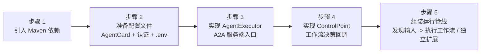
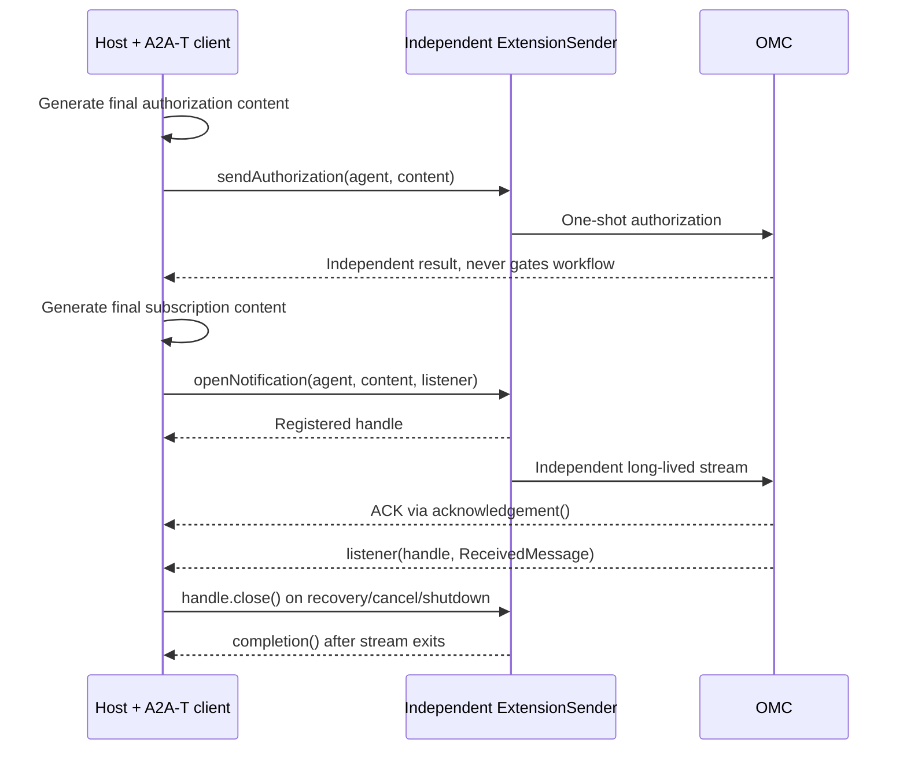

# 工作流执行引擎 SDK 工作台集成指南

> 交付基线：workflow engine `1.0.0`，A2A-T SDK
> `1.1.0`（commit `e42c83acce3e5ac2c245d36546ced0fa017b2b58`），
> A2A Java SDK `1.2.0.Final`。本执行引擎是首发版本，
> 只支持该当前 A2A-T API/资源基线，不提供旧 SDK 状态机接口或旧报文 fallback。

> 面向传输工作台研发团队。本文档以 SPN 专线故障跨城协同诊断联创场景为例，从工作台视角说明接入 Workflow 执行引擎 SDK 的完整路径。
>
> 业务基线：上游为 WAIMO；工作台接收 Task-T 后加载工作流，并行调度两地市 OMC，
> 两路完成后汇总一次并返回 WAIMO。Authorization-T 和 Notification-T 是工作台在
> 独立时机触发的协议操作，不是工作流 DAG 节点。

---

## 1. 场景全景

### 1.1 业务拓扑


工作台是运行时编排宿主，执行引擎 SDK 嵌入工作台进程，不是独立部署的服务。编排中心负责
PSOP 的存储、检索和加载，注册中心负责 AgentCard 的发布和查询；工作台负责在适当时机获取这些
输入并交给 SDK。它接收 WAIMO 通过 A2A-T 下发的原始诊断任务，并行编排下游多地市
SPN Domain Agent（OMC）执行故障根因诊断，汇总结果后上报。

`SpringSpnDemo` 为便于离线运行，默认从 classpath 加载 AgentCard，并在编排中心不可用时使用本地
PSOP fallback。真实 OMC 联调可用 `A2A_AGENT_CARD_LOCATIONS` 指定逗号或分号分隔的
`classpath:`、`file:` URI 或绝对路径；显式文件缺失或内容无效时启动立即失败。这是样例特例，
生产集成应以注册中心和编排中心为数据源，并自行定义受控的失败策略。

### 1.2 四类 A2A-T 交互

SDK 在该场景中承载四类 A2A-T 交互，对应业务流文档的四个接口:

| 序号 | A2A-T 扩展 | 业务含义 | 发起方 | 时机 |
|------|-----------|---------|--------|------|
| 1 | Task-T | 下发诊断任务 | 工作台 -> OMC | 工作流执行中 |
| 2 | Negotiation-T | 参数修正协商 | OMC <-> 工作台 | OMC 发现参数缺失时反向发起 |
| 3 | Authorization-T | 抢通授权 | 工作台 -> OMC | 工作流启动前，前置预定位 |
| 4 | Notification-T | 抢通结果订阅/上报 | 工作台 -> OMC (订阅) / OMC -> 工作台 (SSE 上报) | 工作流启动前订阅，执行中上报 |

序号 1、2 在工作流执行过程中发生，由 SDK 的 `WorkflowEngineClient` 承载。序号 3、4 是流程外的独立操作，Demo 只是在工作流启动前尝试，由 SDK 的 `ExtensionSender` 承载；这个时间顺序不构成因果依赖，授权或订阅失败均不得阻止后续 Task-T 工作流。各路径使用同一类底层传输组件 `A2ATransport`，但 runtime、context 和生命周期互相隔离：工作流发送使用任务级 transport，Notification-T 订阅使用工作台级 transport，避免工作流结束时关闭长连接。

### 1.3 SDK 自动处理 vs 工作台实现

| 引擎承担 | 工作台承担 |
|---|---|
| DAG、并行、任务关联、信封与传输 | onTask 返回最终 MessageContent |
| 上游来源选择、完整响应组装 | 根据业务需要映射上下游输入 |
| 协商关联、去重、等待 | SDK 生成／校验回复，返回 Send 或 Stop |
| 认证机制与 Header 注入 | 凭据来源或自定义 AuthProvider |
| 独立授权发送与订阅生命周期 | SDK 生成授权／订阅内容、处理业务结果 |

A2A-T client/server、模板、schema、LLM 初始化属于宿主；
workflow-engine 仅依赖 a2a-t-core，不管理内容生成。

## 2. 集成全景图

工作台集成 SDK 共需完成六步。先总后分，每步后续均有详细说明和代码示例。



职责分布:

| 组件 | 工作台实现 | SDK 提供 | 说明 |
|------|-----------|---------|------|
| `AgentExecutor` | 是 | 否 | 工作台的 A2A 服务端入口，接收 上层系统 下发的任务 |
| `ControlPoint` | 是 (4 个方法) | 接口 + 默认实现 | 工作流决策: 任务下发、自处理、路由、协商 |
| `AuthProvider` | 是 (可选) | 接口 | 自定义认证头注入 (企业 SSO 等)，与 credentials.json 二选一或组合 |
| `WorkbenchOrchestrator` | 是 | 否 | 组装编排管线的业务类 |
| `WorkflowEngineClient` | 否 | 是 | 工作流发送门面 (Task-T + 协商循环) |
| `ExtensionSender` | 否 | 是 | 前置预定位门面 (授权 + 订阅) |
| `A2ATransport` | 否 | 是 | 共享传输层 (HTTP + 认证 + SSE) |
| `ExecutePsop` | 否 | 是 | 高层运行器 (生命周期 + 事件 + 持久化) |

---

## 3. 逐步集成

### 步骤 1: 引入 Maven 依赖

工作台项目 `pom.xml` 中添加:

```xml
<dependency>
    <groupId>dev.openan.workflow.sdk</groupId>
    <artifactId>workflow-engine</artifactId>
    <version>1.0.0</version>
</dependency>
```

如果工作台基于 Spring Boot 且需要 SDK 自动装配 A2A 服务端 (AgentCard 加载、REST 控制器、事件总线):

```xml
<dependency>
    <groupId>dev.openan.workflow.sdk</groupId>
    <artifactId>spring-boot-starter</artifactId>
    <version>1.0.0</version>
</dependency>
```

Spring Boot starter 会自动注册 `AgentCard`、`RequestHandler`、`RestHandler`、`A2AController` 等 Bean。工作台只需提供一个 `AgentExecutor` 实现类标注 `@Component` 即可。

### 步骤 2: 准备配置文件

集成需要三类配置文件。

#### 2.1 AgentCard (工作台自身的)

工作台作为 A2A 服务端，需要声明自己的 AgentCard。该文件告知 上层故障系统如何调用工作台:

```json
{
  "name": "Transport Workbench Agent",
  "description": "传输工作台智能体: 接收上层诊断任务，编排多地市 OMC 执行诊断并汇总",
  "version": "1.0.0",
  "capabilities": {
    "streaming": true,
    "extensions": [
      {"uri": "https://projects.tmforum.org/a2aproject/telecommunication/extensions/Task-T/v1", "required": false},
      {"uri": "https://projects.tmforum.org/a2aproject/telecommunication/extensions/NEGOTIATION-T", "required": false},
      {"uri": "https://projects.tmforum.org/a2aproject/telecommunication/extensions/Authorization-T/v1", "required": false},
      {"uri": "https://projects.tmforum.org/a2aproject/telecommunication/extensions/Notification-T/v1", "required": false}
    ]
  },
  "defaultInputModes": ["text/plain"],
  "defaultOutputModes": ["text/plain"],
  "skills": [
    {
      "id": "cross-city-fault-diagnosis",
      "name": "跨城故障协同诊断",
      "description": "协同多地市 OMC 执行专线故障诊断并汇总结果",
      "tags": ["SPN", "fault-diagnosis"]
    }
  ],
  "supportedInterfaces": [
    {"protocolBinding": "HTTP+JSON", "url": "https://工作台地址/a2a/json"}
  ]
}
```

下游 SPN Domain Agent 的 AgentCard 由厂商提供或从注册中心获取。工作台只需加载它们用于 SDK 通信。关键信息是 `name` (SDK 中用此名称寻址) 和 `supportedInterfaces.url` (通信地址)。

下游 AgentCard 的安全字段语义:

- `securitySchemes` 表示智能体支持的认证方式，不等于强制要求
- `securityRequirements` 表示当前对接必须满足的认证方式；缺失、`null` 或 `[]` 都表示不启用内置凭证认证
- 如果工作台通过 `AuthProvider` 自行获取 OMC Token，推荐配置 `"securityRequirements": []`，`securitySchemes` 可以保留为能力声明
- 如果希望内置 credentials 认证生效，`securityRequirements` 必须非空，并引用 `securitySchemes` 中声明的方案名

AuthProvider-only 场景的下游 AgentCard 安全字段示例:

```json
{
  "securitySchemes": {
    "bearerAuth": {
      "httpAuthSecurityScheme": {
        "scheme": "Bearer"
      }
    }
  },
  "securityRequirements": []
}
```

#### 2.2 认证配置

SDK 提供两层认证机制，可单独使用或组合使用:

| 认证方式 | 适用场景 | 配置方式 |
|---------|---------|---------|
| Credentials 认证 | Agent 提供登录接口并使用 Bearer 或自定义认证头 | 提供 credentials.json 文件 |
| 自定义 AuthProvider | 工作台自管 Token、企业 SSO、非标准认证头，或经自定义网关/协议转发获取 OMC Token | 实现 `AuthProvider` 接口 |

**合并规则:** 两种认证来源分别生成 Header 后合并。`AuthProvider` 可以作为唯一认证来源；如果两者对同名 Header 生成不同值，引擎会抛出 `SecurityException`。

##### 方式一: Credentials 认证 (credentials.json)

SPN Domain Agent (OMC) 使用 Bearer 认证。SDK 的 `AgentAuthManager` 自动调用登录接口获取令牌并缓存刷新，工作台只需提供凭证文件:

```json
{
  "SPN Domain Agent City1": {
    "bearerAuth": {
      "login_url": "https://omc-city1地址/rest/plat/smapp/v1/oauth/token",
      "method": "PUT",
      "request_fields": {
        "grantType": "password",
        "userName": "admin",
        "value": "enc:加密后的密码",
        "ipaddr": "*"
      },
      "token_field": "accessSession",
      "token_ttl": 3600
    }
  },
  "SPN Domain Agent City2": {
    "bearerAuth": {
      "login_url": "https://omc-city2地址/rest/plat/smapp/v1/oauth/token",
      "method": "PUT",
      "request_fields": {
        "grantType": "password",
        "userName": "admin",
        "value": "enc:加密后的密码",
        "ipaddr": "*"
      },
      "token_field": "accessSession",
      "token_ttl": 3600
    }
  }
}
```

键名必须与 AgentCard 的 `name` 字段一致。SDK 依据此键名匹配 AgentCard 与凭证。密码字段 `value` 使用 `enc:` 前缀标识加密内容，SDK 的 `CredentialCrypto` 自动解密 (密钥通过 `A2AT_CRED_KEY` 环境变量注入，32 字节 hex)。

**密码加密方法:**

加密格式为 `enc:<base64-iv>:<base64-ciphertext>`，算法为 AES-256-GCM。SDK 提供两种加密方式:

**方式一: 命令行工具 (推荐)**

```bash
# 1. 生成 32 字节密钥 (仅首次，妥善保存)
openssl rand -hex 32
# 输出示例: a1b2c3d4e5f6a7b8c9d0e1f2a3b4c5d6e7f8a9b0c1d2e3f4a5b6c7d8e9f0a1b2

# 2. 设置密钥环境变量
set A2AT_CRED_KEY=a1b2c3d4e5f6a7b8c9d0e1f2a3b4c5d6e7f8a9b0c1d2e3f4a5b6c7d8e9f0a1b2

# 3. 加密密码 (输出 enc:... 格式，直接复制到 credentials.json)
java -cp workflow-engine.jar dev.openan.workflow.engine.client.CredentialCrypto "Admin@123"
# 输出: enc:xxxxxxxxxxxx:yyyyyyyyyyyyyyyyyyyyyyyyyyyyyyyyyyyy

# 也可以将密钥作为第二个参数传入
java -cp workflow-engine.jar dev.openan.workflow.engine.client.CredentialCrypto "Admin@123" a1b2c3d4...
```

**方式二: 代码调用**

```java
// 设置密钥后调用
System.setProperty("A2AT_CRED_KEY", "a1b2c3d4e5f6...");
String encrypted = CredentialCrypto.encrypt("Admin@123");
// encrypted = "enc:xxxxxxxxxxxx:yyyyyyyyyyyyyyyyyyyyyyyyyyyyyyyyyyyy"
```

将输出的 `enc:...` 值直接填入 credentials.json 的 `value` 字段:

```json
{
  "request_fields": {
    "value": "enc:xxxxxxxxxxxx:yyyyyyyyyyyyyyyyyyyyyyyyyyyyyyyyyyyy"
  }
}
```

运行时 SDK 从 `A2AT_CRED_KEY` 环境变量读取密钥自动解密。密钥来源优先级：显式 credentialEncryptionKey > 操作系统 A2AT_CRED_KEY > 同名 JVM 属性。引擎不自动读取宿主 LLM .env。

凭证配置支持的完整字段:

| 字段 | 类型 | 默认值 | 说明 |
|------|------|--------|------|
| `login_url` | String | 必填 | 登录接口地址 |
| `method` | String | `POST` | HTTP 方法 |
| `content_type` | String | `application/json` | 请求 Content-Type |
| `request_fields` | Map | - | 请求体字段 (替代 legacy 的 username/password) |
| `token_field` | String | `accessSession` | 从响应 JSON 提取令牌的路径 (支持点号嵌套，如 `data.access_token`) |
| `token_ttl` | int | 3600 | 令牌缓存有效期 (秒)，到期前 60 秒自动刷新 |
| `auth_header` | String | `Authorization` | 自定义认证头名称 (设置后引擎改用该 Header 注入凭证) |
| `auth_header_prefix` | String | `Bearer ` | 自定义认证头前缀 (与 `auth_header` 配合使用) |

##### 方式二: 自定义 AuthProvider

当认证机制不属于标准 Bearer/API Key，或令牌来自外部身份提供商 (如企业 SSO) 时，实现 `AuthProvider` 接口:

```java
public interface AuthProvider {
    /**
     * 为发送消息注入认证头。
     *
     * @param agentName 目标 Agent 名称 (匹配 AgentCard.name)
     * @param agentCard Agent 卡片 (securitySchemes 可能为空)
     * @param headers   可变的请求头 Map，直接写入认证信息
     */
    void applyAuth(String agentName, AgentCard agentCard, Map<String, String> headers);
}
```

通过 `WorkflowEngineClientConfig` 注册:

```java
WorkflowEngineClientConfig config = WorkflowEngineClientConfig.builder()
        .authProvider((agentName, agentCard, headers) -> {
            // 从企业 SSO 获取令牌
            String token = ssoClient.getToken(agentName);
            headers.put("Authorization", "Bearer " + token);
        })
        .sslVerify(sslVerify)
        .build();
```

`AuthProvider` 在**每次消息发送时**被调用，无论 AgentCard 是否声明了 `securitySchemes`。典型用途:

- AgentCard 无 `securitySchemes` 但服务端仍要求认证
- 认证机制非 A2A 标准类型 (Bearer、API Key、OAuth2)
- 令牌来自企业统一身份认证平台 (如企业 SSO)
- 需要注入非标准认证头 (如 `X-Custom-Token`、`X-Request-Signature`)
- 消息经自定义 `A2AJavaClientRuntime` 协议转发时，认证 Header 已由 `AuthProvider` 注入 `callContext`，转发实现原样复制即可

如果 Authorization-T / Notification-T 前置消息和工作流 Task-T 消息都需要认证，请把同一个 `AuthProvider` 配置到 `extensionTransport` 和 `taskTransport` 的 `WorkflowEngineClientConfig` 中。

##### 两种方式组合使用

如果部分 Agent 使用 credentials 认证、部分使用自定义认证，或需要在 credentials 基础上追加额外头:

```java
WorkflowEngineClientConfig config = WorkflowEngineClientConfig.builder()
        .credentialsConfigPath(credentialsPath)    // credentials 认证
        .authProvider((agentName, agentCard, headers) -> {
            // 追加企业级追踪头
            headers.put("X-Trace-Id", TraceContext.current().getTraceId());
        })
        .build();
```

`AuthProvider` 与 credentials 认证分别生成 Header 后再合并。`AuthProvider` 可以作为唯一认证来源，即使 AgentCard 的 `securityRequirements` 非空且未配置 credentials。不同名称的 Header 可同时使用；如果两者对同名 Header（例如 `Authorization`）给出不同值，引擎会立即抛出 `SecurityException`，避免认证信息被顺序覆盖。建议每个认证 Header 只配置一个来源。

#### 2.3 A2A-T SDK 环境 (.env)

A2A-T SDK 的 LLM 配置 (用于 Task-T 提示词生成、场景识别等)。最小配置:

```ini
A2AT_LLM_PROVIDER=openai
A2AT_LLM_MODEL=deepseek-chat
A2AT_LLM_API_KEY=你的API密钥
A2AT_LLM_BASE_URL=https://api.deepseek.com
A2AT_LANGUAGE=zh-CN
```

SDK 通过此配置调用 A2A-T SDK 生成 Task-T 结构化提示词。如果此文件未配置或生成失败，SDK 会降级为使用原始输入文本作为消息内容，不阻断流程。

### 步骤 3: 实现 AgentExecutor

工作台实现 A2A Java AgentExecutor.execute(RequestContext, AgentEmitter) 接收 WAIMO，
并在自己的入口用 A2ATServer.validateTaskPromptAndDataFilling 校验 Task-T。
metadata 中的 Task-T 正文与 templateUri 是内容入口，不用 parts 长短决定读取哪个正文。
然后搜索工作流、获取 AgentCards、调用执行引擎，并通过 A2A emitter 返回 artifact／终态。

可编译的完整实现见 samples 的 SpringWorkbenchExecutor、WorkbenchTaskInputParser、
WorkbenchOrchestrator；Spring starter 只提供协议入口与生命周期，不替宿主决定业务或模板。
入口取消应停止对应本地执行并清理宿主资源；远端已提交任务需按业务策略显式取消。
不要把错误或空结果伪装成成功诊断。

### 步骤 4: 实现 ControlPoint

```java
interface ControlPoint {
    CompletableFuture<MessageContent> onTask(TaskRequest request);
    CompletableFuture<TaskResult> onSelfTask(TaskRequest request);
    CompletableFuture<RouteDecision> onRoute(RouteRequest request);
    CompletableFuture<NegotiationReply> onNegotiation(NegotiationRequest request);
}
```

onTask 返回最终 parts/metadata/extensions，引擎封装发送，不再生成或改写内容。
onSelfTask 返回本地 TaskResult；onRoute 选择允许的候选；onNegotiation 返回 Send 或 Stop。
未实现的回调明确失败，不回显成功、不选首分支、不自动同意。
字段与完整示例见 [业务回调集成契约](BUSINESS_CALLBACKS.md)。

```java
ControlPoint callbacks = ControlPoint.builder()
    .onTask(request -> CompletableFuture.completedFuture(
        MessageContent.text(request.getInstruction())))
    .onSelfTask(request -> CompletableFuture.completedFuture(
        TaskResult.success(List.of(Map.of(
            "sourceResults", request.getWorkflowInput().upstreamResults())))))
    .onRoute(request -> CompletableFuture.failedFuture(
        new IllegalStateException("Supply a routing policy for " + request.stepName())))
    .onNegotiation(request -> CompletableFuture.completedFuture(
        new NegotiationReply.Stop("manual.required", "Manual confirmation required")))
    .build();
```

生产 Task-T 生成及协商示例见 WorkbenchControlPoint / examples.negotiation.NegotiationStrategy；上述仅是普通 A2A 内容示例。

### 步骤 5: 组装编排管线

```java
WorkflowEngineClientConfig config = WorkflowEngineClientConfig.builder()
    .sslVerify(true)
    .credentialsConfigPath(credentialsPath) // 内置认证；自定义认证时改为 authProvider 并不配置它
    .credentialEncryptionKey(credentialKey) // 宿主密钥；明文配置可不提供
    .maxNegotiationExchanges(3)
    .build();
try (A2ATransport transport = new A2ATransport(cards, runtime, config)) {
    WorkflowEngineClient client = new DefaultWorkflowEngineClient(transport);
    ExecutionResult result = ExecutePsop.builder()
        .psop(workflow).agentCards(cards).controlPoint(callbacks)
        .engineClient(client).runtimeIntent(intent).execute().join();
}
```

workflow、cards、callbacks、intent 由宿主取得或构造。
runtime 为 null 时使用默认直连实现；dev 的东信 runtime 只替换传输，不替换业务回调。
上面 transport 仅属于这次工作流；授权和通知使用另外的实例。
宿主自己的 A2ATClient 可在回调中复用，但要确保业务状态按 execution/task 隔离。

#### 5.1 前置预定位详解

```java
// authorizationSender 与 notificationSender 各自使用独立 transport/runtime。
MessageContent authContent = A2atMessages.from(
    sdk.generateAuthPromptFromDataWithSchema(authData, authSchema,
        StandardTemplates.AUTHORIZATION_POLICY_MANAGEMENT.uri()),
    List.of(new TextPart("新增动网操作授权")));
authorizationSender.sendAuthorization(agentName, authContent)
    .whenComplete((result, error) -> recordIndependentAuthorization(result, error));

MessageContent notificationContent = A2atMessages.from(
    sdk.generateNotificationPromptFromDataWithSchema(notifData, notifSchema,
        StandardTemplates.SERVICE_RECOVERY.uri()),
    List.of(new TextPart("订阅业务抢通事件")));
NotificationSubscription subscription = notificationSender.openNotification(
    agentName, notificationContent, (handle, received) -> {
        if (received.artifacts().stream().anyMatch(a -> "recovery-result".equals(a.name()))) {
            handle.close();
        }
    });
// 将 handle 加入宿主订阅集合；ACK/失败都仅影响这个独立操作。
// 监听器使用传入的 handle，不依赖此时外部 subscription 变量是否赋值。
subscription.acknowledgement().whenComplete((ack, error) -> recordIndependentSubscription(ack, error));
```

sdk、业务数据、schema、recordIndependent* 均由宿主提供，不是引擎隐式服务。
内容生成失败也只记录本次独立操作失败，不能阻止任务 DAG。
close() 幂等请求关闭；completion() 等待真实流退出。工作流完成不能关闭独立订阅。
实际生命周期与异常处理见 samples 的 ExtensionPrePositioner / WorkbenchExtensionLifecycle。

#### 5.2 PSOP 工作流搜索与加载

工作流 (PSOP) 存储在编排中心。SDK 提供搜索和加载方法:

```java
// 语义搜索: 根据原始意图匹配最相关的工作流
List<WorkflowSearchResult> results = LoadPsop.search(orchUrl, messageText, 3, null, sslVerify);
String psopId = results.get(0).getWorkflowId();

// 加载完整工作流定义
Workflow workflow = LoadPsop.load(orchUrl, psopId, null, sslVerify);
```

生产环境应明确编排中心不可用时的业务失败策略，不能默认执行可能过期的本地流程。
`SpringSpnDemo` 为离线演示提供本地 PSOP fallback；接入方只有在完成版本一致性、审计和变更治理后，
才应自行设计受控的本地兜底。

#### 5.3 EventCallback -- 事件追踪

`ExecutePsop` 在执行过程中产出全量事件。工作台可实现 `EventCallback` 追踪执行进度、记录日志、向前端推送:

```java
private EventCallback createLogCallback() {
    return new EventCallback() {
        @Override
        public void onEvent(String type, Map<String, Object> data) {
            switch (type) {
                case EventType.START -> log.info("[开始] 工作流: {}", data.get("workflow"));
                case EventType.STEP_START -> log.info("[步骤开始] {}", data.get("step"));
                case EventType.AGENT_REQUEST -> log.info("[发送] -> {}", data.get("agent"));
                case EventType.AGENT_RESPONSE -> log.info("[接收] <- {}", data.get("agent"));
                case EventType.NEGOTIATION_REQUEST ->
                        log.info("[协商请求] agent={}, 第{}次交互", data.get("agent"), data.get("exchange"));
                case EventType.NEGOTIATION_RESOLVED ->
                        log.info("[协商完成] agent={}", data.get("agent"));
                // 以下事件类型为预留，当前 SDK 版本不会触发
                // (独立操作不进入工作流事件流)
                case EventType.AUTHORIZATION_REQUEST ->
                        log.info("[授权请求] agent={}", data.get("agent"));
                case EventType.NOTIFICATION ->
                        log.info("[通知] agent={}", data.get("agent"));
                case EventType.ROUTE_DECISION ->
                        log.info("[路由] {} -> {}", data.get("step"), data.get("next"));
                case EventType.STEP_COMPLETE -> log.info("[步骤完成] {}", data.get("step"));
                case EventType.COMPLETE -> log.info("[完成]");
                case EventType.ERROR -> log.error("[错误] {}", data.get("error"));
                case EventType.CLOSE -> log.info("[关闭]");
            }
        }
    };
}
```

事件类型完整列表见 SDK 的 `EventType` 常量类。关键事件: `start` -> `step_start` -> `agent_request` / `agent_response` (含 `negotiation_*`) -> `step_complete` -> `complete` / `error` -> `close`。

> **注意:** `authorization_request` 和 `notification` 事件类型在当前 SDK 版本中不会被触发 (独立操作不进入工作流事件流)。这些事件类型为未来扩展预留。独立授权通过 SendMessageResult，订阅通过 handle 的 ACK 和监听器取得响应，不经过事件流。

---

## 4. 完整调用时序

```mermaid
sequenceDiagram
    participant H as Host callbacks + A2A-T client
    participant E as Workflow engine
    participant A as Remote agent
    E->>H: onTask(TaskRequest + upstream window)
    H->>H: Generate/validate final content
    H-->>E: MessageContent
    E->>A: A2A envelope + unchanged content
    opt INPUT_REQUIRED with valid Propose
        A-->>E: Task status + Negotiation-T Propose
        E->>H: onNegotiation(originalSubmission, received, history)
        H->>H: Validate proposal; generate reply
        H-->>E: Send(MessageContent) or local Stop
        E->>A: Same task/context; final reply content
    end
    A-->>E: Task result / artifacts
    E->>H: onSelfTask(selected complete upstream results)
    H-->>E: TaskResult
```



只有远端 `INPUT_REQUIRED` 携带有效 Negotiation-T Propose 才进入 `onNegotiation`。
终态不会重启协商，普通 INPUT_REQUIRED 明确报告不支持的交互。
宿主自行校验、理解 Propose，并用自己的 A2A-T client 生成最终 Accept/Reject/Abort。
通过 `A2atMessages.contextOf(request.received())` 取得收到的上下文；
结束回复保持相同 id、round、maxRounds，最后允许的一轮仍可回答，不自行 nextRound 或返回新 Propose。

返回 `new NegotiationReply.Send(content)` 发送最终内容；
返回 `new NegotiationReply.Stop(code, reason)` 只在本地停止，不生成 Abort。
同一任务／会话／轮次的重复等待事件不会重复回调、重复提交；未变化状态通过 getTask 观察。
`maxNegotiationExchanges` 默认 3，是独立于 SDK context.maxRounds 的本地交互资源预算。
超时、预算耗尽、回调缺失均明确失败，不默认 Accept，也不自动生成 Abort。
Accept/Reject 的 SUBMITTED/WORKING ACK 仍需等待任务结果，不重发原命令。
业务发送 Abort 后，即使远端用 COMPLETED 确认，也不能判为诊断成功。

### 查看真实协商与协议日志

直接运行本地 SpringSpnDemo，默认 City1 缺参并协商、City2 参数完整直接诊断，无需添加 VM 参数。
Negotiation-T 扩展激活本身不强制协商；这是本地 Demo 专门设置的场景，不是引擎默认行为。
要关闭本地缺参演示、让两城市都直接诊断，在 IDEA **VM options** 增加：

```text
-Da2at.samples.negotiation=false
```

默认仅移除 City1 的 Task-T 任务对象；启用状态下增加 `-Da2at.samples.negotiation.city=city2` 或 `both`
可演示 City2 或两城市同时缺参。宿主仍保留各城市的正确输入，原投诉上下文不变。预期链路是 `DEMO_NEGOTIATION` → `INPUT_REQUIRED / PROPOSE`
→ 工作台 onNegotiation → `ACCEPT` → 两城市完成 → 一次汇总。
非内嵌 OMC 模式默认不注入缺参，显式设置 `-Da2at.samples.negotiation=true` 也会被拒绝。
Demo 将开关传入当前 Spring 应用实例，不设置或修改 JVM 全局开关，不影响其他宿主。
协议日志在控制台及以运行目录为基准的 `logs/spn-demo.log`。
main 支持直连；dev 默认 order，两种模式使用同一业务回调。

离线重复验证（两个命令顺序执行，避免端口冲突）：

```powershell
mvn -q -pl samples -am "-Dtest=SpringSpnDemoE2ETest" "-Dsurefire.failIfNoSpecifiedTests=false" test
# 仅 dev：真实供应商 jar + 本地平台/OMC 模拟器
mvn -q -pl samples -am "-Dtest=SpringSpnDemoOrderE2ETest" "-Dsurefire.failIfNoSpecifiedTests=false" test
```

每个测试类覆盖无 VM 参数的默认单城市协商、显式关闭、显式开启及两城市同时缺参。测试使用离线 LLM provider，但实际运行当前 SDK 的
模板、校验和 HTTP/SSE；不是现网 OMC、平台或真实模型语义的验证。

### Demo 端到端 A2A-T SDK 调用清单

`SpringSpnDemo` 完整业务链路（两地市并行诊断、City1 缺参协商、City2 直接诊断）按业务时序对
A2A-T SDK 的全部调用如下。授权与订阅是独立于工作流 DAG 的操作，使用各自的独立通道
（授权为一次性通道，订阅为长连接通道），与 Task-T 报文无关；Demo 的调用时机是在工作流任务
下发**之前**先行完成授权与订阅，再启动两地市诊断。样例覆盖全部 8 个 validate 接口和全部
7 个 fromData 生成接口，均为真实调用；fromText 生成系列未在样例中使用（见文末说明）。

| # | 业务时机 | 调用方（角色） | A2A-T SDK 接口 | 样例实现 |
|---|---------|--------------|----------------|----------|
| 1 | WAIMO 下发投诉任务，工作台入口校验 Task-T 并提取任务参数 | 工作台（服务端） | `A2ATServer.validateTaskPromptAndDataFilling` | `WorkbenchTaskInputParser` |
| 2 | 工作台生成抢通白名单授权请求，经独立一次性通道发送 OMC（任务下发前） | 工作台（客户端） | `A2ATClient.generateAuthPromptFromDataWithSchema` | `ExtensionPrePositioner` |
| 3 | OMC 收到授权报文，校验并按白名单执行，返回 ACK | OMC（服务端） | `A2ATServer.validateAuthPromptAndDataFilling` | `PrePositionedExtensionHandler` |
| 4 | 工作台生成业务抢通事件订阅请求，经独立长连接通道向 OMC 订阅（任务下发前） | 工作台（客户端） | `A2ATClient.generateNotificationPromptFromDataWithSchema` | `ExtensionPrePositioner` |
| 5 | OMC 校验订阅报文，建立 SSE 上报；后续抢通结果经该长连接推回工作台 | OMC（服务端） | `A2ATServer.validateNotificationPromptAndDataFilling` | `PrePositionedExtensionHandler` |
| 6 | 授权与订阅就绪后，工作台按地市分别生成 Task-T，并行下发两地市 OMC | 工作台（客户端） | `A2ATClient.generateTaskPromptFromDataWithSchema` | `SpringSpnDemo` |
| 7 | OMC 校验 Task-T，提取任务对象/上下文；参数完整则直接诊断（City2） | OMC（服务端） | `A2ATServer.validateTaskPromptAndDataFilling` | `NegotiationBaseAgentExecutor` |
| 8 | OMC 发现必选参数缺失，生成协商 Propose，随 INPUT_REQUIRED 返回（City1） | OMC（服务端） | `A2ATServer.generateNegotiationProposePromptFromData` | `NegotiationBaseAgentExecutor` |
| 9 | 工作台 `onNegotiation` 回调：校验入站 Propose，提取所需补充字段 | 工作台（客户端） | `A2ATClient.validateProposePromptAndDataFilling` | `NegotiationStrategy` |
| 10 | 工作台从当前地市业务输入补参，生成协商结尾报文（Accept；拒绝/终止对应 Reject/Abort 变体） | 工作台（客户端） | `A2ATClient.generateNegotiationAcceptPromptFromData`（及 Reject/Abort 变体） | `NegotiationStrategy` |
| 11 | OMC 校验工作台回传的协商结尾报文，提取补参后重新执行诊断 | OMC（客户端） | `A2ATClient.validateAcceptPromptAndDataFilling`（及 Reject/Abort 变体） | `NegotiationBaseAgentExecutor` |

两个组装辅助贯穿上述调用（属执行引擎的通用工具，非 SDK 接口）：

- `A2atMessages.from(MetadataContent, parts)`：把 SDK 生成的 `MetadataContent`（模板 URI、扩展 URI、
  协商上下文 metadata）封装为发送用的 `MessageContent`，不生成、不解释业务内容；
- `A2atMessages.contextOf(received)`：从收到的协商报文中取回 `NegotiationContext`，协商结尾回复
  保持相同 id/round/maxRounds（步骤 6）。

说明：

- 全部生成都走 **fromData（结构化输入、确定性渲染）**；`generateTaskPromptFromText` 等 fromText 系列
  （自然语言入口，含一步 LLM 抽取）接口在样例中未使用，接口契约见
  [A2A-T SDK 依赖说明](A2AT-SDK-DEPENDENCY.md)。
- 协商由 **OMC 侧触发**（缺参时返回 INPUT_REQUIRED + Propose），工作台无法选择哪个地市协商；
  样例通过删除 City1 的任务对象字段构造该输入条件，两城市的补参互相隔离。
- 输入内容（任务参数、补参值、授权策略、订阅条件）全部来自样例构造的业务数据（`SpnCasePrompts`），
  SDK 接口输出不做任何打桩；运行 `SpringSpnDemo` 使用真实 LLM 配置。

## 5. 工作台需交付物清单

| 交付物 | 类型 | 说明 |
|--------|------|------|
| `TransportWorkbenchExecutor` | Java 类 | 实现 `AgentExecutor`，A2A 服务端入口 |
| `WorkbenchControlPoint` | Java 类 | 继承 `DefaultControlPoint`，实现 onTask/onSelfTask/onRoute/onNegotiation |
| `WorkbenchOrchestrator` | Java 类 | 组装编排管线 (加载卡片 -> 预定位 -> 执行) |
| `WorkbenchAuthProvider` (可选) | Java 类 | 实现 `AuthProvider`，自定义认证逻辑 (如企业 SSO) |
| `agentcard/transport_workbench_agent.json` | JSON | 工作台自身的 AgentCard |
| `spn_agent_credentials.json` (可选) | JSON | 下游 OMC 的认证凭证 (使用 Credentials 认证时需要) |
| `.env` | INI | A2A-T SDK 的 LLM 配置 |
| `application.yml` (Spring Boot) | YAML | `a2at.server.agent-card` 等配置项 |

---

## 6. 生产环境注意事项

### 6.1 TLS 与证书

生产环境 OMC 通常使用自签名证书。`WorkflowEngineClientConfig` 中:
- `sslVerify(true)`: 校验证书 (需配置 CA 信任库 `caCertsPath`)
- `sslVerify(false)`: 仅跳过证书链校验，主机名校验仍启用；只用于受控的本地诊断
  （HTTP/JSON-RPC 会继续加载 mTLS 客户端证书；默认 gRPC 使用 plaintext，不能同时配置 mTLS/CRL）

```java
WorkflowEngineClientConfig.builder()
        .sslVerify(true)
        .caCertsPath("/path/to/ca-certs.pem")
        // OMC 要求双向 TLS 时配置：
        .clientCertPath("/path/to/client-cert.pem")
        .clientKeyPath("/path/to/client-key.pem")
        .credentialsConfigPath(credentialsPath)
        .build()
```

### 6.2 凭证加密与自定义认证

**Credentials 认证:** `spn_agent_credentials.json` 中的密码字段使用 `enc:` 前缀标识加密内容。SDK 的 `CredentialCrypto` 使用 AES-GCM 对称加密自动解密。加密密钥通过环境变量 `A2AT_CRED_KEY` 注入 (32 字节 hex)。生产环境不应明文存储密码。

**自定义 AuthProvider:** 如果工作台已有统一的认证体系 (如企业 SSO、OAuth2 网关)，可直接实现 `AuthProvider` 接口，无需维护 credentials.json 文件。`AuthProvider` 在每次消息发送时调用，适合令牌生命周期由外部管理的场景:

```java
public class SsoAuthProvider implements AuthProvider {
    private final SsoClient ssoClient;

    @Override
    public void applyAuth(String agentName, AgentCard agentCard, Map<String, String> headers) {
        String token = ssoClient.getAccessToken(agentName);
        headers.put("Authorization", "Bearer " + token);
    }
}
```

### 6.3 协商轮次限制

WorkflowEngineClientConfig.builder().maxNegotiationExchanges(3) 配置本地交互预算，
与收到的 SDK context.maxRounds 分开。耗尽／超时只本地失败，不自动生成 Abort。
结束回复保留收到的 id/round/maxRounds，最后一轮仍可回答。

### 6.4 SSE 长连接管理

`sendNotification` 建立的 SSE 订阅通道是长连接。SDK 的 `A2ATransport` 管理连接池和超时。工作台应在服务关闭时调用 `extensionTransport.close()` 释放连接。`ExecutePsop` 在工作流结束后自动关闭 `engineClient` 及其任务级 transport；不要把这个 transport 与 `ExtensionSender` 共用，否则 Notification-T 长连接会在工作流结束时被关闭。

### 6.5 并发与并行

SDK 的 `WorkflowExecutor` 自动并行调度同一层的步骤 (无依赖关系的步骤并发执行)。步骤内的子任务也并行执行。工作台无需自行管理并发。如果 OMC 有并发限制，通过 DAG 依赖边或宿主限流控制；layer 不是执行顺序约束。

### 6.6 错误处理

引擎处理远端协议状态和结果解包；onTask 只返回 MessageContent。onSelfTask 返回 TaskResult，失败原因与 outputs 分离。异常和失败 future 由引擎记录；不要把未发送成功包装成成功输出。详见 [业务回调契约](BUSINESS_CALLBACKS.md)。

## 7. 接口速查表

```java
interface ControlPoint {
    CompletableFuture<MessageContent> onTask(TaskRequest request);
    CompletableFuture<TaskResult> onSelfTask(TaskRequest request);
    CompletableFuture<RouteDecision> onRoute(RouteRequest request);
    CompletableFuture<NegotiationReply> onNegotiation(NegotiationRequest request);
}
```

onTask 返回最终 parts/metadata/extensions，引擎封装发送，不再生成或改写内容。
onSelfTask 返回本地 TaskResult；onRoute 选择允许的候选；onNegotiation 返回 Send 或 Stop。
未实现的回调明确失败，不回显成功、不选首分支、不自动同意。
字段与完整示例见 [业务回调集成契约](BUSINESS_CALLBACKS.md)。

```java
CompletableFuture<SendMessageResult> sendAuthorization(String agentName, MessageContent content);
NotificationSubscription openNotification(String agentName, MessageContent content,
    BiConsumer<NotificationSubscription, ReceivedMessage> listener);
```

- ExecutePsop.builder().execute()：执行完整工作流。
- WorkflowEngineClient.sendMessage(String, MessageContent)：DAG 外发送最终内容；DAG 内由执行器调用 dispatch。
- LoadPsop.search/load、RegistryClient.fetchAgentCards：可选发现辅助。
- AuthProvider.applyAuth(String, AgentCard, Map<String,String>)：宿主认证，不接收引擎强制规定的凭据文件结构。
- A2atMessages.from / contextOf：metadata 转换与规范上下文辅助，不是内容 SDK 门面。

## 8. 与 Demo 的关键区别

本次集成是生产环境接入，与 Demo 示例代码的关键区别:

| 维度 | Demo (samples) | 生产环境 |
|------|----------------|---------|
| AgentExecutor | 模拟实现，返回固定文本 | 对接真实 上层故障系统，需完整 A2A 消息时序 |
| OMC Agent | 模拟 Agent，预置响应 | 真实 SPN Domain Agent，Bearer 认证、真实诊断逻辑 |
| AgentCard | 从 classpath 加载 JSON | 从注册中心获取或厂商提供 |
| 认证 | credentials.json 明文密码 | 加密存储 (enc: 前缀) 或自定义 AuthProvider (企业 SSO) |
| TLS | sslVerify=false | 生产证书校验 |
| PSOP | fallback 固定 ID | 编排中心语义搜索 + 动态加载 |
| 事件 | 日志打印 | SSE 推送前端 + 持久化数据库 |
| 协商 | 结构化规则示例（typed reply） | 宿主 SDK 生成最终回复，回调返回 Send 或 Stop |
| 抢通结果 | 通过独立订阅接收，收到结果关闭 | 通过 Notification-T SSE 通道接收并入库 |

---

## 9. 集成自查清单

- Maven 是否解析到 `a2a-t-client:1.1.0`，且 jar 为 Central 发布制品而非本地同坐标重打包
- AgentCard 是否包含 `name`、`description`、`version`、`capabilities`、`defaultInputModes`、`defaultOutputModes`、`skills`、`supportedInterfaces`
- 下游 AgentCard 的 `securitySchemes` / `securityRequirements` 是否按实际认证方式配置；AuthProvider-only 推荐 `securityRequirements: []`
- `AuthProvider` 是否已同时配置到前置预定位 transport 和工作流任务 transport
- 前置预定位 transport 是否为工作台级生命周期，工作流 transport 是否为任务级生命周期
- onTask 是否仅准备 MessageContent，由引擎判断远端终态；本地 onSelfTask 是否明确返回业务成功或失败
- `sendNotification` 是否传入回调，并在服务关闭时释放前置预定位 transport

## 协议日志

将 `PROTOCOL` logger 设为 DEBUG，可查看实际传输边界的观测记录。
HTTP/JSON-RPC 记录 A2A SDK 处理后的实际序列化正文和应用头；
A2A-Version 只在真实请求有该头时出现，不为日志展示补造 Header。
gRPC 记录实际 metadata 和 protobuf 的 JSON 展示，不伪装成 HTTP JSON 报文。
JDK 自动网络头、HTTP/2 帧、TLS 密文及服务端字节不在此观测范围。

dev 中 `ORDER_FORWARD_REQUEST` 表示交给东信 SDK 的请求，
`ORDER_SDK_RESPONSE` 表示 SDK 实际交付的状态、多值响应头和文本。
`sdk-sse-text` 从 SDK 字符串分片组装可见 SSE 帧；原始字节编码及平台到 OMC 的报文不可见，
不能称为 OMC 抓包。`MODEL_PREVIEW` 只是高层预览，默认关闭，不是协议证据。

```properties
logger.protocol.name=PROTOCOL
logger.protocol.level=DEBUG
logger.protocol.additivity=true
WORKFLOW_ENGINE_PROTOCOL_INCLUDE_BODY=true
WORKFLOW_ENGINE_PROTOCOL_MAX_BODY_CHARS=100000
```

DEBUG 开启时正文观测默认开启；敏感部署可显式禁用。JVM 同名属性优先于环境变量。
认证头、Cookie、Token 及识别出的口令字段强制脱敏，不提供关闭脱敏的开关。
这是字段级脱敏，不能自动识别所有个人信息和业务敏感内容，生产应另定日志策略。
缓冲有界：原始收集器按该数值限制字节，输出文本按字符限制；
超限 SSE 帧整帧丢弃至下个分隔符并标记 dropped-capacity，禁用、截断、中断也有明确标记。
UTF-8 分片先组装再解码，日志观察失败不改变报文投递；文件引用不会为打印日志而下载。
requestId 关联单次调用；工作流调用还带 executionId/logicalTaskId/attempt、
agent/contextId/channel，已知远端任务时附 remoteTaskId，均为本地日志字段，不污染协议 metadata。

### 协议日志 pretty 展示

协议日志默认以 pretty 形式展示：逐行打印头字段，缩进 JSON 正文。SSE 保留 id/event 等事件信息，
JSON 在 `=== SSE data (JSON display; not wire text) ===` 与 `=== End SSE data ===` 之间单独展示，
不再为展开后的每行 JSON 添加 `data:` 前缀。多个事件各自保留边界。
`WORKFLOW_ENGINE_PROTOCOL_PRETTY=false`（环境变量或同名 JVM 属性）可保留脱敏后的原始正文展示。
pretty 只影响显示（JSON 缩进及 SSE 数据区标记），不改实际发送字节、metadata、数值或扩展头；
原始观测正文仍保留，SSE pretty 展示不是可直接重放的抓包。
JSON 字符串中的 `\\n` 保留转义，避免把业务字符串误写成非法 JSON；非 JSON／不完整正文保持原样。
日志仍执行脱敏和容量限制。Demo 启动记录 `NEGOTIATION_DEMO enabled=..., city=...`；
本地默认 City1 协商、City2 直接诊断，`-Da2at.samples.negotiation=false` 关闭缺参演示。
协商激活位于 `A2A-Extensions: .../Negotiation-T/v1`，不存在专用的 Negotiation-T HTTP 头；
正文检查对应 URI 的 metadata 和 `negotiationContext`，不要只检索大写 `NEGOTIATION-T`。
