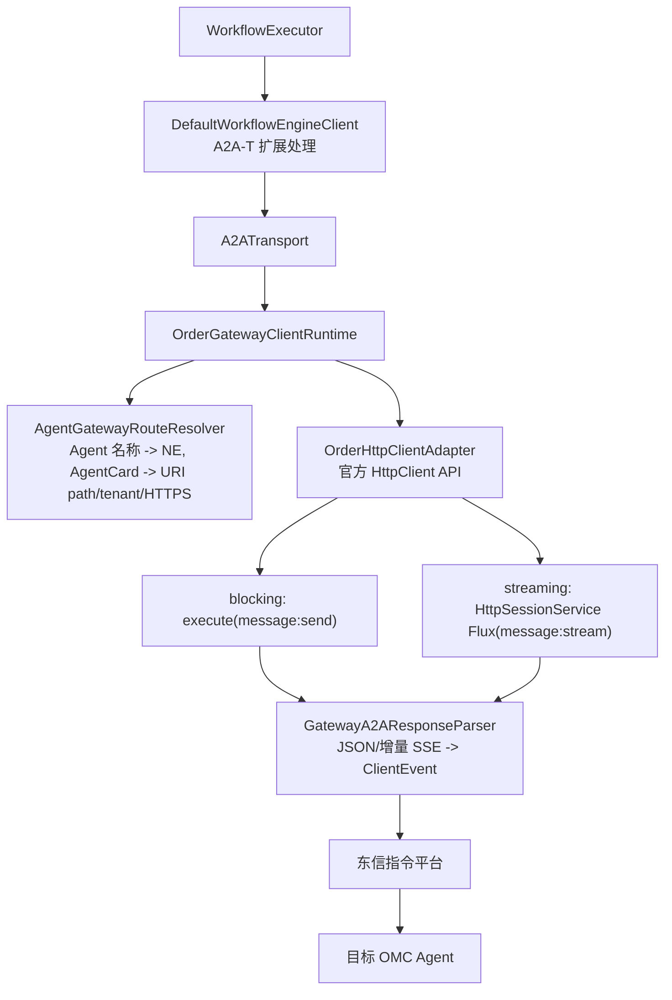

# 东信指令平台转发适配指南

## 运行链路

`SpringSpnDemo` 的工作台出站消息默认通过东信 Order SDK 转发，不再默认直连 OMC：



指令平台只负责通道建立和透明转发。Task-T、Negotiation-T、Authorization-T、Notification-T 扩展仍由执行引擎和 OMC 在协议端点处理，扩展 metadata 和请求头会随 A2A 请求一起发送。SPN 主工作流只使用 Task-T；Negotiation-T 保留为独立协议用例，不通过已废弃的 `startNegotiation` 等接口进入主流程。

## 设计边界

- `ClientRuntimeFactory`：根据配置创建 `order`、`mock` 或 `direct` runtime，Spring 执行器不依赖具体适配器。
- `ConfiguredAgentGatewayRouteResolver`：负责 Agent 到 NE 的映射，未配置路由时立即报错，不会误发到其他 OMC。
- `OrderGatewayClientRuntime`：只负责编排 SDK 会话和转发，不承载工作流状态。
- `GatewayA2AResponseParser`：无共享状态，每次请求独立解析，避免并发任务串 task/context。
- `OrderHttpClientAdapter`：隔离 Order SDK 1.1.18 的版本化类型，业务请求调用公开的 `HttpClient`/`sendSse` API；不直接访问内部 `HttpSessionService`。由于 1.1.18 存在已确认的 `ByteBuf` 所有权缺陷，创建客户端时还会安装 `EastcomOrder118ByteBufWorkaround`；该兼容层只负责释放供应商桥接器已消费但未释放的请求缓冲区。
- 适配器实例按 `contextId + NE + channel` 隔离并串行访问。SDK `HttpClient` 没有公开的 `login/init/logout` 生命周期，每次请求自包含认证；这里的 `SESSION_OPEN/REUSE/CLOSE` 仅表示执行引擎的逻辑 conversation 资源，不等同于指令平台登录会话。
- `WorkbenchExtensionLifecycle`：拥有工作台级前置操作。Authorization-T 每个目标 Agent 执行一次，收到响应后立即释放请求会话；Notification-T 使用独立 transport 持续保持，在收到预期 `recovery-result`、显式取消订阅或工作台进程关闭时释放。

## 配置

复制根目录 `.env.example` 为 `.env`，至少填写：

```dotenv
A2A_TRANSPORT_MODE=order

EASTCOM_ORDER_HOST=10.x.x.x
EASTCOM_ORDER_PORT=12345
EASTCOM_ORDER_USERNAME=your-username
EASTCOM_ORDER_PASSWORD=your-password
EASTCOM_ORDER_CLIENT_ID=
EASTCOM_ORDER_CLIENT_SECRET=

# 可配置每个 Agent 的 NE；名称必须与 AgentCard.name 完全一致
EASTCOM_ORDER_CITY1_NE=city1-omc
EASTCOM_ORDER_CITY2_NE=city2-omc

# 可选：没有精确路由时使用的兜底 NE
EASTCOM_ORDER_DEFAULT_NE=
EASTCOM_ORDER_LOGIN_TIMEOUT_SECONDS=15
EASTCOM_ORDER_TIMEOUT_SECONDS=600
```

Spring 启动前会加载项目向上查找到的 `.env`，但操作系统环境变量和 JVM system property 优先，不会被 `.env` 覆盖。Order 模式缺少 host、port、用户名、密码或所有 NE 配置时会启动失败并给出明确配置项。

这些值分为两类：SDK 能确定字段及协议结构，但不能从客户端反推出生产平台部署数据。真实的 host、port、账号、clientId/clientSecret 和 NE 名称必须由东信平台管理员提供；本地模拟时则可由双方自行约定。

## 启动方式

真实东信平台（默认）：

```bash
mvn -pl samples spring-boot:run \
  -Dspring-boot.run.main-class=dev.openan.workflow.engine.examples.demo.SpringSpnDemo
```

没有真实平台时，优先使用协议级模拟：

```dotenv
A2A_TRANSPORT_MODE=order
EASTCOM_ORDER_SIMULATOR_ENABLED=true
EASTCOM_ORDER_HOST=127.0.0.1
EASTCOM_ORDER_PORT=26401
EASTCOM_ORDER_USERNAME=sim-user
EASTCOM_ORDER_PASSWORD=sim-password
EASTCOM_ORDER_CLIENT_ID=sim-client
EASTCOM_ORDER_CLIENT_SECRET=sim-secret
EASTCOM_ORDER_CITY1_NE=sim-city1
EASTCOM_ORDER_CITY2_NE=sim-city2
```

当且仅当 `A2A_TRANSPORT_MODE=order` 且 `EASTCOM_ORDER_SIMULATOR_ENABLED=true` 时，Spring 容器才启动并关闭 `EastcomOrderSimulatorServer`，监听 26401；`direct`/`mock` 模式即使环境变量残留也不会启动模拟器。客户端不替换、不覆盖 SDK 1.1.18 jar，业务请求仍使用其公开 `HttpClient` API和 TCP/RSocket-RPC 网络栈；执行引擎只在运行时安装下述缓冲区所有权兼容层。模拟平台把 `sim-city1`、`sim-city2` 分别解析为本地 26335、26336 OMC，并转发 blocking 或 SSE 请求。该模式可验证客户端与当前 SDK 版本的线协议兼容性；生产环境必须将 `EASTCOM_ORDER_SIMULATOR_ENABLED` 设为 `false`。

SDK 1.1.18 在 Windows/JDK 17 下可能按 JVM 默认字符集把 `String` 请求体编码后传入内部 RPC；若服务端一律按 UTF-8 解码，中文 A2A-T metadata 会损坏。协议模拟器先用严格 UTF-8 解码，只有字节序列不是合法 UTF-8 时才回退 GB18030，并记录 `REQUEST_ENCODING_FALLBACK`。此兼容只用于本地验证；生产指令平台必须按 `Content-Type` 使用 UTF-8 或透明转发原始字节，不能依赖回退。

### SDK 1.1.18 请求缓冲区泄漏兼容

`order-shaded-client:1.1.18` 的 `WrapperHttpClient` 使用
`PooledByteBufAllocator.DEFAULT.buffer()` 创建请求体，随后
`ReactorNettyBridgeHandler.write(...)` 将该缓冲区同步复制到 RPC protobuf 并吞掉这次
Netty write，但没有调用 `release()`。因此日志会出现：

```text
ResourceLeakDetector - LEAK: ByteBuf.release() was not called
Created at: WrapperHttpClient.lambda$null$9(WrapperHttpClient.java:164)
```

这是供应商 SDK 的资源所有权缺陷，不是 A2A-T 报文解析失败；当前请求通常仍会继续，
但长稳运行会积累池化直接内存。`EastcomOrder118ByteBufWorkaround` 在供应商 bridge 的
出站前一跳安装可共享 handler：先让 bridge 同步复制消息，再在 `finally` 中通过
`ReferenceCountUtil.safeRelease(msg)` 归还原始缓冲区。兼容层有以下边界：

1. 不修改或覆盖原始 1.1.18 jar，也不关闭 Netty 泄漏检测；
2. 只对供应商 bridge 已消费的出站消息负责，不释放响应缓冲区；
3. 若升级后的 SDK 不再包含预期 bridge，启动请求会失败并提示复核兼容层，避免静默双重释放；
4. 东信发布正式修复版本后，应升级依赖、删除兼容层，并用 `paranoid` 泄漏检测重跑 Order 端到端及长稳压测。

若配置仍指向 `127.0.0.1:26401` 却关闭 simulator，应用会在启动阶段直接报告配置冲突，不再等到发送时才出现 `Service unavailable URL{host='127.0.0.1', port=26401}`。还需注意 IDEA Run Configuration 或操作系统环境变量优先于 `.env`；若启动日志没有 `[EastcomSimulator] READY`，应检查是否存在同名环境变量覆盖。

保留的 adapter-level mock 模式可用于快速单元回归：

```bash
mvn -pl samples spring-boot:run \
  -Dspring-boot.run.main-class=dev.openan.workflow.engine.examples.demo.SpringSpnDemo \
  -Dspring-boot.run.arguments=--a2a.transport-mode=mock
```

mock 模式仍然以 `OrderGatewayClientRuntime` 作为实际运行时，不会绕过生产适配器。它只把无法在本地启动的东信 `HttpClient` 调用替换为实现同一内部 `OrderSession` 端口的 `MockOrderHttpSessionClient`，并继续使用供应商的 `OrderHttpSessionStrRequest` 和 `OrderHttpSessionStrResponse` 类型。AgentCard 能力判断、Agent→NE 路由、URI/tenant 生成、streaming 增量解析、终态识别、超时及逻辑资源释放均执行生产代码。

本地模拟路由为：

| Agent | 模拟 NE | 模拟目标 |
|---|---|---|
| `SPN Domain Agent City1` | `mock-ne-city1` | `https://127.0.0.1:26335` |
| `SPN Domain Agent City2` | `mock-ne-city2` | `https://127.0.0.1:26336` |

HTTP mock 会校验 POST 方法、目标白名单、`Content-Type`、`Accept`、`A2A-Version` 和 A2A `SendMessageRequest` JSON，校验通过后打印 `[MockGateway] VALIDATION_PASSED`。它用于快速验证 SDK 适配层，不覆盖 RSocket 网络实现；需要验证完整本地 SDK 链路时使用上述协议级模拟。

如需临时绕过指令平台直连 OMC，可显式使用 `--a2a.transport-mode=direct`；这不是 Demo 默认行为。

## Order SDK 调用语义

### HttpClient API 调用方式

按照东信《联机指令平台接口说明 v1.8》(2026-01-27) 的 SDK 接入说明，执行引擎的业务调用使用官方承诺的 HttpClient API，不再依赖内部 RSocket-RPC OrderHttpSessionClient；唯一的内部兼容点是上节说明的 1.1.18 `ByteBuf` 所有权修复：

1. HttpClient.create(serverInfo, config)：创建 HTTP 客户端。serverInfo 携带平台连接凭据（host、port、username、password、clientId、clientSecret）；config 通过 HttpRequestConfig.builder().deviceName(ne).build() 指定目标 NE。SDK 内部完成平台认证和 NE 资源解析，无需显式 login/init。
2. .responseTimeout(Duration)：设置请求超时。
3. .post().uri(path).header(name, value).body(body).send()：同步 HTTP 请求，返回 HttpResponse（statusCode()、headers()、
esponseContent().asString()）。
4. .sendSse(SseListener)：SSE 流式调用。SseListener.onHeader(HttpClientResponse) 收到首帧 HTTP 状态码和响应头；onBodyString(String) 收到每个 SSE 事件体。sendSse 阻塞直到平台自然结束 SSE 流。
5. HTTPS 是目标 OMC 路由属性，由平台内部处理。不要在客户端 RSocket 连接上调用 `.secure(...)`，否则会把“平台连接 TLS”和“目标设备 HTTPS”混为一谈。
6. HttpClient 无持久会话生命周期，无需 logout。底层 Netty 连接池由 SDK 自行管理。

RPC 路由由 SDK 按接口规范生成。协议级模拟端 (EastcomOrderSimulatorServer) 仍使用供应商 jar 自带的 RpcServer.addService(HttpSessionService.class, ...) 验证 RSocket 协议兼容性，但生产路径已切换为 HttpClient HTTP 语义。

单次发送按以下顺序执行：

1. 根据 AgentCard.name 解析目标 NE，根据 HTTP+JSON 接口解析 URI path、tenant 和 HTTPS；MessageSendParams.tenant 可覆盖接口默认 tenant，与原生 A2A REST client 一致。
2. 创建 OrderHttpClientAdapter(serverInfo, ne, https)，内部调用 HttpClient.create(serverInfo, config) 完成平台认证和 NE 绑定。
3. 将 `MessageSendParams` 序列化为 A2A protobuf JSON，并保留 `ClientCallContext` 请求头。
4. 根据 AgentCard.capabilities.streaming 选择发送方式：
   - `false`：调用 `/message:send`，通过 `httpClient.post().uri().header().body().send()` 获取单个 `SendMessageResponse`。
   - `true`：调用 `/message:stream`，通过 `httpClient.post().uri().header().body().sendSse(listener)` 逐帧消费 SSE 事件。
5. Streaming 模式每收到一个 onBodyString 回调就增量完成 SSE 分帧并立即调用 eventSink，中间状态、Artifact 和最终状态不会等连接结束后才上报。
6. 发现 completed/failed/canceled/rejected/input-required/auth-required 终态后完成本轮 A2A 解析，sendSse 继续阻塞直到平台自然结束 SSE 流，不主动中断。
7. 配置仍使用秒，调用 HttpClient 前转换为毫秒。
8. 普通 Task-T 请求和随后的 Negotiation-T 补充请求虽然是两个 /message:stream 调用，但属于同一逻辑 conversation。HttpClient 无状态会话，每次请求自包含认证。
9. OrderHttpClientAdapter.close() 为空操作；HttpClient 的底层连接池由 Netty 管理。

登录超时与业务请求超时：SDK 内部管理平台连接，`EASTCOM_ORDER_LOGIN_TIMEOUT_SECONDS` 仍用于配置 `ServerInfo`；`EASTCOM_ORDER_TIMEOUT_SECONDS` 控制 A2A 请求的 `responseTimeout`。可通过 `SESSION_CREATE/SESSION_READY/SESSION_SETUP_FAILED` 日志区分客户端创建和业务阶段。

### Negotiation-T 会话复用

`INPUT_REQUIRED` 是当前 SSE 请求的终止状态，因此工作台补充信息后会新建一个 A2A `/message:stream` 请求；它不是复用原来的物理 SSE 长连接。两次请求使用相同的 `contextId`，且 follow-up Message 携带首轮返回的 `taskId`，属于同一个逻辑会话和同一个 A2A Task。公开 `HttpClient` API 不暴露登录复用语义。

执行引擎通过可选的 `ConversationScopedA2AJavaClientRuntime` 生命周期接口把“单次 A2A 请求结束”和“完整发送/协商循环结束”分开：`OrderGatewayClientRuntime` 按 `contextId + NE + channel` 保存并串行访问逻辑适配器，`DefaultWorkflowEngineClient` 在最终完成或异常退出时关闭 conversation。对当前公开 `HttpClient` 适配器而言 `close()` 是无状态清理钩子，不会调用不存在的供应商 `logout`。

Notification-T 不属于上述任务 conversation。工作台启动后由 `WorkbenchExtensionLifecycle` 建立独立 transport 和独立 `notification` 会话通道；Task-T 任务通道不能触碰订阅 transport。Notification-T 在收到预期 `recovery-result`、显式取消订阅或工作台停机时关闭。Authorization-T 虽然与 Notification-T 都是预置操作，但它是一次性请求，响应完成后立即关闭逻辑 conversation。

独立 Negotiation-T 用例的逻辑日志顺序应为：首轮 `SESSION_OPEN`，补充信息回传时出现 `SESSION_REUSE`，最终出现 `SESSION_CLOSE reason=conversation_complete`。这些日志不代表供应商平台的物理登录次数。如果 `contextId` 为空，适配器无法可靠关联轮次，会降级为单次请求资源并在请求后关闭。

## 需要与东信平台联调确认

执行引擎侧已经按实时 Flux 语义实现。以下行为依赖真实指令平台、网络和 OMC，必须在现场环境确认，并在联调记录中填写实际结果。

| 编号 | 待确认事项 | 当前执行引擎行为 | 通过标准 |
|---|---|---|---|
| L-01 | OMC 的每个 SSE chunk 是否被指令平台立即映射为一个或多个 `OrderHttpSessionResponse`，而不是缓存到连接关闭后一次返回 | 逐个消费响应 Flux，并对任意拆分的 SSE/JSON chunk 做增量组帧 | WORKING、Artifact 等中间事件在 COMPLETED 之前到达工作台；中间事件延迟符合现场指标 |
| L-02 | streaming Flux 首帧和后续帧的 HTTP status、headers、cookies 表达方式 | status 为非零值时要求 2xx；暂时允许后续帧 status 为 `0` | 明确首帧/后续帧字段约定，并用真实报文验证不会误判成功或失败 |
| L-03 | OMC 发送本轮终态后，指令平台是否及时自然结束下游 Flux | 识别 completed、failed、canceled、rejected、input-required、auth-required 或 `isFinal`；保留事件终态，但等待平台自然完成 Flux，避免取消破坏后续 execute | 终态后 Flux 在约定时间内完成且不再收到业务帧；同一 Order session 能继续发送 Negotiation-T follow-up |
| L-04 | 长时间无业务消息时的最大空闲时间和心跳格式 | 空心跳不会产生 `ClientEvent`；总调用受 Order timeout 控制 | 心跳不会导致 JSON/SSE 解析失败，连接可以保持到约定的最大空闲时间 |
| L-05 | blocking 模式 `/message:send` 的真实响应结构 | 按 A2A `SendMessageResponse` 解析 Message 或 Task | Message、Task、业务失败三类响应均能正确解析/报错 |
| L-06 | HTTP+JSON 接口 base path、AgentInterface 默认 tenant 和请求 tenant 覆盖规则 | 使用 `MessageSendParams.tenant` 覆盖接口 tenant，并拼接 `/message:stream` 或 `/message:send` | 默认 tenant、请求覆盖 tenant、空 tenant 三种路径均准确转发到目标 OMC |
| L-07 | A2A 及认证请求头的透传/过滤规则 | 发送 `Content-Type`、`Accept`、`A2A-Version` 和 `ClientCallContext` 请求头，不记录敏感值 | OMC 实际收到所需认证及扩展头；指令平台不会错误覆盖或丢弃 |
| L-08 | Order SDK timeout 的起算点、超时异常类型以及超时后的取消传播 | 配置秒数转换为毫秒传入 SDK；异常向工作流层传播并使当前逻辑 conversation 失效 | 超时发生时间符合配置；Flux、平台连接和 OMC 请求不残留 |
| L-09 | 工作台取消、线程中断或异常时，指令平台是否继续执行上游请求 | 真正的取消/异常会终止当前调用并释放逻辑 conversation；正常 A2A 终态等待平台自然完成 Flux | 平台和 OMC 能观察到取消/断连，不继续产生不可见的后台任务；正常终态不破坏后续独立请求 |
| L-10 | 多 Agent、多 NE 并发时的平台会话限制和隔离性 | 按 `contextId + NE + channel` 隔离 Order 会话；同一键串行使用，不同键可并行 | 并行请求不串 NE、sessionId、taskId、contextId；Notification-T 不阻塞普通任务；平台连接数没有持续增长 |
| L-11 | 平台错误、OMC 非 2xx、网络断开和半开连接的错误表达 | 非 2xx、空响应、解析错误和 Flux 异常均使当前发送失败 | 明确可重试/不可重试错误码；错误信息能关联 requestId、Agent、NE，且不泄露凭据 |
| L-12 | 单帧大小、总响应大小、字符编码及 SSE 换行格式限制 | 支持 UTF-8 JSON、`\n\n`/`\r\n\r\n` 分帧和跨 Flux item 拆包 | 中文、较大 Artifact、不同换行及边界拆包均无乱码、截断或丢帧 |
| L-13 | TLS、证书链以及平台是否要求双向认证 | HTTPS 标志按 AgentInterface URL 解析，具体 TLS 连接由 Order SDK 管理 | 生产证书校验通过；如要求 mTLS，明确证书配置、轮换和过期告警方式 |
| L-14 | Order SDK 长时间空闲、系统休眠或网络闪断后的底层 RSocket 重连 | 仅通过公开 `HttpClient` 发起下一请求；创建/发送失败分别记录 `SESSION_SETUP_FAILED`/`SEND_FAILED`，不猜测内部代理状态 | 空闲超过 180 秒、休眠恢复和平台重启后下一请求成功；确认是否需要供应商升级 SDK 或约定安全的一次重连策略 |
| L-15 | `INPUT_REQUIRED` 后，在相同 `contextId`/`taskId` 上发送独立 Negotiation-T follow-up 是否受平台支持 | 两次都是自包含的 `/message:stream` 调用，执行引擎串行复用逻辑适配器，但不假设物理会话复用 | 第二次请求能准确路由到同一 OMC/A2A Task，无串单、重复执行或资源残留 |
| L-16 | 同一 SDK `HttpClient` 实例的串行复用、关闭及底层连接池生命周期 | 同一 `contextId + NE + channel` 串行调用；`close()` 不调用未公开的 logout；1.1.18 已安装已消费请求缓冲区的释放兼容层 | 东信确认线程安全和连接池回收语义并提供正式修复版本；`paranoid` 泄漏检测及长稳压测中线程、连接和直接内存不持续增长 |
| L-17 | Notification-T 因网络闪断或平台重启而异常结束后，重复订阅是否幂等以及是否需要原 subscriptionId | 收到预期 `recovery-result` 后正常关流；其他异常断线明确告警，不在未知幂等语义下自动重复下发 | 东信明确重订阅协议、去重键和退避策略后，再启用自动重连；验证不会形成重复订阅或漏通知 |

### 联调执行与取证要求

每次联调用例至少记录以下信息：

1. 用例编号、Agent、NE、streaming 能力、tenant、请求 `requestId`、taskId 和 contextId。
2. OMC 生成每个事件的时间、指令平台收到/转发时间、执行引擎 `STREAM_FRAME` 时间以及工作台 `eventSink` 时间。
3. 每个 Flux item 的序号、status、header 名称、body 字符数和对应的 A2A 事件类型；敏感 header 只记录名称，不记录值。
4. 终态或异常发生后，执行引擎、指令平台和 OMC 三侧的连接关闭时间及 sessionId 释放情况。
5. 实际结果、预期结果、是否通过、问题责任侧和关联日志位置。

联调验收不能只检查最终结果。至少需要覆盖以下场景：

- streaming：WORKING → Artifact（含多 chunk/append）→ COMPLETED。
- streaming：INPUT_REQUIRED/AUTH_REQUIRED、FAILED、CANCELED 和中途断连。
- blocking：返回 Task、返回 Message、业务错误和 HTTP 错误。
- 超时与取消：无心跳超时、有心跳但无业务结果、工作台主动取消。
- 路由与并发：两个 Agent 并行发送到不同 NE，以及默认 tenant/请求 tenant 覆盖。

只有 L-01 能证明“经过东信 SDK 后仍然实时流式”。建议以 `OMC 事件时间 → 平台 Flux 时间 → STREAM_FRAME 时间 → eventSink 时间` 四个时间点计算逐段延迟，并将原始日志随联调结论一起归档。

## 关键日志

日志均带稳定阶段名和关联信息，排障时可按以下关键字检索：

- `[Demo] STAGE_START/STAGE_DONE/FAILED`：Demo 生命周期。
- `[SpringWorkbench] EXECUTE_*`：工作台任务入口和工作流结果。
- `[OrderGateway] SEND_START/SEND_DONE/SEND_FAILED`：请求 ID、Agent、NE、耗时；`SEND_FAILED` 只用于真实发送、协议或网络失败。
- `[OrderGateway] SEND_CANCELLED reason=thread_interrupted`：Notification-T 长连接被生命周期管理器主动停止，不属于业务失败。
- `[OrderGateway] STREAM_FRAME/STREAM_TERMINAL/STREAM_CLOSED`：逐帧到达、终态识别和流结束状态。
- `[OrderGateway] SESSION_OPEN/SESSION_REUSE/SESSION_CLOSE`：逻辑 conversation 适配器的创建、复用和最终释放，不代表平台物理登录。
- `[EastcomSimulator] LOGIN_ACCEPTED/INIT_ACCEPTED/FORWARD_*/LOGOUT`：协议模拟端收到的原生 SDK 调用及 OMC 转发。
- `[Executor] STEP_*/TASK_*`：工作流步骤及子任务执行状态。
- `[Transport] NOTIFICATION_OPEN/NOTIFICATION_EVENT/NOTIFICATION_CLOSED`：Notification-T 的建立、实时事件和关闭原因；正常收尾应为 `reason=transport_shutdown`。
- `[Transport] NOTIFICATION_SHUTDOWN_DONE/NOTIFICATION_SHUTDOWN_TIMEOUT`：关闭时等待通知线程退出的结果；只有超过 2 秒仍未退出才打印 WARN。
- `[Transport] NOTIFICATION_ACK_TIMEOUT`：仅表示 5 秒内没有收到订阅 ACK 并按兼容策略假定连接有效；真实建链异常不会再被降级成 ACK 超时。
- `[ExtensionLifecycle] START/ACTIVE`：工作台启动阶段完成一次性授权并进入长期订阅状态；此后任务完成日志中不应出现该 contextId 的关闭。
- `[ExtensionLifecycle] CLOSE_START/CLOSE_DONE reason=workbench_shutdown`：仅在工作台关闭时释放 Notification-T；如果它紧跟单次 `WORKFLOW_DONE` 且工作台仍在运行，说明生命周期接入错误。

日志不会打印平台密码、client secret、Authorization 值或完整业务报文；完整报文仅应在受控环境临时开启 DEBUG 后查看。

## 依赖

样例模块直接依赖：

```xml
<dependency>
    <groupId>com.eastcom.apollo</groupId>
    <artifactId>order-shaded-client</artifactId>
    <version>1.1.18</version>
</dependency>
```

如果制品仓未提供该依赖，先把供应商 jar 安装到本地 Maven 仓库：

```bash
mvn install:install-file \
  -Dfile=order-shaded-client-1.1.18.jar \
  -DgroupId=com.eastcom.apollo \
  -DartifactId=order-shaded-client \
  -Dversion=1.1.18 \
  -Dpackaging=jar
```

## 相关代码

| 文件 | 职责 |
|---|---|
| `samples/.../spring/ClientRuntimeFactory.java` | Spring runtime 选择和 Order 配置组装 |
| `samples/.../OrderGatewayClientRuntime.java` | 东信 SDK 转发适配器 |
| `samples/.../OrderHttpClientAdapter.java` | 供应商公开 `HttpClient`/`sendSse` API 适配层 |
| `samples/.../ConfiguredAgentGatewayRouteResolver.java` | Agent 到 NE 路由 |
| `samples/.../GatewayA2AResponseParser.java` | 阻塞响应及增量 SSE 分帧解析 |
| `samples/.../server/EastcomOrderSimulatorServer.java` | SDK 1.1.18 RSocket-RPC 协议模拟平台 |
| `workflow-engine/.../client/A2ATransport.java` | 统一传输与订阅资源管理 |
| `workflow-engine/.../core/WorkflowExecutor.java` | DAG 遍历引擎，含工作流结构校验 |
