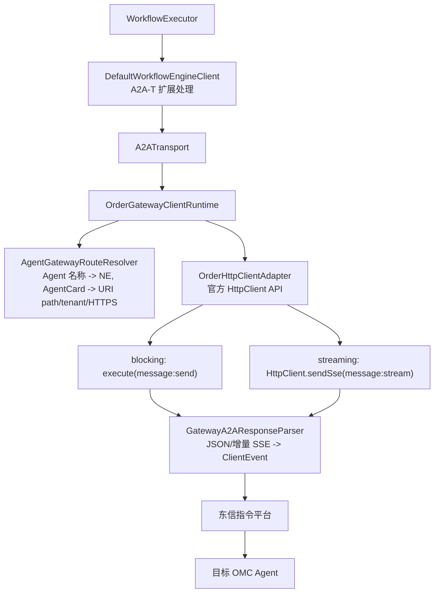

# 东信指令平台转发适配指南

> 适用基线：`dev` 分支，workflow engine `1.0.0`、A2A-T SDK
> `1.1.0`、A2A Java SDK `1.2.0.Final`、东信 `order-shaded-client:1.1.18`。本文只描述当前版本，
> 不包含旧 A2A-T SDK 或旧 Order 适配接口。

## 集成方拿到代码后的最短路径

1. 按 [开发者指南](DEVELOPER_GUIDE.md)使用 Maven Central 的 `1.1.0` 制品，并从企业制品库或供应商取得
   `order-shaded-client:1.1.18`。
2. 先以 `A2A_TRANSPORT_MODE=direct` 跑通工作台到两个 OMC 的 Task-T、条件 Negotiation-T、一次性 Authorization-T 和独立
   Notification-T 长连接。
3. 再配置真实东信 host/port/账号和 Agent→NE 映射，改为
   `A2A_TRANSPORT_MODE=order`；不要改变业务 `ControlPoint`、AgentCard 或 A2A-T metadata。
4. 用内置 Order 协议模拟器完成离线 E2E 后，再按本文 L-01～L-17 在现场平台取证。
5. 生产工程不要依赖 `samples` jar；把 `gateway` 包作为东信专用适配模块迁入工作台工程， 通用执行引擎依赖仍保持
   vendor-neutral。

工作台至少需要向东信平台管理员确认：平台地址、登录账号、可选 clientId/clientSecret、 两个地市 NE 名称、租户/base
path、请求头透传策略、SSE 心跳/超时、TLS 和并发会话限制。 缺少这些部署数据时，执行引擎无法从 AgentCard 自动推导生产 NE。

## 运行链路

`SpringSpnDemo` 的工作台出站消息默认通过东信 Order SDK 转发，不再默认直连 OMC：



指令平台只负责通道建立和透明转发。Task-T、Negotiation-T、Authorization-T、Notification-T 扩展仍由工作台、执行引擎和 OMC
在协议端点处理，扩展 metadata 和请求头随 A2A 请求一起发送。工作流任务使用 Task-T；当 OMC 以携带有效 Negotiation-T Propose 的
`INPUT_REQUIRED` 响应时，引擎在同一逻辑任务中进入协商续发。当前实现不使用已废弃的 `startNegotiation` 等状态机接口。

## 设计边界

- `ClientRuntimeFactory`：根据配置创建 `order`、`mock` 或 `direct` runtime，Spring 执行器不依赖具体适配器。
- `ConfiguredAgentGatewayRouteResolver`：负责 Agent 到 NE 的映射，未配置路由时立即报错，不会误发到其他 OMC。
- `OrderGatewayClientRuntime`：只负责编排 SDK 会话和转发，不承载工作流状态。
- `GatewayA2AResponseParser`：无共享状态，每次请求独立解析，避免并发任务串 task/context。
- `OrderHttpClientAdapter`：隔离 Order SDK 1.1.18 的版本化类型，业务请求调用公开的 `HttpClient`/`sendSse` API；不直接访问内部
  `HttpSessionService`。由于 1.1.18 存在已确认的 `ByteBuf` 所有权缺陷，创建客户端时还会安装
  `EastcomOrder118ByteBufWorkaround`；该兼容层只负责释放供应商桥接器已消费但未释放的请求缓冲区。
- 适配器实例按 `contextId + NE + channel` 隔离并串行访问。1.1.18 JAR 的 `HttpClient` 确实公开静态
  `login(serverInfo, config)`，但 v1.8 文档的 HTTP 接入章节并未要求调用它，而是以 `HttpClient.create(serverInfo, config)`
  直接获取设备 Token 和调用设备接口。当前实现遵循该 HTTP 章节；这里的 `SESSION_OPEN/REUSE/CLOSE` 仅表示执行引擎的逻辑
  conversation 资源，不等同于 `OrdersClientImpl.login/logout` 会话。
- `WorkbenchExtensionLifecycle`：拥有工作台级流程外操作。Authorization-T 每个目标 Agent 执行一次，收到响应后立即释放请求会话；Notification-T
  使用独立 transport 持续保持，在收到预期 `recovery-result`、显式取消订阅或工作台进程关闭时释放。二者在 Demo
  中虽然先于主工作流尝试，但结果互不依赖，失败也不会阻止后续 Task-T 工作流。

## 配置

复制根目录 `.env.example` 为 `.env`，至少填写：

```dotenv
A2A_TRANSPORT_MODE=order
# 真实 Order 使用外部 OMC，不在工作台机器绑定 OMC AgentCard 地址
A2A_EMBEDDED_OMC_ENABLED=false
# 逗号或分号分隔；支持 classpath:、file: URI 和绝对路径。显式配置加载失败时启动即报错
A2A_AGENT_CARD_LOCATIONS=file:E:/config/spn_city1.json,file:E:/config/spn_city2.json
# 生产必须校验证书；自签 CA 应导入 JVM truststore，不能长期关闭校验
A2A_SSL_VERIFY=true

EASTCOM_ORDER_HOST=10.x.x.x
EASTCOM_ORDER_PORT=12345
EASTCOM_ORDER_USERNAME=your-username
EASTCOM_ORDER_PASSWORD=your-password
EASTCOM_ORDER_CLIENT_ID=your-client-id
EASTCOM_ORDER_CLIENT_SECRET=

# 可配置每个 Agent 的 NE；名称必须与 AgentCard.name 完全一致
EASTCOM_ORDER_CITY1_NE=city1-omc
EASTCOM_ORDER_CITY2_NE=city2-omc

# 可选：没有精确路由时使用的兜底 NE
EASTCOM_ORDER_DEFAULT_NE=
EASTCOM_ORDER_LOGIN_TIMEOUT_SECONDS=15
EASTCOM_ORDER_TIMEOUT_SECONDS=600

# 经指令平台调用 OMC 登录接口；登录地址/账号/密码来自 credential Profile
EASTCOM_ORDER_OMC_AUTH_ENABLED=true
# 仅 Demo 内置 EastcomAuthProvider 使用；宿主注入自定义 Provider 时不读取
EASTCOM_ORDER_OMC_CREDENTIALS_PATH=classpath:spn_agent_credentials.json
# 以下是 Profile 未配置对应字段时的兜底值
EASTCOM_ORDER_OMC_LOGIN_PATH=/rest/plat/smapp/v1/oauth/token
EASTCOM_ORDER_OMC_LOGIN_METHOD=PUT
EASTCOM_ORDER_OMC_TOKEN_RESPONSE_HEADER=accessSession
EASTCOM_ORDER_OMC_REQUEST_AUTH_HEADER=Authorization
EASTCOM_ORDER_OMC_REQUEST_AUTH_SCHEME=Bearer
EASTCOM_ORDER_OMC_TOKEN_TTL_SECONDS=3600
EASTCOM_ORDER_OMC_USERNAME_FIELD=userName
EASTCOM_ORDER_OMC_PASSWORD_FIELD=value
```

Spring 启动前会加载项目向上查找到的 `.env`，但操作系统环境变量和 JVM system property 优先，不会被 `.env` 覆盖。Order 模式缺少
host、port、用户名、密码、clientId 或所有 NE 配置时会启动失败并给出明确配置项。

这些值分为两类：SDK 能确定字段及协议结构，但不能从客户端反推出生产平台部署数据。真实的 host、port、账号、clientId/clientSecret
和 NE 名称必须由东信平台管理员提供；本地模拟时则可由双方自行约定。

## 启动方式

直连基线（不启动、不经过东信模拟器）：

```powershell
$env:A2A_TRANSPORT_MODE = 'direct'
$env:EASTCOM_ORDER_SIMULATOR_ENABLED = 'false'
mvn -B -pl samples -am -DskipTests install
mvn -B -f samples/pom.xml spring-boot:run `
  "-Dspring-boot.run.main-class=dev.openan.workflow.engine.examples.demo.SpringSpnDemo" `
  "-Dspring-boot.run.arguments=--a2a.transport-mode=direct"
```

真实东信平台（默认；先在 reactor 根目录安装模块，再运行 samples）：

```powershell
mvn -B -pl samples -am -DskipTests install
mvn -B -f samples/pom.xml spring-boot:run `
  "-Dspring-boot.run.main-class=dev.openan.workflow.engine.examples.demo.SpringSpnDemo" `
  "-Dspring-boot.run.arguments=--a2a.transport-mode=order --a2a.embedded-omc-enabled=false"
```

真实 Order 模式不会启动本地 `JdkHttpA2AServer`，因此 AgentCard 可以来自注册中心并声明 真实 OMC
接口地址，不会再尝试把远端地址绑定到工作台主机。直连本地演示和 Order 模拟器 默认启动内嵌 OMC；也可通过
`A2A_EMBEDDED_OMC_ENABLED` 显式控制。下游卡片的 `name`
必须与工作流节点及 `EASTCOM_ORDER_CITY1_NE`/`CITY2_NE` 所对应的 Agent 名称一致。

没有真实平台时，优先使用协议级模拟：

```dotenv
A2A_TRANSPORT_MODE=order
EASTCOM_ORDER_SIMULATOR_ENABLED=true
EASTCOM_ORDER_HOST=127.0.0.1
EASTCOM_ORDER_PORT=26401
EASTCOM_ORDER_USERNAME=sim-user
EASTCOM_ORDER_PASSWORD=sim-password
EASTCOM_ORDER_CLIENT_ID=sim-client
EASTCOM_ORDER_CLIENT_SECRET=sim-secret
EASTCOM_ORDER_CITY1_NE=sim-city1
EASTCOM_ORDER_CITY2_NE=sim-city2
# 默认转发到内置 OMC
EASTCOM_ORDER_SIMULATOR_CITY1_TARGET_URL=https://127.0.0.1:26335
EASTCOM_ORDER_SIMULATOR_CITY2_TARGET_URL=https://127.0.0.1:26336
EASTCOM_ORDER_SIMULATOR_CONNECT_TIMEOUT_SECONDS=30
EASTCOM_ORDER_SIMULATOR_READ_TIMEOUT_SECONDS=30
```

`CONNECT_TIMEOUT` 控制模拟器到 OMC 的建连等待；`READ_TIMEOUT` 控制首个 HTTP 响应头等待。 SSE 建立后内部使用不超过 1
秒的取消轮询，空闲 Notification-T 不会因轮询超时而断开。

若要只验证“东信 SDK 适配器 → 真实 OMC”，可继续启用模拟器，但关闭内置 OMC，并把目标 改成真实 OMC 的 A2A 服务基址：

```dotenv
A2A_EMBEDDED_OMC_ENABLED=false
EASTCOM_ORDER_SIMULATOR_CITY1_TARGET_URL=https://omc.example:port
EASTCOM_ORDER_SIMULATOR_CITY2_TARGET_URL=https://omc.example:port
```

模拟 NE 的 OMC 登录凭据可单独配置，不必修改 Java：

```dotenv
EASTCOM_ORDER_SIMULATOR_CITY1_USERNAME=your-city1-omc-user
EASTCOM_ORDER_SIMULATOR_CITY1_PASSWORD=your-city1-omc-password
EASTCOM_ORDER_SIMULATOR_CITY2_USERNAME=your-city2-omc-user
EASTCOM_ORDER_SIMULATOR_CITY2_PASSWORD=your-city2-omc-password
```

这些值只在模拟器启用时读取，默认仍是内嵌演示 OMC 的公开测试凭据。 密码支持现有的 `enc:` 密文格式，解密使用 `A2AT_CRED_KEY`
。真实值只放本地 .env， 不要修改公共 YAML/Java 默认值。`EASTCOM_ORDER_USERNAME/PASSWORD` 是模拟平台登录凭据， 不参与 OMC
用户名、密码替换。

要使用模拟 NE 凭据，外部 credential Profile 的 `request_fields` 应使用
`${ne:username}` / `${ne:password}` 占位符（或省略 `request_fields`，使用现有 OMC 登录字段兜底）。 若 Profile 已填写具体 OMC
用户名/密码，仍按 Profile 发出，不会被模拟 NE 配置覆盖。 资源查询与 JSON 占位符替换使用同一份 NE 配置；包含引号、反斜杠的替换值按
JSON 转义。 请求中的 SDK `deviceName` 决定目标与凭据，不通过共享“上次加载的 NE”推断；未知 NE 拒绝转发。 同一 NE
重复配置不同地址或不同凭据会在启动时失败；不同 NE 可以共用目标地址并使用不同凭据。

启动防误配校验同时适用于 SpringSpnDemo 和独立 Spring 应用中的模拟平台： 模拟器开启时 `EASTCOM_ORDER_HOST`
必须是本机可绑定地址，不能填远端平台地址； 连接真实平台应关闭模拟器。Demo 启用内嵌 OMC 时会校验实际加载的两张卡片，
非本机地址直接提示设置 `A2A_EMBEDDED_OMC_ENABLED=false`，不自动改变运行模式。

两个逻辑地市可以临时指向同一台 OMC；它们仍应使用各自的 Agent 名称和 NE，以验证并发隔离。 这个模式 **绕过真实东信指令平台**
，只能证明执行引擎、东信客户端协议适配和 OMC 接口能够配合， 不能替代真实平台登录、NE 路由、头部透传、限流和长连接稳定性的现场验收。

Windows 可直接运行根目录 `run_order.bat`；它会先安装 reactor 模块，再用上述模拟器配置 启动 `SpringSpnDemo`。如果使用
IDEA，Main class 选择
`dev.openan.workflow.engine.examples.demo.SpringSpnDemo`，Use classpath of module 选择
`workflow-engine-samples`，Program arguments 填 `--a2a.transport-mode=direct` 或 `order`。

当且仅当 `A2A_TRANSPORT_MODE=order` 且 `EASTCOM_ORDER_SIMULATOR_ENABLED=true` 时，Spring 容器才启动并关闭
`EastcomOrderSimulatorServer`，监听 26401；`direct`/`mock` 模式即使环境变量残留也不会启动模拟器。客户端不替换、不覆盖 SDK
1.1.18 jar，业务请求仍使用其公开 `HttpClient` API和 TCP/RSocket-RPC 网络栈；执行引擎只在运行时安装下述缓冲区所有权兼容层。模拟平台按
NE 解析 `EASTCOM_ORDER_SIMULATOR_CITY1_TARGET_URL` / `CITY2_TARGET_URL` 并转发 blocking 或 SSE 请求；默认值才是本地
26335、26336。目标必须是绝对 HTTP (S) URL，非法配置在启动时失败。该模式可验证客户端与当前 SDK 版本的线协议兼容性；生产环境必须将
`EASTCOM_ORDER_SIMULATOR_ENABLED` 设为 `false`。

SDK 1.1.18 在 Windows/JDK 17 下可能按 JVM 默认字符集把 `String` 请求体编码后传入内部 RPC；若服务端一律按 UTF-8 解码，中文
A2A-T metadata 会损坏。协议模拟器先用严格 UTF-8 解码，只有字节序列不是合法 UTF-8 时才回退 GB18030，并记录
`REQUEST_ENCODING_FALLBACK`。此兼容只用于本地验证；生产指令平台必须按 `Content-Type` 使用 UTF-8 或透明转发原始字节，不能依赖回退。

### A2A 错误与任务失败

任务创建前，指令平台必须保留 OMC 返回的非 2xx 状态、`application/a2a+json` 正文及相关响应头。
适配器解析标准顶层 `google.rpc.Status` 信封并投影为 `RemoteA2AErrorException`。供应商回调状态为 `0` 时，
使用信封中的 `error.code`；两者都存在时，以实际观察到的 HTTP 状态为准。非标准的非 2xx 响应回退为
`a2a.http.<status>`。这类错误不会转换为任务事件、协商 Propose 或自动重试。
详见[A2A 错误与任务失败](INTEGRATION_GUIDE.md#14-a2a-错误与任务失败)。

流式请求返回非 2xx 时，适配器先记录响应头，收集供应商 SDK 的全部正文回调，待调用结束后再对完整错误正文解析一次。
这是因为一次 JSON 错误信封可能被拆到多个回调中。HTTP 2xx 的 SSE 响应仍保持逐帧增量处理，不等待连接结束才上报事件。

任务创建成功后，HTTP 200 携带的 `TASK_STATE_FAILED` 仍是普通 A2A 任务结果。适配器保留其状态消息、
metadata 和 artifact，不把扩展协议中的业务内容误判为协议错误。

失败后应区分“调用方已收到错误”和“平台到 OMC 的连接已释放”。当前 SDK 1.1.18 的
`ReactorNettyBridgeHandler.channelInactive` 在本地连接关闭时完成请求流； 模拟平台据此停止本次转发，记录
`FORWARD_CANCEL_REQUESTED` / `FORWARD_CANCELLED`， 不关闭其他 NE 请求或独立 Notification-T 订阅，也不把错误改写成成功终态。
持续心跳回归已验证直连和模拟平台路径在错误后断开对应 OMC 连接，且不重复提交。 真实平台是否消费相同关闭信号、是否停止后台诊断，需要按
L-09 现场验证； 本地调用失败或 `STREAM_EXIT` 不能作为生产 OMC 已释放任务配额的证明。

### SDK 1.1.18 请求缓冲区泄漏兼容

`order-shaded-client:1.1.18` 的 `WrapperHttpClient` 使用
`PooledByteBufAllocator.DEFAULT.buffer()` 创建请求体，随后
`ReactorNettyBridgeHandler.write(...)` 将该缓冲区同步复制到 RPC protobuf 并吞掉这次 Netty write，但没有调用 `release()`
。因此日志会出现：

```text
ResourceLeakDetector - LEAK: ByteBuf.release() was not called
Created at: WrapperHttpClient.lambda$null$9(WrapperHttpClient.java:164)
```

这是供应商 SDK 的资源所有权缺陷，不是 A2A-T 报文解析失败；当前请求通常仍会继续， 但长稳运行会积累池化直接内存。
`EastcomOrder118ByteBufWorkaround` 在供应商 bridge 的 出站前一跳安装可共享 handler：先让 bridge 同步复制消息，再在
`finally` 中通过
`ReferenceCountUtil.safeRelease(msg)` 归还原始缓冲区。兼容层有以下边界：

1. 不修改或覆盖原始 1.1.18 jar，也不关闭 Netty 泄漏检测；
2. 只对供应商 bridge 已消费的出站消息负责，不释放响应缓冲区；
3. 若升级后的 SDK 不再包含预期 bridge，启动请求会失败并提示复核兼容层，避免静默双重释放；
4. 东信发布正式修复版本后，应升级依赖、删除兼容层，并用 `paranoid` 泄漏检测重跑 Order 端到端及长稳压测。

若配置仍指向 `127.0.0.1:26401` 却关闭 simulator，应用会在启动阶段直接报告配置冲突，不再等到发送时才出现
`Service unavailable URL{host='127.0.0.1', port=26401}`。还需注意 IDEA Run Configuration 或操作系统环境变量优先于 `.env`
；若启动日志没有 `[EastcomSimulator] READY`，应检查是否存在同名环境变量覆盖。

保留的 adapter-level mock 模式可用于快速单元回归：

```bash
mvn -pl samples spring-boot:run \
  -Dspring-boot.run.main-class=dev.openan.workflow.engine.examples.demo.SpringSpnDemo \
  -Dspring-boot.run.arguments=--a2a.transport-mode=mock
```

mock 模式仍然以 `OrderGatewayClientRuntime` 作为实际运行时，不会绕过生产适配器。它只把无法在本地启动的东信 `HttpClient`
调用替换为实现同一内部 `OrderSession` 端口的 `MockOrderHttpSessionClient`，请求仍使用供应商 `OrderHttpSessionStrRequest`
，响应转换成内部 `OrderResponse(status, body, multiValueHeaders, representation)`，避免供应商 protobuf 单值 Map
丢失重复响应头。AgentCard 能力判断、Agent→NE 路由、URI/tenant 生成、streaming 增量解析、终态识别、超时及逻辑资源释放均执行生产代码。

本地模拟路由为：

| Agent                    | 模拟 NE         | 模拟目标                  |
|--------------------------|-----------------|---------------------------|
| `SPN Domain Agent City1` | `mock-ne-city1` | `https://127.0.0.1:26335` |
| `SPN Domain Agent City2` | `mock-ne-city2` | `https://127.0.0.1:26336` |

HTTP mock 会校验 POST 方法、目标白名单、`Content-Type`、`Accept`、`A2A-Version` 和 A2A `SendMessageRequest` JSON，校验通过后打印
`[MockGateway] VALIDATION_PASSED`。它用于快速验证 SDK 适配层，不覆盖 RSocket 网络实现；需要验证完整本地 SDK 链路时使用上述协议级模拟。

如需临时绕过指令平台直连 OMC，可显式使用 `--a2a.transport-mode=direct`；这不是 Demo 默认行为。

## Order SDK 调用语义

### HttpClient API 调用方式

按照东信《联机指令平台接口说明 v1.8》 (2026-08-20) 的 SDK 接入说明，执行引擎的业务调用使用官方承诺的 HttpClient API，不再依赖内部
RSocket-RPC OrderHttpSessionClient；唯一的内部兼容点是上节说明的 1.1.18 `ByteBuf` 所有权修复：

1. `HttpClient.create(serverInfo, config)`：创建 HTTP 客户端。`serverInfo`
   携带平台连接凭据（host、port、username、password、clientId、clientSecret）；`config` 通过
   `HttpRequestConfig.builder().deviceName(ne).build()` 指定目标 NE。v1.8 的 HTTP 示例就是这一路径；它不同于指令流
   `OrdersClientImpl.login/connectNE/logout`。
2. .responseTimeout(Duration)：设置请求超时。
3. .post().uri(path).header(name, value).body(body).send()：同步 HTTP 请求，返回 HttpResponse（statusCode()、headers
   ()、responseContent().asString()）。
4. .sendSse(SseListener)：SSE 流式调用。SseListener.onHeader(HttpClientResponse) 收到首帧 HTTP 状态码和响应头；onBodyString
   (String) 收到字符串分片。sendSse 在正常情况下等待平台结束 SSE 流，回调异常或取消也可使本次调用退出。
5. HTTPS 是目标 OMC 路由属性，由平台内部处理。不要在客户端 RSocket 连接上调用 `.secure(...)`，否则会把“平台连接 TLS”和“目标设备
   HTTPS”混为一谈。

补充：1.1.18 JAR 还存在静态 `HttpClient.login(serverInfo, config)`，但原始 v1.8 HTTP
章节没有给出该方法的契约或要求。没有东信确认其适用认证配置、返回值及复用边界前，通用适配器不把未成文的 helper 当作必选步骤。OMC
Bearer Token 仍按文档“调用 HTTP 接口获取 Token”的 `create -> method -> uri -> body -> send` 流程获取。

6. HttpClient 无持久会话生命周期，无需 logout。底层 Netty 连接池由 SDK 自行管理。

RPC 路由由 SDK 按接口规范生成。协议级模拟端 (EastcomOrderSimulatorServer) 仍使用供应商 jar 自带的 RpcServer.addService
(HttpSessionService.class, ...) 验证 RSocket 协议兼容性，但生产路径已切换为 HttpClient HTTP 语义。

单次发送按以下顺序执行：

1. 根据 AgentCard.name 解析目标 NE，根据 HTTP+JSON 接口解析 URI path、tenant 和 HTTPS；MessageSendParams.tenant 可覆盖接口默认
   tenant，与原生 A2A REST client 一致。
2. 创建 OrderHttpClientAdapter (serverInfo, ne, https)，内部调用 HttpClient.create(serverInfo, config) 完成平台认证和 NE
   绑定。
3. 将 `MessageSendParams` 序列化为 A2A protobuf JSON，并保留 `ClientCallContext` 请求头。
4. 根据 AgentCard.capabilities.streaming 选择发送方式：
    - `false`：调用 `/message:send`，通过 `httpClient.post().uri().header().body().send()` 获取单个 `SendMessageResponse`。
    - `true`：调用 `/message:stream`，通过 `httpClient.post().uri().header().body().sendSse(listener)` 逐帧消费 SSE 事件。
5. Streaming 模式每收到一个 onBodyString 回调就增量完成 SSE 分帧并立即调用 eventSink，中间状态、Artifact 和最终状态不会等连接结束后才上报。
   非 2xx 响应除外：它的回调内容先聚合为完整错误正文，再按标准 A2A 错误信封解析，不作为 SSE 任务事件上报。
6. 发现 completed/failed/canceled/rejected/input-required/auth-required 终态后完成本轮 A2A 解析，sendSse 继续阻塞直到平台自然结束
   SSE 流，不主动中断。
7. 配置仍使用秒，调用 HttpClient 前转换为毫秒。
8. 普通 Task-T 请求和随后的 Negotiation-T 补充请求虽然是两个 /message:stream 调用，但属于同一逻辑 conversation。HttpClient
   无状态会话，每次请求自包含认证。
9. OrderHttpClientAdapter.close() 为空操作；HttpClient 的底层连接池由 Netty 管理。
10. 标准任务管理沿用同一 Agent→NE 路由与认证：`GET /tasks` 透传状态过滤和分页参数，
    `POST /tasks/{id}:cancel` 取消指定任务。两者使用独立的短生命周期 Order 会话，不复用或关闭工作流、授权、通知通道。
    真实指令平台必须保留查询参数并正确转发 GET/POST；应在依赖该能力规避活跃任务容量限制前完成现场验证。

### OMC Bearer 认证

Order 模式存在两层不同的认证，不能混用：

1. `EASTCOM_ORDER_USERNAME/PASSWORD/CLIENT_ID/CLIENT_SECRET` 是工作台登录东信指令平台的凭据，写入 `ServerInfo`。
2. Demo 默认实现的 OMC 登录地址、用户名、密码和 Token 提取规则来自
   `EASTCOM_ORDER_OMC_CREDENTIALS_PATH` 指向的 credential Profile。`EastcomTokenService` 用同一个东信 `HttpClient` 按
   Agent→NE 转发登录 请求；Profile 中的 `enc:` 密码由 `A2AT_CRED_KEY` 解密。

OMC 登录响应优先从 Profile 的 `order_token_header`（默认 `accessSession`）提取；Header 不存在时 从 `token_field`（默认
`accessSession`）指定的 JSON Body 路径提取。`EastcomAuthProvider.applyAuth(...)`
在每次 A2A-T 发送前按 Agent 获取或刷新 Token，并写入 `Authorization: Bearer <token>`。

`ClientRuntimeFactory` 在 `order` 且 `omc-auth-enabled=true` 时，优先查找宿主提供的、Bean 名为
`workflowOmcAuthProvider` 的 `AuthProvider`。找到后直接使用它，既不创建
`EastcomTokenService`，也不读取 `EASTCOM_ORDER_OMC_CREDENTIALS_PATH`。未提供宿主 Bean 时， Demo 才创建线程安全的
`EastcomTokenService`/`EastcomAuthProvider` 作为兜底。同一个 Provider 被 Task-T、Authorization-T、Notification-T 三套
transport 引用，但这些 transport/runtime/协议通道仍完全独立。 Order 模式只让 Provider 消费 credential Profile，并向引擎传
`credentialsConfigPath=null`； 直连模式只启用内置 Credentials 且 `authProvider=null`，因此不会出现两套 `Authorization` 冲突。

宿主工作台自管认证时只需注册 Bean；Token 的配置、缓存和获取过程完全属于宿主：

```java

@Bean("workflowOmcAuthProvider")
AuthProvider workflowOmcAuthProvider(TokenService tokenService) {
    return (agentName, agentCard, headers) -> {
        String token = tokenService.getOrRefresh(agentName);
        headers.put("Authorization", "Bearer " + token);
    };
}
```

此时不需要配置 `EASTCOM_ORDER_OMC_CREDENTIALS_PATH`。若同时把
`EASTCOM_ORDER_OMC_AUTH_ENABLED` 设为 `false` 又注册上述 Bean，应用会在启动阶段报配置冲突。

登录超时与业务请求超时：`EASTCOM_ORDER_LOGIN_TIMEOUT_SECONDS` 控制 OMC Token 请求的 `responseTimeout`；
`EASTCOM_ORDER_TIMEOUT_SECONDS` 控制 A2A 请求的 `responseTimeout`。可通过
`SESSION_CREATE/SESSION_READY/SESSION_SETUP_FAILED` 日志区分客户端创建和业务阶段。Token 只记录获取、来源和刷新事件，不打印
明文 Header 值；协议日志对认证 Header 强制脱敏。

### Negotiation-T 会话复用

`INPUT_REQUIRED` 是当前 SSE 请求的终止状态，因此工作台补充信息后会新建一个 A2A `/message:stream` 请求；它不是复用原来的物理
SSE 长连接。两次请求使用相同的 `contextId`，且 follow-up Message 携带首轮返回的 `taskId`，属于同一个逻辑会话和同一个 A2A
Task。当前集成不依赖静态 `HttpClient.login` 的复用语义。

执行引擎通过可选的 `ConversationScopedA2AJavaClientRuntime` 生命周期接口把“单次 A2A 请求结束”和“完整发送/协商循环结束”分开：
`OrderGatewayClientRuntime` 按 `contextId + NE + channel` 保存并串行访问逻辑适配器，`DefaultWorkflowEngineClient`
在最终完成或异常退出时关闭 conversation。对当前 `HttpClient.create` 适配器而言 `close()` 是逻辑资源清理钩子；HTTP API
没有实例级 `logout()`。

Notification-T 不属于上述任务 conversation。工作台启动后由 `WorkbenchExtensionLifecycle` 建立独立 transport 和独立
`notification` 会话通道；Task-T 任务通道不能触碰订阅 transport。Notification-T 在收到预期 `recovery-result`
、显式取消订阅或工作台停机时关闭。Authorization-T 虽然与 Notification-T 都是流程外操作，但它是一次性请求，响应完成后立即关闭逻辑
conversation。

独立 Negotiation-T 用例的逻辑日志顺序应为：首轮 `SESSION_OPEN`，补充信息回传时出现 `SESSION_REUSE`，最终出现
`SESSION_CLOSE reason=conversation_complete`。这些日志不代表供应商平台的物理登录次数。如果 `contextId`
为空，适配器无法可靠关联轮次，会降级为单次请求资源并在请求后关闭。

## 需要与东信平台联调确认

执行引擎侧已经按实时 Flux 语义实现。以下行为依赖真实指令平台、网络和 OMC，必须在现场环境确认，并在联调记录中填写实际结果。

| 编号 | 待确认事项                                                                                                         | 当前执行引擎行为                                                                                                                                        | 通过标准                                                                                                          |
|------|--------------------------------------------------------------------------------------------------------------------|---------------------------------------------------------------------------------------------------------------------------------------------------------|-------------------------------------------------------------------------------------------------------------------|
| L-01 | OMC 的每个 SSE chunk 是否被指令平台立即映射为一个或多个 `OrderHttpSessionResponse`，而不是缓存到连接关闭后一次返回 | 逐个消费响应 Flux，并对任意拆分的 SSE/JSON chunk 做增量组帧                                                                                             | WORKING、Artifact 等中间事件在 COMPLETED 之前到达工作台；中间事件延迟符合现场指标                                 |
| L-02 | streaming Flux 首帧和后续帧的 HTTP status、headers、cookies 表达方式                                               | status 为非零值时要求 2xx；暂时允许后续帧 status 为 `0`                                                                                                 | 明确首帧/后续帧字段约定，并用真实报文验证不会误判成功或失败                                                       |
| L-03 | OMC 发送本轮终态后，指令平台是否及时自然结束下游 Flux                                                              | 识别 completed、failed、canceled、rejected、input-required、auth-required 或 `isFinal`；保留事件终态，但等待平台自然完成 Flux，避免取消破坏后续 execute | 终态后 Flux 在约定时间内完成且不再收到业务帧；同一 Order session 能继续发送 Negotiation-T follow-up               |
| L-04 | 长时间无业务消息时的最大空闲时间和心跳格式                                                                         | 空心跳不会产生 `ClientEvent`；总调用受 Order timeout 控制                                                                                               | 心跳不会导致 JSON/SSE 解析失败，连接可以保持到约定的最大空闲时间                                                  |
| L-05 | blocking 模式 `/message:send` 的真实响应结构                                                                       | 按 A2A `SendMessageResponse` 解析 Message 或 Task，并识别标准 A2A 错误                                                                                  | Message、Task、失败三类响应均能正确解析/报错                                                                      |
| L-06 | HTTP+JSON 接口 base path、AgentInterface 默认 tenant 和请求 tenant 覆盖规则                                        | 使用 `MessageSendParams.tenant` 覆盖接口 tenant，并拼接 `/message:stream` 或 `/message:send`                                                            | 默认 tenant、请求覆盖 tenant、空 tenant 三种路径均准确转发到目标 OMC                                              |
| L-07 | A2A 及认证请求头的透传/过滤规则                                                                                    | 发送 `Content-Type`、`Accept`、`A2A-Version` 和 `ClientCallContext` 请求头，不记录敏感值                                                                | OMC 实际收到所需认证及扩展头；指令平台不会错误覆盖或丢弃                                                          |
| L-08 | Order SDK timeout 的起算点、超时异常类型以及超时后的取消传播                                                       | 配置秒数转换为毫秒传入 SDK；异常向工作流层传播并使当前逻辑 conversation 失效                                                                            | 超时发生时间符合配置；Flux、平台连接和 OMC 请求不残留                                                             |
| L-09 | 工作台取消、线程中断或异常时，指令平台是否继续执行上游请求                                                         | 真正的取消/异常会终止当前调用并释放逻辑 conversation；正常 A2A 终态等待平台自然完成 Flux                                                                | 平台和 OMC 能观察到取消/断连，不继续产生不可见的后台任务；正常终态不破坏后续独立请求                              |
| L-10 | 多 Agent、多 NE 并发时的平台会话限制和隔离性                                                                       | 按 `contextId + NE + channel` 隔离 Order 会话；同一键串行使用，不同键可并行                                                                             | 并行请求不串 NE、sessionId、taskId、contextId；Notification-T 不阻塞普通任务；平台连接数没有持续增长              |
| L-11 | 平台错误、OMC 非 2xx、网络断开和半开连接的错误表达                                                                 | 非 2xx、空响应、解析错误和 Flux 异常均使当前发送失败                                                                                                    | 明确可重试/不可重试错误码；错误信息能关联 requestId、Agent、NE，且不泄露凭据                                      |
| L-12 | 单帧大小、总响应大小、字符编码及 SSE 换行格式限制                                                                  | 支持 UTF-8 JSON、`\n\n`/`\r\n\r\n` 分帧和跨 Flux item 拆包                                                                                              | 中文、较大 Artifact、不同换行及边界拆包均无乱码、截断或丢帧                                                       |
| L-13 | TLS、证书链以及平台是否要求双向认证                                                                                | HTTPS 标志按 AgentInterface URL 解析，具体 TLS 连接由 Order SDK 管理                                                                                    | 生产证书校验通过；如要求 mTLS，明确证书配置、轮换和过期告警方式                                                   |
| L-14 | Order SDK 长时间空闲、系统休眠或网络闪断后的底层 RSocket 重连                                                      | 仅通过公开 `HttpClient` 发起下一请求；创建/发送失败分别记录 `SESSION_SETUP_FAILED`/`SEND_FAILED`，不猜测内部代理状态                                    | 空闲超过 180 秒、休眠恢复和平台重启后下一请求成功；确认是否需要供应商升级 SDK 或约定安全的一次重连策略            |
| L-15 | `INPUT_REQUIRED` 后，在相同 `contextId`/`taskId` 上发送独立 Negotiation-T follow-up 是否受平台支持                 | 两次都是自包含的 `/message:stream` 调用，执行引擎串行复用逻辑适配器，但不假设物理会话复用                                                               | 第二次请求能准确路由到同一 OMC/A2A Task，无串单、重复执行或资源残留                                               |
| L-16 | 同一 SDK `HttpClient` 实例的串行复用、关闭及底层连接池生命周期                                                     | 同一 `contextId + NE + channel` 串行调用；`close()` 不调用未公开的 logout；1.1.18 已安装已消费请求缓冲区的释放兼容层                                    | 东信确认线程安全和连接池回收语义并提供正式修复版本；`paranoid` 泄漏检测及长稳压测中线程、连接和直接内存不持续增长 |
| L-17 | Notification-T 因网络闪断或平台重启而异常结束后，重复订阅是否幂等以及是否需要原 subscriptionId                     | 收到预期 `recovery-result` 后正常关流；其他异常断线明确告警，不在未知幂等语义下自动重复下发                                                             | 东信明确重订阅协议、去重键和退避策略后，再启用自动重连；验证不会形成重复订阅或漏通知                              |
| L-18 | `GET /tasks` 分页查询及 `POST /tasks/{id}:cancel` 是否完整转发                                                     | 使用短生命周期认证会话，并保留查询参数和任务路径编码                                                                                                    | 当前身份可见的活跃任务均被查询并取消，且不影响工作流、授权和通知通道                                              |

### 联调执行与取证要求

每次联调用例至少记录以下信息：

1. 用例编号、Agent、NE、streaming 能力、tenant、请求 `requestId`、taskId 和 contextId。
2. OMC 生成每个事件的时间、指令平台收到/转发时间、执行引擎 `STREAM_FRAME` 时间以及工作台 `eventSink` 时间。
3. 每个 Flux item 的序号、status、header 名称、body 字符数和对应的 A2A 事件类型；敏感 header 只记录名称，不记录值。
4. 终态或异常发生后，执行引擎、指令平台和 OMC 三侧的连接关闭时间及 sessionId 释放情况。
5. 实际结果、预期结果、是否通过、问题责任侧和关联日志位置。

联调验收不能只检查最终结果。至少需要覆盖以下场景：

- streaming：WORKING → Artifact（含多 chunk/append）→ COMPLETED。
- streaming：INPUT_REQUIRED/AUTH_REQUIRED、FAILED、CANCELED 和中途断连。
- blocking：返回 Task、返回 Message、业务错误和 HTTP 错误。
- 超时与取消：无心跳超时、有心跳但无业务结果、工作台主动取消。
- 路由与并发：两个 Agent 并行发送到不同 NE，以及默认 tenant/请求 tenant 覆盖。

只有 L-01 能证明“经过东信 SDK 后仍然实时流式”。建议以 `OMC 事件时间 → 平台 Flux 时间 → STREAM_FRAME 时间 → eventSink 时间`
四个时间点计算逐段延迟，并将原始日志随联调结论一起归档。

## 关键日志

将 `PROTOCOL` logger 设为 DEBUG，可查看实际传输边界的观测记录。 HTTP/JSON-RPC 记录 A2A SDK 处理后的实际序列化正文和应用头；
A2A-Version 只在真实请求有该头时出现，不为日志展示补造 Header。 gRPC 记录实际 metadata 和 protobuf 的 JSON 展示，不伪装成
HTTP JSON 报文。 JDK 自动网络头、HTTP/2 帧、TLS 密文及服务端字节不在此观测范围。

dev 中 `ORDER_FORWARD_REQUEST` 表示交给东信 SDK 的请求，
`ORDER_SDK_RESPONSE` 表示 SDK 实际交付的状态、多值响应头和文本。
`sdk-sse-text` 从 SDK 字符串分片组装可见 SSE 帧；原始字节编码及平台到 OMC 的报文不可见， 不能称为 OMC 抓包。`MODEL_PREVIEW`
只是高层预览，默认关闭，不是协议证据。

```properties
logger.protocol.name=PROTOCOL
logger.protocol.level=DEBUG
logger.protocol.additivity=true
WORKFLOW_ENGINE_PROTOCOL_INCLUDE_BODY=true
WORKFLOW_ENGINE_PROTOCOL_MAX_BODY_CHARS=100000
```

DEBUG 开启时正文观测默认开启；敏感部署可显式禁用。JVM 同名属性优先于环境变量。 认证头、Cookie、Token
及识别出的口令字段强制脱敏，不提供关闭脱敏的开关。 这是字段级脱敏，不能自动识别所有个人信息和业务敏感内容，生产应另定日志策略。
缓冲有界：原始收集器按该数值限制字节，输出文本按字符限制； 超限 SSE 帧整帧丢弃至下个分隔符并标记
dropped-capacity，禁用、截断、中断也有明确标记。 UTF-8 分片先组装再解码，日志观察失败不改变报文投递；文件引用不会为打印日志而下载。
requestId 关联单次调用；工作流调用还带 executionId/logicalTaskId/attempt、 agent/contextId/channel，已知远端任务时附
remoteTaskId，均为本地日志字段，不污染协议 metadata。

### 查看真实协商与协议日志

直接运行本地 SpringSpnDemo，默认 City1 缺参并协商、City2 参数完整直接诊断，无需添加 VM 参数。 Negotiation-T 扩展激活本身不强制协商；这是本地
Demo 专门设置的场景，不是引擎默认行为。 要关闭本地缺参演示、让两城市都直接诊断，在 IDEA **VM options** 增加：

```text
-Da2at.samples.negotiation=false
```

默认仅移除 City1 的 Task-T 任务对象；启用状态下增加 `-Da2at.samples.negotiation.city=city2` 或 `both`
可演示 City2 或两城市同时缺参。宿主仍保留各城市的正确输入，原投诉上下文不变。预期链路是 `DEMO_NEGOTIATION` →
`INPUT_REQUIRED / PROPOSE`
→ 工作台 onNegotiation → `ACCEPT` → 两城市完成 → 一次汇总。 非内嵌 OMC 模式默认不注入缺参，显式设置
`-Da2at.samples.negotiation=true` 也会被拒绝。 Demo 将开关传入当前 Spring 应用实例，不设置或修改 JVM 全局开关，不影响其他宿主。
协议日志在控制台及以运行目录为基准的 `logs/spn-demo.log`。 main 支持直连；dev 默认 order，两种模式使用同一业务回调。

离线重复验证（两个命令顺序执行，避免端口冲突）：

```powershell
mvn -q -pl samples -am "-Dtest=SpringSpnDemoE2ETest" "-Dsurefire.failIfNoSpecifiedTests=false" test
# 仅 dev：真实供应商 jar + 本地平台/OMC 模拟器
mvn -q -pl samples -am "-Dtest=SpringSpnDemoOrderE2ETest" "-Dsurefire.failIfNoSpecifiedTests=false" test
```

每个测试类覆盖无 VM 参数的默认单城市协商、显式关闭、显式开启及两城市同时缺参。测试使用离线 LLM provider，但实际运行当前 SDK
的 模板、校验和 HTTP/SSE；不是现网 OMC、平台或真实模型语义的验证。

OrderGateway 的 SEND_START/SEND_DONE、STREAM_FRAME/STREAM_TERMINAL、SESSION_OPEN/SESSION_CLOSE
是操作轨迹，不替代真实正文观测。Notification ACK 超时会失败并关闭，不假定订阅成功；正常业务收到抢通结果即可关闭，不仅限于工作台退出。

协议日志默认以 pretty 形式展示：逐行打印头字段，缩进 JSON 正文。SSE 保留 id/event 等事件信息；JSON 在
`=== SSE data (JSON display; not wire text) ===` 与 `=== End SSE data ===` 之间单独展示，不为展开后的每行 JSON 添加
`data:` 前缀。多个事件各自保留边界。设置 `WORKFLOW_ENGINE_PROTOCOL_PRETTY=false`（环境变量或同名 JVM 属性）可切换到
脱敏、限长后的原始正文展示。pretty 只影响显示，不改实际发送字节、metadata、数值或扩展头，也不是可直接重放的抓包。
协商激活应检查 `A2A-Extensions: .../Negotiation-T/v1`、对应 URI 的 metadata 和 `negotiationContext`；不存在专用的
Negotiation-T HTTP 头。

## 依赖

样例模块直接依赖：

```xml
<dependency>
    <groupId>com.eastcom.apollo</groupId>
    <artifactId>order-shaded-client</artifactId>
    <version>1.1.18</version>
</dependency>
```

如果制品仓未提供该依赖，先把供应商 jar 安装到本地 Maven 仓库：

```bash
mvn install:install-file \
  -Dfile=order-shaded-client-1.1.18.jar \
  -DgroupId=com.eastcom.apollo \
  -DartifactId=order-shaded-client \
  -Dversion=1.1.18 \
  -Dpackaging=jar
```

## 相关代码

| 文件                                                   | 职责                                         |
|--------------------------------------------------------|----------------------------------------------|
| `samples/.../gateway/ClientRuntimeFactory.java`        | Spring runtime 选择和 Order 配置组装         |
| `samples/.../OrderGatewayClientRuntime.java`           | 东信 SDK 转发适配器                          |
| `samples/.../OrderHttpClientAdapter.java`              | 供应商公开 `HttpClient`/`sendSse` API 适配层 |
| `samples/.../ConfiguredAgentGatewayRouteResolver.java` | Agent 到 NE 路由                             |
| `samples/.../GatewayA2AResponseParser.java`            | 阻塞响应及增量 SSE 分帧解析                  |
| `samples/.../server/EastcomOrderSimulatorServer.java`  | SDK 1.1.18 RSocket-RPC 协议模拟平台          |
| `workflow-engine/.../client/A2ATransport.java`         | 统一传输与订阅资源管理                       |
| `workflow-engine/.../core/WorkflowExecutor.java`       | DAG 遍历引擎，含工作流结构校验               |

## 工作流业务回调边界

Order 只改变传输，不改变 onTask/onSelfTask/onRoute/onNegotiation 契约。onTask 返回最终 MessageContent；宿主自行调用 A2A-T
SDK，执行器封装并下发。onNegotiation 返回 Send(content) 或 Stop，保持原任务／context／协商轮次。流式结果保留
ReceivedMessage 的 message/task/artifact metadata、多值内容和顺序， 不能只保留 text
而丢失结构化结果。详见 [业务回调契约](BUSINESS_CALLBACKS.md)。 供应商 SDK 类型仅出现在 dev 适配器，不进入公共 model/control
API。
