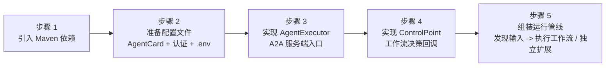
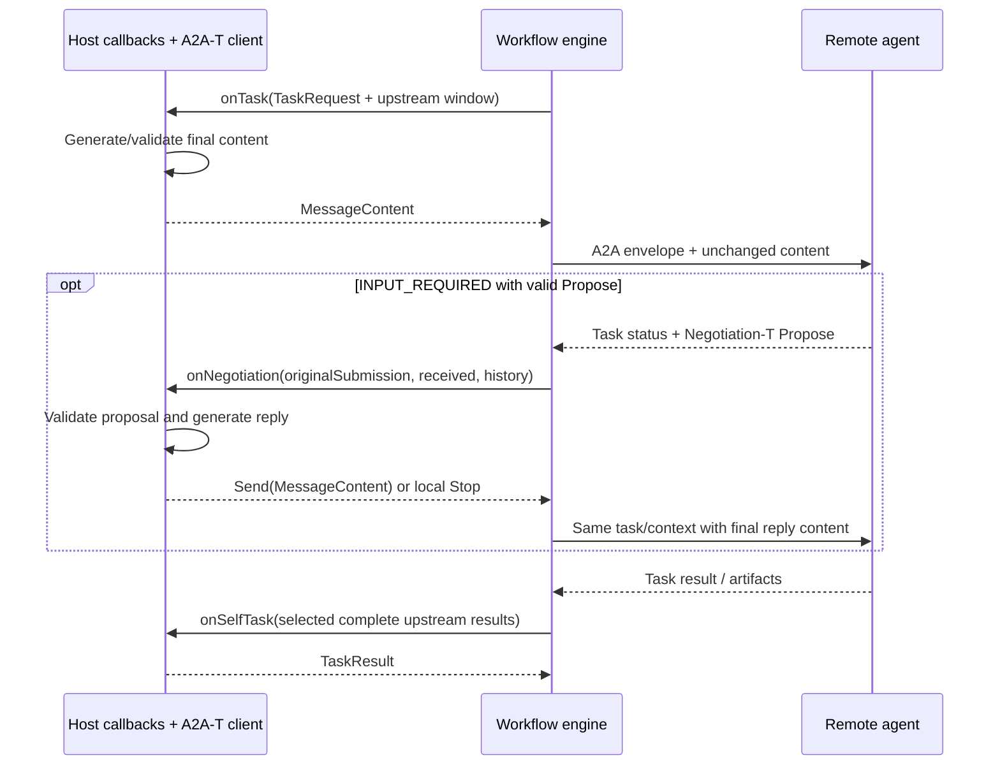
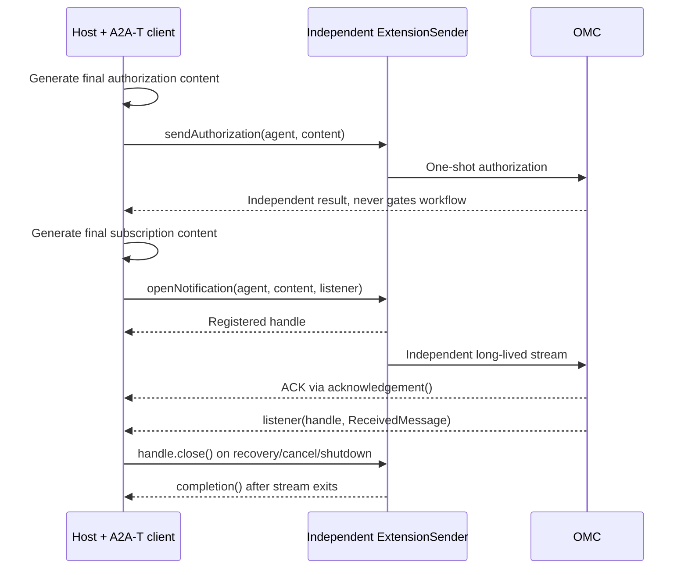

# 工作流执行引擎 SDK 集成方场景接入指南

> 交付基线：workflow engine `1.0.0`，A2A-T SDK
> `1.1.0`（commit `e42c83acce3e5ac2c245d36546ced0fa017b2b58`），
> A2A Java SDK `1.2.0.Final`，东信 Order SDK `1.1.18`。本执行引擎是首发版本，
> 只支持该当前 A2A-T API/资源基线，不提供旧 SDK 状态机接口或旧报文 fallback。

> 集成方团队应先完成本指南的通用接入，再按[东信指令平台转发适配指南](指令平台适配指南.md)
> 配置现网 Order 路径；直连和 Order 只是南向 transport 不同，业务回调及 A2A-T 协议语义相同。

## 0. 交付包与责任边界

仅发送这份 Markdown 不等于完成 SDK 交付。交付方应同时提供以下内容：

| 交付物                                                       | 用途                                                                   | 责任方                                  |
|--------------------------------------------------------------|------------------------------------------------------------------------|-----------------------------------------|
| `workflow-engine:1.0.0`、`spring-boot-starter:1.0.0`         | 通用工作流协议与 Spring A2A 服务端                                     | 执行引擎方                              |
| A2A-T client/server `1.1.0` 制品                             | 当前模板、schema、生成与校验 API；已发布到 Maven Central，无需手工构建 | Maven Central（执行引擎方声明版本基线） |
| `dev` 的 `samples/.../gateway` 适配源码及测试                | 东信 Order 专用转发层；生产应迁入独立适配模块                          | 执行引擎方提供，集成方集成            |
| 集成方自身 `AgentExecutor`、`ControlPoint`、持久化与业务回调 | 接收 WAIMO、任务决策、汇总和结果入库                                   | 集成方                                |
| 真实平台地址、账号、NE、tenant、TLS 和限流参数               | 现网东信通道部署数据                                                   | 东信平台方                              |
| OMC AgentCard、认证要求和四类协议联调用例                    | 目标能力声明与端到端验收                                               | OMC 方/三方联合                         |

`samples` 是可运行参考实现，不是集成方生产依赖。通用能力通过前两个 Maven artifact 接入；东信专用代码只存在 `dev`，应被迁入集成方自己的
adapter 模块，不能复制进通用
`workflow-engine` 核心。若交付方只提供 `main` 制品，则只能得到直连能力，不包含 Order 适配器。

对方完成接入的判定标准不是“项目能编译”，而是本文末尾检查清单全部通过，并分别取得 直连 E2E、Order 协议模拟器 E2E
和真实东信平台现场联调证据。

> 本文中的集成方是宿主智能体。代码示例保留 Workbench* 类名与 AgentCard 标识，便于对应真实源码；这些名称不构成 SDK 的业务绑定。
>
> 面向集成方研发团队。本文档以 SPN 专线故障跨城协同诊断联创场景为例，从集成方视角说明接入 Workflow 执行引擎 SDK 的完整路径。
>
> 业务基线：上游为 WAIMO；集成方接收 Task-T 后加载工作流，并行调度两地市 OMC，
> 两路完成后汇总一次并返回 WAIMO。Authorization-T 和 Notification-T 是集成方在
> 独立时机触发的协议操作，不是工作流 DAG 节点。

---

## 1. 场景全景

### 1.1 业务拓扑

周边系统与 SDK 的可编辑架构图见 [架构设计](DESIGN.md)。

集成方是运行时编排宿主，执行引擎 SDK 嵌入集成方进程，不是独立部署的服务。编排中心负责 PSOP 的存储、检索和加载，注册中心负责
AgentCard 的发布和查询；集成方负责在适当时机获取这些 输入并交给 SDK。它接收 WAIMO 通过 A2A-T 下发的原始诊断任务，并行编排下游多地市
SPN Domain Agent（OMC）执行故障根因诊断，汇总结果后上报。

`SpringSpnDemo` 为便于离线运行，默认从 classpath 加载 AgentCard，并在编排中心不可用时使用本地 PSOP fallback。真实 OMC 联调可用
`A2A_AGENT_CARD_LOCATIONS` 指定逗号或分号分隔的
`classpath:`、`file:` URI 或绝对路径；显式文件缺失或内容无效时启动立即失败。这是样例特例， 生产集成应以注册中心和编排中心为数据源，并自行定义受控的失败策略。

### 1.2 四类 A2A-T 交互

SDK 在该场景中承载四类 A2A-T 交互，对应业务流文档的四个接口:

| 序号 | A2A-T 扩展      | 业务含义          | 发起方                                          | 时机                                 |
|------|-----------------|-------------------|-------------------------------------------------|--------------------------------------|
| 1    | Task-T          | 下发诊断任务      | 集成方 -> OMC                                   | 工作流执行中                         |
| 2    | Negotiation-T   | 参数修正协商      | OMC <-> 集成方                                  | OMC 发现参数缺失时反向发起           |
| 3    | Authorization-T | 抢通白名单授权    | 集成方 -> OMC                                   | 集成方在业务所需时独立触发           |
| 4    | Notification-T  | 抢通结果订阅/上报 | 集成方 -> OMC (订阅) / OMC -> 集成方 (SSE 上报) | 集成方独立建立长连接，收到结果后关闭 |

序号 1、2 在工作流执行过程中发生，由 `WorkflowEngineClient` 承载。序号 3、4 由
`ExtensionSender` 在独立业务时机承载。三类协议使用三个独立的 `A2ATransport`、runtime、 context 和通道：Task-T
使用任务级实例，Authorization-T 一次性实例在 ACK 后释放， Notification-T 使用集成方级长连接实例。

### 1.3 SDK 自动处理 vs 集成方实现

| 引擎承担                        | 集成方承担                            |
|---------------------------------|---------------------------------------|
| DAG、并行、任务关联、信封与传输 | onTask 返回最终 MessageContent        |
| 上游来源选择、完整响应组装      | 根据业务需要映射上下游输入            |
| 协商关联、去重、等待            | SDK 生成／校验回复，返回 Send 或 Stop |
| 认证机制与 Header 注入          | 凭据来源或自定义 AuthProvider         |
| 独立授权发送与订阅生命周期      | SDK 生成授权／订阅内容、处理业务结果  |

A2A-T client/server、模板、schema、LLM 初始化属于宿主； workflow-engine 仅依赖 a2a-t-core，不管理内容生成。

## 2. 集成全景图

集成方集成 SDK 共需完成六步。先总后分，每步后续均有详细说明和代码示例。



职责分布:

| 组件                    | 集成方实现    | SDK 提供        | 说明                                                     |
|-------------------------|---------------|-----------------|----------------------------------------------------------|
| `AgentExecutor`         | 是            | 否              | 集成方的 A2A 服务端入口，接收 上层系统 下发的任务        |
| `ControlPoint`          | 是 (4 个方法) | 接口 + 默认实现 | 工作流决策: 任务下发、自处理、路由、协商                 |
| `AuthProvider`          | 是 (可选)     | 接口            | 自定义认证头注入；同一 Header 与 credentials.json 二选一 |
| `WorkbenchOrchestrator` | 是            | 否              | 组装编排管线的业务类                                     |
| `WorkflowEngineClient`  | 否            | 是              | 工作流发送门面 (Task-T + 协商循环)                       |
| `ExtensionSender`       | 否            | 是              | 独立协议操作门面 (授权 + 订阅)                           |
| `A2ATransport`          | 否            | 是              | 通用传输类 (HTTP + 认证 + SSE)；三类协议分别建立实例     |
| `ExecutePsop`           | 否            | 是              | 高层运行器 (生命周期 + 事件 + 持久化)                    |

---

## 3. 逐步集成

### 步骤 1: 引入 Maven 依赖

集成方项目 `pom.xml` 中添加:

```xml

<dependency>
    <groupId>dev.openan.workflow.sdk</groupId>
    <artifactId>workflow-engine</artifactId>
    <version>1.0.0</version>
</dependency>
```

如果集成方基于 Spring Boot 且需要 SDK 自动装配 A2A 服务端 (AgentCard 加载、REST 控制器、事件总线):

```xml

<dependency>
    <groupId>dev.openan.workflow.sdk</groupId>
    <artifactId>spring-boot-starter</artifactId>
    <version>1.0.0</version>
</dependency>
```

Spring Boot starter 会自动注册 `AgentCard`、`RequestHandler`、`RestHandler`、`A2AController` 等 Bean。集成方只需提供一个
`AgentExecutor` 实现类标注 `@Component` 即可。

`workflow-engine` 仅传递依赖 `a2a-t-core:1.1.0`，不引入内容生成客户端。 集成方若调用生成／校验 API，需显式依赖
`a2a-t-client:1.1.0`／`a2a-t-server:1.1.0`。 A2A-T 1.1.0 已发布到 Maven Central，IDEA Reload Maven 即可解析，不再手工编译安装
SDK。 详见 [A2A-T SDK 依赖说明](A2AT-SDK-DEPENDENCY.md)；东信供应商 jar 的获取方式不变。

### 步骤 2: 准备配置文件

集成需要三类配置文件。

#### 2.1 AgentCard (集成方自身的)

集成方作为 A2A 服务端，需要声明自己的 AgentCard。该文件告知 上层故障系统如何调用集成方:

```json
{
  "name": "Transport Workbench Agent",
  "description": "传输工作台智能体: 接收上层诊断任务，编排多地市 OMC 执行诊断并汇总",
  "version": "1.0.0",
  "capabilities": {
    "streaming": true,
    "extensions": [
      {
        "uri": "https://projects.tmforum.org/a2aproject/telecommunication/extensions/Task-T/v1",
        "required": false
      },
      {
        "uri": "https://projects.tmforum.org/a2aproject/telecommunication/extensions/Negotiation-T/v1",
        "required": false
      },
      {
        "uri": "https://projects.tmforum.org/a2aproject/telecommunication/extensions/Authorization-T/v1",
        "required": false
      },
      {
        "uri": "https://projects.tmforum.org/a2aproject/telecommunication/extensions/Notification-T/v1",
        "required": false
      }
    ]
  },
  "defaultInputModes": [
    "text/plain"
  ],
  "defaultOutputModes": [
    "text/plain"
  ],
  "skills": [
    {
      "id": "cross-city-fault-diagnosis",
      "name": "跨城故障协同诊断",
      "description": "协同多地市 OMC 执行专线故障诊断并汇总结果",
      "tags": [
        "SPN",
        "fault-diagnosis"
      ]
    }
  ],
  "supportedInterfaces": [
    {
      "protocolBinding": "HTTP+JSON",
      "url": "https://工作台地址/a2a/json"
    }
  ]
}
```

下游 SPN Domain Agent 的 AgentCard 由厂商提供或从注册中心获取。集成方只需加载它们用于 SDK 通信。关键信息是 `name` (SDK
中用此名称寻址) 和 `supportedInterfaces.url` (通信地址)。

下游 AgentCard 的安全字段语义:

- `securitySchemes` 表示智能体支持的认证方式，不等于强制要求
- `securityRequirements` 表示当前对接必须满足的认证方式；缺失、`null` 或 `[]` 都表示不启用内置凭证认证
- 即使集成方通过 `AuthProvider` 获取 OMC Token，AgentCard 仍应声明真实的 `bearerAuth`
  `securityRequirements`；运行时实现与能力声明是两个维度
- 如果希望内置 credentials 认证生效，`securityRequirements` 必须非空，并引用 `securitySchemes` 中声明的方案名

由 AuthProvider 实现 Bearer 的下游 AgentCard 安全字段示例:

```json
{
  "securitySchemes": {
    "bearerAuth": {
      "httpAuthSecurityScheme": {
        "scheme": "Bearer"
      }
    }
  },
  "securityRequirements": [
    {
      "schemes": {
        "bearerAuth": {}
      }
    }
  ]
}
```

#### 2.2 认证配置

SDK 提供两种认证执行策略；同一个认证 Header 必须二选一：

| 认证方式            | 适用场景                                                              | 配置方式                   |
|---------------------|-----------------------------------------------------------------------|----------------------------|
| Credentials 认证    | Agent 提供登录接口并使用 Bearer 或自定义认证头                        | 提供 credentials.json 文件 |
| 自定义 AuthProvider | 集成方自管 Token、企业 SSO、非标准认证头，或经东信 SDK 获取 OMC Token | 实现 `AuthProvider` 接口   |

**合并规则:** 同一个认证 Header 只能有一个所有者。直连由内置 Credentials 生成
`Authorization`，Order 由 `EastcomAuthProvider` 生成；只有追加不同名称的 Header 时才能组合。

##### 方式一: Credentials 认证 (credentials.json)

SPN Domain Agent (OMC) 使用 Bearer 认证。SDK 的 `AgentAuthManager`
自动调用登录接口获取令牌并缓存刷新，集成方只需提供凭证文件:

```json
{
  "profiles": {
    "spn-omc-default": {
      "bearerAuth": {
        "login_url": "https://omc地址/rest/plat/smapp/v1/oauth/token",
        "method": "PUT",
        "request_fields": {
          "grantType": "password",
          "userName": "admin",
          "value": "enc:加密后的密码",
          "ipaddr": "*"
        },
        "token_field": "accessSession",
        "order_token_header": "bearToken",
        "token_ttl": 3600
      }
    }
  },
  "agents": {
    "SPN Domain Agent City1": {
      "profile": "spn-omc-default"
    },
    "SPN Domain Agent City2": {
      "profile": "spn-omc-default"
    }
  }
}
```

`agents` 键名必须与 AgentCard 的 `name` 完全一致。相同认证信息只定义一次 Profile；某个 Agent 地址或字段不同时，在绑定中增加
`overrides.bearerAuth`。密码字段 `value` 使用 `enc:`
前缀，`CredentialCrypto` 使用 `A2AT_CRED_KEY` 自动解密。

**密码加密方法:**

加密格式为 `enc:<base64-iv>:<base64-ciphertext>`，算法为 AES-256-GCM。SDK 提供两种加密方式:

**方式一: 命令行工具 (推荐)**

```bash
# 1. 生成 32 字节密钥 (仅首次，妥善保存)
openssl rand -hex 32
# 输出示例: a1b2c3d4e5f6a7b8c9d0e1f2a3b4c5d6e7f8a9b0c1d2e3f4a5b6c7d8e9f0a1b2

# 2. 设置密钥环境变量
set A2AT_CRED_KEY=a1b2c3d4e5f6a7b8c9d0e1f2a3b4c5d6e7f8a9b0c1d2e3f4a5b6c7d8e9f0a1b2

# 3. 加密密码 (输出 enc:... 格式，直接复制到 credentials.json)
java -cp workflow-engine.jar dev.openan.workflow.engine.client.CredentialCrypto "Admin@123"
# 输出: enc:xxxxxxxxxxxx:yyyyyyyyyyyyyyyyyyyyyyyyyyyyyyyyyyyy

# 也可以将密钥作为第二个参数传入
java -cp workflow-engine.jar dev.openan.workflow.engine.client.CredentialCrypto "Admin@123" a1b2c3d4...
```

**方式二: 代码调用**

```java
// 设置密钥后调用
System.setProperty("A2AT_CRED_KEY","a1b2c3d4e5f6...");

String encrypted = CredentialCrypto.encrypt("Admin@123");
// encrypted = "enc:xxxxxxxxxxxx:yyyyyyyyyyyyyyyyyyyyyyyyyyyyyyyyyyyy"
```

将输出的 `enc:...` 值直接填入 credentials.json 的 `value` 字段:

```json
{
  "request_fields": {
    "value": "enc:xxxxxxxxxxxx:yyyyyyyyyyyyyyyyyyyyyyyyyyyyyyyyyyyy"
  }
}
```

运行时 SDK 从 `A2AT_CRED_KEY` 环境变量读取密钥自动解密。密钥来源优先级：显式 credentialEncryptionKey > 操作系统
A2AT_CRED_KEY > 同名 JVM 属性。引擎不自动读取宿主 LLM .env。

凭证配置支持的完整字段:

| 字段                 | 类型   | 默认值             | 说明                                                              |
|----------------------|--------|--------------------|-------------------------------------------------------------------|
| `login_url`          | String | 必填               | 登录接口地址                                                      |
| `method`             | String | `POST`             | HTTP 方法                                                         |
| `content_type`       | String | `application/json` | 请求 Content-Type                                                 |
| `request_fields`     | Map    | -                  | 请求体字段 (替代 legacy 的 username/password)                     |
| `token_field`        | String | `accessSession`    | 从响应 JSON 提取令牌的路径 (支持点号嵌套，如 `data.access_token`) |
| `order_token_header` | String | `bearToken`        | Order 模式优先读取的响应 Header；缺失时回退 `token_field`         |
| `token_ttl`          | int    | 3600               | 令牌缓存有效期 (秒)，到期前 60 秒自动刷新                         |
| `auth_header`        | String | `Authorization`    | 自定义认证头名称 (设置后引擎改用该 Header 注入凭证)               |
| `auth_header_prefix` | String | `Bearer `          | 自定义认证头前缀 (与 `auth_header` 配合使用)                      |

##### 方式二: 自定义 AuthProvider

当认证机制不属于标准 Bearer/API Key，或令牌来自外部身份提供商 (如企业 SSO) 时，实现 `AuthProvider` 接口:

```java
public interface AuthProvider {
    /**
     * 为发送消息注入认证头。
     *
     * @param agentName 目标 Agent 名称 (匹配 AgentCard.name)
     * @param agentCard Agent 卡片 (securitySchemes 可能为空)
     * @param headers   可变的请求头 Map，直接写入认证信息
     */
    void applyAuth(String agentName, AgentCard agentCard, Map<String, String> headers);
}
```

通过 `WorkflowEngineClientConfig` 注册:

```java
WorkflowEngineClientConfig config = WorkflowEngineClientConfig.builder()
        .authProvider((agentName, agentCard, headers) -> {
            // 从企业 SSO 获取令牌
            String token = ssoClient.getToken(agentName);
            headers.put("Authorization", "Bearer " + token);
        })
        .sslVerify(sslVerify)
        .build();
```

`AuthProvider` 在 **每次消息发送时**被调用，无论 AgentCard 是否声明了 `securitySchemes`。典型用途:

- AgentCard 无 `securitySchemes` 但服务端仍要求认证
- 认证机制非 A2A 标准类型 (Bearer、API Key、OAuth2)
- 令牌来自企业统一身份认证平台 (如企业 SSO)
- 需要注入非标准认证头 (如 `X-Custom-Token`、`X-Request-Signature`)

##### 东信转发与 OMC 认证

该场景的责任划分是:

- `AuthProvider`: 如 OMC 仍要求报文级 Token，负责获取并缓存 Token，把认证 Header 写入 `headers`
- `A2AJavaClientRuntime`: 负责把 A2A 请求及 `ClientCallContext` Header 交给东信 SDK 转发
- `AgentCard`: 继续声明 `bearerAuth` 安全要求；运行时只选择一个实现满足该要求

东信平台登录使用 `EASTCOM_ORDER_USERNAME/PASSWORD/CLIENT_ID`（以及可选 clientSecret）， 它与透传给 OMC 的 A2A Header
是两套认证，不能混为一套 Token。

`SpringSpnDemo` 将两种模式的配置入口隔离：直连模式由 `A2A_OMC_CREDENTIALS_PATH` 指定 内置 Credentials 文件；Order Demo 的兜底
Provider 由
`EASTCOM_ORDER_OMC_CREDENTIALS_PATH` 指定凭据文件。两个文件都可使用 `profiles + agents`： 多个 Agent 可以引用同一个
Profile，并用 `overrides` 覆盖少量差异。Order 模式不启用引擎 内置 Credentials 客户端；未注入宿主 Provider 时，才由
`EastcomTokenService` 读取 Order 专属配置，根据 Agent→NE 路由调用
`HttpClient.create(serverInfo, HttpRequestConfig.builder().deviceName(ne).build())` 转发登录请求。

Profile 的 `request_fields` 是实际 OMC 登录字段，`enc:` 值使用 `A2AT_CRED_KEY` 解密；
`login_url` 在直连模式使用完整 URL，在 Order 模式只使用 path/query，实际目标由 NE 决定。 Order 优先读取`order_token_header`
（例如 `bearToken`），不存在时读取 `token_field`
指定的 JSON Body 字段（例如 `accessSession`）。Token 按 Agent+NE 隔离缓存，
`EastcomAuthProvider` 将其注入为 `Authorization: Bearer <token>`。

如果集成方已经实现 Token 获取逻辑，在 Spring 容器中注册指定名称的 Bean：

```java

@Bean("workflowOmcAuthProvider")
AuthProvider workflowOmcAuthProvider(TokenService tokenService) {
    return (agentName, agentCard, headers) -> {
        String token = tokenService.getOrRefresh(agentName);
        headers.put("Authorization", "Bearer " + token);
    };
}
```

`ClientRuntimeFactory` 会优先使用这个 Bean，不会读取
`EASTCOM_ORDER_OMC_CREDENTIALS_PATH`，也不会创建 Demo 的 `EastcomTokenService`。因此宿主可以 自行从数据库、密钥中心、东信
SDK 或统一认证服务获取 Token，引擎不感知其账号和配置结构。 只有没有该 Bean 时才启用 Demo 配置型兜底实现。

协议转发实现可直接参考 `samples` 模块的 `OrderGatewayClientRuntime`：

- `sendMessage(...)` 接收引擎传入的 `ClientCallContext`
- `extractHeaders(...)` 将 `callContext.getHeaders()` 原样复制到东信 SDK 请求
- `OrderHttpClientAdapter` 只使用供应商公开 `HttpClient`/`sendSse` API
- `OrderGatewayClientRuntime` 按 `contextId + NE + channel` 管理逻辑 conversation
- `GatewayA2AResponseParser` 解析阻塞响应和 SSE 帧
- `ConversationScopedA2AJavaClientRuntime` 保证协商 follow-up 复用同一会话
- `ClientRuntimeFactory` 展示如何在 Spring 中根据 `a2a.transport-mode=order` 创建 runtime

生产项目不建议直接依赖 `samples` 模块。应将上述模式复制到集成方工程，或抽成集成方自己的东信适配模块；
`EastcomAuthProviderTest`、`EastcomTokenServiceTest`、`EastcomOrderSimulatorServerTest`、`OrderGatewayClientRuntimeTest` 和
`ClientRuntimeFactoryTest` 可作为迁移时的参考测试与配置结构。

```java
A2AJavaClientRuntime runtime = new OrderGatewayClientRuntime(orderConfig);
A2ATransport taskTransport = new A2ATransport(
        agentCards,
        runtime,
        WorkflowEngineClientConfig.builder()
                .sslVerify(false)
                .authProvider((agentName, card, headers) ->
                        headers.put("Authorization", "Bearer " + tokenClient.getToken(agentName)))
                .build());
```

`sslVerify(false)` 只作用于引擎自身创建的 HTTP/JSON-RPC transport；集成方通过东信 SDK 获取 Token 或转发消息时的 TLS 策略，由该
SDK 客户端自行配置。

如果 Authorization-T、Notification-T 和工作流 Task-T 都需要认证，请把同一无状态或线程安全的
`AuthProvider` 配置到 `authorizationTransport`、`notificationTransport` 和 `taskTransport`
各自的 `WorkflowEngineClientConfig` 中，不要共享 transport/runtime 实例。

##### 两种方式组合使用

如果需要在认证基础上追加不冲突的追踪 Header，可以组合 contributor：

```java
WorkflowEngineClientConfig config = WorkflowEngineClientConfig.builder()
        .credentialsConfigPath(credentialsPath)    // credentials 认证
        .authProvider((agentName, agentCard, headers) -> {
            // 追加企业级追踪头
            headers.put("X-Trace-Id", TraceContext.current().getTraceId());
        })
        .build();
```

`AuthProvider` 与 credentials 只有在负责不同 Header 时才允许组合。直连和 Order 的 OMC Bearer 认证不能同时启用：直连设置
`credentialsConfigPath` 且 `authProvider=null`；Order 设置
`credentialsConfigPath=null`，由 `EastcomAuthProvider` 独占 `Authorization`。如果两个来源生成 不同的同名 Header，引擎会立即抛出
`SecurityException`，不会按顺序覆盖。

#### 2.3 A2A-T SDK 环境 (.env)

A2A-T SDK 的 LLM 配置 (用于 Task-T 提示词生成、场景识别等)。最小配置:

```ini
A2AT_LLM_PROVIDER=openai
A2AT_LLM_MODEL=deepseek-chat
A2AT_LLM_API_KEY=你的API密钥
A2AT_LLM_BASE_URL=https://api.deepseek.com
A2AT_LANGUAGE=zh-CN
```

宿主通过此配置初始化 A2A-T SDK 并生成／校验 Task-T 内容；引擎本身不读取此文件。宿主不会在 SDK 未配置、模板缺失、schema
校验或渲染失败时降级为原始文本；这些情况会明确失败， 避免向 OMC 发送一个看似成功但不符合当前协议的请求。

### 步骤 3: 实现 AgentExecutor

集成方实现 A2A Java AgentExecutor.execute (RequestContext, AgentEmitter) 接收 WAIMO， 并在自己的入口用
A2ATServer.validateTaskPromptAndDataFilling 校验 Task-T。 metadata 中的 Task-T 正文与 templateUri 是内容入口，不用 parts
长短决定读取哪个正文。 然后搜索工作流、获取 AgentCards、调用执行引擎，并通过 A2A emitter 返回 artifact／终态。

可编译的完整实现见 samples 的 SpringWorkbenchExecutor、WorkbenchTaskInputParser、 WorkbenchOrchestrator；Spring starter
只提供协议入口与生命周期，不替宿主决定业务或模板。 入口取消应停止对应本地执行并清理宿主资源；远端已提交任务需按业务策略显式取消。
不要把错误或空结果伪装成成功诊断。

### 步骤 4: 实现 ControlPoint

```java
interface ControlPoint {
    CompletableFuture<MessageContent> onTask(TaskRequest request);

    CompletableFuture<TaskResult> onSelfTask(TaskRequest request);

    CompletableFuture<RouteDecision> onRoute(RouteRequest request);

    CompletableFuture<NegotiationReply> onNegotiation(NegotiationRequest request);
}
```

onTask 返回最终 parts/metadata/extensions，引擎封装发送，不再生成或改写内容。 onSelfTask 返回本地 TaskResult；onRoute
选择允许的候选；onNegotiation 返回 Send 或 Stop。 未实现的回调明确失败，不回显成功、不选首分支、不自动同意。
字段与完整示例见 [业务回调集成契约](BUSINESS_CALLBACKS.md)。

```java
ControlPoint callbacks = ControlPoint.builder()
        .onTask(request -> CompletableFuture.completedFuture(
                MessageContent.text(request.getInstruction())))
        .onSelfTask(request -> CompletableFuture.completedFuture(
                TaskResult.success(List.of(Map.of(
                        "sourceResults", request.getWorkflowInput().upstreamResults())))))
        .onRoute(request -> CompletableFuture.failedFuture(
                new IllegalStateException("Supply a routing policy for " + request.stepName())))
        .onNegotiation(request -> CompletableFuture.completedFuture(
                new NegotiationReply.Stop("manual.required", "Manual confirmation required")))
        .build();
```

生产 Task-T 生成及协商示例见 WorkbenchControlPoint / examples.negotiation.NegotiationStrategy；上述仅是普通 A2A 内容示例。

### 步骤 5: 组装编排管线

```java
WorkflowEngineClientConfig config = WorkflowEngineClientConfig.builder()
        .sslVerify(true)
        .credentialsConfigPath(credentialsPath) // 内置认证；自定义认证时改为 authProvider 并不配置它
        .credentialEncryptionKey(credentialKey) // 宿主密钥；明文配置可不提供
        .maxNegotiationExchanges(3)
        .build();
try(
A2ATransport transport = new A2ATransport(cards, runtime, config)){
WorkflowEngineClient client = new DefaultWorkflowEngineClient(transport);
ExecutionResult result = ExecutePsop.builder()
        .psop(workflow).agentCards(cards).controlPoint(callbacks)
        .engineClient(client).runtimeIntent(intent).execute().join();
}
```

workflow、cards、callbacks、intent 由宿主取得或构造。 runtime 为 null 时使用默认直连实现；dev 的东信 runtime 只替换传输，不替换业务回调。
上面 transport 仅属于这次工作流；授权和通知使用另外的实例。 宿主自己的 A2ATClient 可在回调中复用，但要确保业务状态按
execution/task 隔离。

#### 5.1 独立授权与通知通道详解

```java
// authorizationSender 与 notificationSender 各自使用独立 transport/runtime。
MessageContent authContent = A2atMessages.from(
                sdk.generateAuthPromptFromDataWithSchema(authData, authSchema,
                        StandardTemplates.AUTHORIZATION_POLICY_MANAGEMENT.uri()),
                List.of(new TextPart("新增动网操作授权")));
authorizationSender.

sendAuthorization(agentName, authContent)
    .

whenComplete((result, error) ->

recordIndependentAuthorization(result, error));

MessageContent notificationContent = A2atMessages.from(
        sdk.generateNotificationPromptFromDataWithSchema(notifData, notifSchema,
                StandardTemplates.SERVICE_RECOVERY.uri()),
        List.of(new TextPart("订阅业务抢通事件")));
NotificationSubscription subscription = notificationSender.openNotification(
        agentName, notificationContent, (handle, received) -> {
            if (received.artifacts().stream().anyMatch(a -> "recovery-result".equals(a.name()))) {
                handle.close();
            }
        });
// 将 handle 加入宿主订阅集合；ACK/失败都仅影响这个独立操作。
// 监听器使用传入的 handle，不依赖此时外部 subscription 变量是否赋值。
subscription.

acknowledgement().

whenComplete((ack, error) ->

recordIndependentSubscription(ack, error));
```

sdk、业务数据、schema、recordIndependent* 均由宿主提供，不是引擎隐式服务。 内容生成失败也只记录本次独立操作失败，不能阻止任务
DAG。 close () 幂等请求关闭；completion () 等待真实流退出。工作流完成不能关闭独立订阅。 实际生命周期与异常处理见 samples 的
ExtensionPrePositioner / WorkbenchExtensionLifecycle。

#### 5.2 PSOP 工作流搜索与加载

工作流 (PSOP) 存储在编排中心。SDK 提供搜索和加载方法:

```java
// 语义搜索: 根据原始意图匹配最相关的工作流
List<WorkflowSearchResult> results = LoadPsop.search(orchUrl, messageText, 3, null, sslVerify);
String psopId = results.get(0).getWorkflowId();

// 加载完整工作流定义
Workflow workflow = LoadPsop.load(orchUrl, psopId, null, sslVerify);
```

生产环境应明确编排中心不可用时的业务失败策略，不能默认执行可能过期的本地流程。
`SpringSpnDemo` 为离线演示提供本地 PSOP fallback；接入方只有在完成版本一致性、审计和变更治理后， 才应自行设计受控的本地兜底。

#### 5.3 EventCallback -- 事件追踪

`ExecutePsop` 在执行过程中产出全量事件。集成方可实现 `EventCallback` 追踪执行进度、记录日志、向前端推送:

```java
private EventCallback createLogCallback() {
    return new EventCallback() {
        @Override
        public void onEvent(String type, Map<String, Object> data) {
            switch (type) {
                case EventType.START -> log.info("[开始] 工作流: {}", data.get("workflow"));
                case EventType.STEP_START -> log.info("[步骤开始] {}", data.get("step"));
                case EventType.AGENT_REQUEST -> log.info("[发送] -> {}", data.get("agent"));
                case EventType.AGENT_RESPONSE -> log.info("[接收] <- {}", data.get("agent"));
                case EventType.NEGOTIATION_REQUEST ->
                        log.info("[协商请求] agent={}, 第{}次交互", data.get("agent"), data.get("exchange"));
                case EventType.NEGOTIATION_RESOLVED -> log.info("[协商完成] agent={}", data.get("agent"));
                // 以下事件类型为预留，当前 SDK 版本不会触发
                // (独立操作不进入工作流事件流)
                case EventType.AUTHORIZATION_REQUEST -> log.info("[授权请求] agent={}", data.get("agent"));
                case EventType.NOTIFICATION -> log.info("[通知] agent={}", data.get("agent"));
                case EventType.ROUTE_DECISION -> log.info("[路由] {} -> {}", data.get("step"), data.get("next"));
                case EventType.STEP_COMPLETE -> log.info("[步骤完成] {}", data.get("step"));
                case EventType.COMPLETE -> log.info("[完成]");
                case EventType.ERROR -> log.error("[错误] {}", data.get("error"));
                case EventType.CLOSE -> log.info("[关闭]");
            }
        }
    };
}
```

事件类型完整列表见 SDK 的 `EventType` 常量类。关键事件: `start` -> `step_start` -> `agent_request` / `agent_response` (含
`negotiation_*`) -> `step_complete` -> `complete` / `error` -> `close`。

> **注意:** `authorization_request` 和 `notification` 事件类型在当前 SDK 版本中不会被触发
> (它们是独立操作，不进入工作流事件流)。这些事件类型为未来扩展预留。独立授权/订阅操作通过 `ExtensionSender` 的返回值或
> `NotificationSubscription` 回调获取，不经过工作流事件流。

---

## 4. 完整调用时序





只有远端 `INPUT_REQUIRED` 携带有效 Negotiation-T Propose 才进入 `onNegotiation`。 终态不会重启协商，普通 INPUT_REQUIRED
明确报告不支持的交互。 宿主自行校验、理解 Propose，并用自己的 A2A-T client 生成最终 Accept/Reject/Abort。 通过
`A2atMessages.contextOf(request.received())` 取得收到的上下文； 结束回复保持相同 id、round、maxRounds，最后允许的一轮仍可回答，不自行
nextRound 或返回新 Propose。

返回 `new NegotiationReply.Send(content)` 发送最终内容； 返回 `new NegotiationReply.Stop(code, reason)` 只在本地停止，不生成
Abort。 同一任务／会话／轮次的重复等待事件不会重复回调、重复提交；未变化状态通过 getTask 观察。
`maxNegotiationExchanges` 默认 3，是独立于 SDK context.maxRounds 的本地交互资源预算。 超时、预算耗尽、回调缺失均明确失败，不默认
Accept，也不自动生成 Abort。 Accept/Reject 的 SUBMITTED/WORKING ACK 仍需等待任务结果，不重发原命令。 业务发送 Abort 后，即使远端用
COMPLETED 确认，也不能判为诊断成功。

### 查看真实协商与协议日志

直接运行本地 SpringSpnDemo，默认 City1 缺参并协商、City2 参数完整直接诊断，无需添加 VM 参数。 Negotiation-T 扩展激活本身不强制协商；这是本地
Demo 专门设置的场景，不是引擎默认行为。 要关闭本地缺参演示、让两城市都直接诊断，在 IDEA **VM options** 增加：

```text
-Da2at.samples.negotiation=false
```

默认仅移除 City1 的 Task-T 任务对象；启用状态下增加 `-Da2at.samples.negotiation.city=city2` 或 `both`
可演示 City2 或两城市同时缺参。宿主仍保留各城市的正确输入，原投诉上下文不变。预期链路是 `DEMO_NEGOTIATION` →
`INPUT_REQUIRED / PROPOSE`
→ 集成方 onNegotiation → `ACCEPT` → 两城市完成 → 一次汇总。 非内嵌 OMC 模式默认不注入缺参，显式设置
`-Da2at.samples.negotiation=true` 也会被拒绝。 Demo 将开关传入当前 Spring 应用实例，不设置或修改 JVM 全局开关，不影响其他宿主。
协议日志在控制台及以运行目录为基准的 `logs/spn-demo.log`。 main 支持直连；dev 默认 order，两种模式使用同一业务回调。

离线重复验证（两个命令顺序执行，避免端口冲突）：

```powershell
mvn -q -pl samples -am "-Dtest=SpringSpnDemoE2ETest" "-Dsurefire.failIfNoSpecifiedTests=false" test
# 仅 dev：真实供应商 jar + 本地平台/OMC 模拟器
mvn -q -pl samples -am "-Dtest=SpringSpnDemoOrderE2ETest" "-Dsurefire.failIfNoSpecifiedTests=false" test
```

每个测试类覆盖无 VM 参数的默认单城市协商、显式关闭、显式开启及两城市同时缺参。测试使用离线 LLM provider，但实际运行当前 SDK
的 模板、校验和 HTTP/SSE；不是现网 OMC、平台或真实模型语义的验证。

### Demo 端到端 A2A-T SDK 调用清单

`SpringSpnDemo` 完整业务链路（两地市并行诊断、City1 缺参协商、City2 直接诊断）按业务时序对 A2A-T SDK 的全部调用如下。授权与订阅是独立于工作流
DAG 的操作，使用各自的独立通道 （授权为一次性通道，订阅为长连接通道），与 Task-T 报文无关；Demo 的调用时机是在工作流任务 下发
**之前**先行完成授权与订阅，再启动两地市诊断。样例覆盖全部 8 个 validate 接口和全部 7 个 fromData 生成接口，均为真实调用；fromText
生成系列未在样例中使用（见文末说明）。

| #  | 业务时机                                                                                  | 调用方（角色）   | A2A-T SDK 接口                                                               | 样例实现                        |
|----|-------------------------------------------------------------------------------------------|------------------|------------------------------------------------------------------------------|---------------------------------|
| 1  | WAIMO 下发投诉任务，集成方入口校验 Task-T 并提取任务参数                                  | 集成方（服务端） | `A2ATServer.validateTaskPromptAndDataFilling`                                | `WorkbenchTaskInputParser`      |
| 2  | 集成方生成抢通白名单授权请求，经独立一次性通道发送 OMC（任务下发前）                      | 集成方（客户端） | `A2ATClient.generateAuthPromptFromDataWithSchema`                            | `ExtensionPrePositioner`        |
| 3  | OMC 收到授权报文，校验并按白名单执行，返回 ACK                                            | OMC（服务端）    | `A2ATServer.validateAuthPromptAndDataFilling`                                | `PrePositionedExtensionHandler` |
| 4  | 集成方生成业务抢通事件订阅请求，经独立长连接通道向 OMC 订阅（任务下发前）                 | 集成方（客户端） | `A2ATClient.generateNotificationPromptFromDataWithSchema`                    | `ExtensionPrePositioner`        |
| 5  | OMC 校验订阅报文，建立 SSE 上报；后续抢通结果经该长连接推回集成方                         | OMC（服务端）    | `A2ATServer.validateNotificationPromptAndDataFilling`                        | `PrePositionedExtensionHandler` |
| 6  | 集成方按地市生成并行 Task-T；不依赖独立授权或订阅成功                         | 集成方（客户端） | `A2ATClient.generateTaskPromptFromDataWithSchema`                            | `SpringSpnDemo`                 |
| 7  | OMC 校验 Task-T，提取任务对象/上下文；参数完整则直接诊断（City2）                         | OMC（服务端）    | `A2ATServer.validateTaskPromptAndDataFilling`                                | `NegotiationBaseAgentExecutor`  |
| 8  | OMC 发现必选参数缺失，生成协商 Propose，随 INPUT_REQUIRED 返回（City1）                   | OMC（服务端）    | `A2ATServer.generateNegotiationProposePromptFromData`                        | `NegotiationBaseAgentExecutor`  |
| 9  | 集成方 `onNegotiation` 回调：校验入站 Propose，提取所需补充字段                           | 集成方（客户端） | `A2ATClient.validateProposePromptAndDataFilling`                             | `NegotiationStrategy`           |
| 10 | 集成方从当前地市业务输入补参，生成协商结尾报文（Accept；拒绝/终止对应 Reject/Abort 变体） | 集成方（客户端） | `A2ATClient.generateNegotiationAcceptPromptFromData`（及 Reject/Abort 变体） | `NegotiationStrategy`           |
| 11 | OMC 校验集成方回传的协商结尾报文，提取补参后重新执行诊断                                  | OMC（客户端）    | `A2ATClient.validateAcceptPromptAndDataFilling`（及 Reject/Abort 变体）      | `NegotiationBaseAgentExecutor`  |

两个组装辅助贯穿上述调用（属执行引擎的通用工具，非 SDK 接口）：

- `A2atMessages.from(MetadataContent, parts)`：把 SDK 生成的 `MetadataContent`（模板 URI、扩展 URI、 协商上下文
  metadata）封装为发送用的 `MessageContent`，不生成、不解释业务内容；
- `A2atMessages.contextOf(received)`：从收到的协商报文中取回 `NegotiationContext`，协商结尾回复 保持相同
  id/round/maxRounds（步骤 6）。

说明：

- 全部生成都走 **fromData（结构化输入、确定性渲染）**；`generateTaskPromptFromText` 等 fromText 系列 （自然语言入口，含一步
  LLM 抽取）接口在样例中未使用，接口契约见
  [A2A-T SDK 依赖说明](A2AT-SDK-DEPENDENCY.md)。
- 协商由 **OMC 侧触发**（缺参时返回 INPUT_REQUIRED + Propose），集成方无法选择哪个地市协商； 样例通过删除 City1
  的任务对象字段构造该输入条件，两城市的补参互相隔离。
- 输入内容（任务参数、补参值、授权策略、订阅条件）全部来自样例构造的业务数据（`SpnCasePrompts`）， SDK 接口输出不做任何打桩；运行
  `SpringSpnDemo` 使用真实 LLM 配置。

## 5. 集成方需交付物清单

| 交付物                                     | 类型    | 说明                                                                     |
|--------------------------------------------|---------|--------------------------------------------------------------------------|
| `TransportWorkbenchExecutor`               | Java 类 | 实现 `AgentExecutor`，A2A 服务端入口                                     |
| `WorkbenchControlPoint`                    | Java 类 | 继承 `DefaultControlPoint`，实现 onTask/onSelfTask/onRoute/onNegotiation |
| `WorkbenchOrchestrator`                    | Java 类 | 组装编排管线 (加载卡片 -> 检索工作流 -> 执行)                                |
| `WorkbenchAuthProvider` (可选)             | Java 类 | 实现 `AuthProvider`，自定义认证逻辑 (如企业 SSO)                         |
| `agentcard/transport_workbench_agent.json` | JSON    | 集成方自身的 AgentCard                                                   |
| `spn_agent_credentials.json` (可选)        | JSON    | 下游 OMC 的认证凭证 (使用 Credentials 认证时需要)                        |
| `.env`                                     | INI     | A2A-T SDK 的 LLM 配置                                                    |
| `application.yml` (Spring Boot)            | YAML    | `a2at.server.agent-card` 等配置项                                        |

---

## 6. 生产环境注意事项

### 6.1 TLS 与证书

生产环境 OMC 通常使用自签名证书。`WorkflowEngineClientConfig` 中:

- `sslVerify(true)`: 校验证书 (需配置 CA 信任库 `caCertsPath`)
- `sslVerify(false)`: 仅跳过证书链校验，主机名校验仍启用；只用于受控的本地诊断 （HTTP/JSON-RPC 会继续加载 mTLS 客户端证书；默认
  gRPC 使用 plaintext，不能同时配置 mTLS/CRL）

```java
WorkflowEngineClientConfig.builder()
        .

sslVerify(true)
        .

caCertsPath("/path/to/ca-certs.pem")
// OMC 要求双向 TLS 时配置：
        .

clientCertPath("/path/to/client-cert.pem")
        .

clientKeyPath("/path/to/client-key.pem")
        .

credentialsConfigPath(credentialsPath)
        .

build()
```

### 6.2 凭证加密与自定义认证

**Credentials 认证:** `spn_agent_credentials.json` 中的密码字段使用 `enc:` 前缀标识加密内容。SDK 的 `CredentialCrypto` 使用
AES-GCM 对称加密自动解密。加密密钥通过环境变量 `A2AT_CRED_KEY` 注入 (32 字节 hex)。生产环境不应明文存储密码。

**自定义 AuthProvider:** 如果集成方已有统一的认证体系 (如企业 SSO、OAuth2 网关)，可直接实现 `AuthProvider` 接口，无需维护
credentials.json 文件。`AuthProvider` 在每次消息发送时调用，适合令牌生命周期由外部管理的场景:

```java
public class SsoAuthProvider implements AuthProvider {
    private final SsoClient ssoClient;

    @Override
    public void applyAuth(String agentName, AgentCard agentCard, Map<String, String> headers) {
        String token = ssoClient.getAccessToken(agentName);
        headers.put("Authorization", "Bearer " + token);
    }
}
```

### 6.3 协商轮次限制

WorkflowEngineClientConfig.builder ().maxNegotiationExchanges (3) 配置本地交互预算， 与收到的 SDK context.maxRounds
分开。耗尽／超时只本地失败，不自动生成 Abort。 结束回复保留收到的 id/round/maxRounds，最后一轮仍可回答。

### 6.4 SSE 长连接管理

`openNotification` 建立的 SSE 订阅通道是长连接。集成方必须保留
`NotificationSubscription`，区分 `acknowledgement()` 与真实业务通知；收到期望的
`recovery-result` 后调用句柄的幂等 `close()`。显式取消或服务关闭时也要关闭。
`ExecutePsop` 只关闭它内部创建的 owning client；外部注入的 Task-T client 由调用方关闭， 两者都不得影响 Notification-T 长连接。

### 6.5 并发与并行

SDK 的 `WorkflowExecutor` 按 DAG 已激活前驱的完成情况调度就绪步骤；无依赖关系的就绪步骤及步骤内子任务可并行执行。如果
OMC 有并发限制，通过 DAG 依赖边或宿主限流控制；layer 不是执行顺序约束。

### 6.6 错误处理

引擎处理远端协议状态和结果解包；onTask 只返回 MessageContent。onSelfTask 返回 TaskResult，失败原因与 outputs 分离。异常和失败
future 由引擎记录；不要把未发送成功包装成成功输出。详见 [业务回调契约](BUSINESS_CALLBACKS.md)。

### 6.7 东信 Order 模式: 并发 NE 断连/超时排查

> **这是联调中最容易踩坑的问题，务必在改造前阅读。**

#### 问题现象

Order 模式下同时向两个不同地市 OMC 发送 Task-T 诊断任务（或前置阶段给 City1 发完 Notification-T 后给 City2 发
Authorization-T），其中一个城市的请求报 `Timeout on blocking read for 10000000000 NANOSECONDS`，堆栈指向
`WrapperHttpClient.loadNeResource`。

根因有两个，两者叠加才会复现：

#### 根因一: 东信 SDK 共享 RSocket 连接

东信 SDK 的 `ServiceReference` 类内部有一个 `static final Map INVOKERS`，按 `className + host + port` 缓存 RSocket
连接。所有发往同一东信平台地址（同一 host:port）的请求，无论 NE 是 `sim-city1` 还是 `sim-city2`，都共用同一条 RSocket 连接。

SDK 的 `WrapperHttpClient.loadNeResource()` 通过 `Mono.block(Duration.ofSeconds(10))` 同步阻塞等待 RSocket 响应。这个 10
秒超时是 SDK 硬编码的，无法通过配置修改。

#### 根因二: 模拟器阻塞 I/O 卡住 RSocket 事件循环

`EastcomOrderSimulatorServer` 的 `execute` 方法（处理 RSocket `requestChannel`）在收到 HTTP 请求后，调用 `forwardParsed` 通过
`HttpURLConnection` 转发给 OMC。`forwardParsed` 内部的 `reader.read()` 是阻塞 I/O。

当 City1 的 Notification-T 是长连接（等待 OMC 上报抢通结果），`reader.read()` 会一直阻塞。如果这个阻塞发生在 RSocket 事件循环线程（
`reactor-tcp-nio-*`）上，该线程被占死，无法处理同一 RSocket 连接上 City2 的 `loadNeResource` 请求（RSocket `requestResponse`
），10 秒后 City2 超时。

#### 时序示例

```
T0  City1 Notification-T: loadNeResource → simulator 设置 lastResolvedTarget=city1_url
T1  City1 Notification-T: execute → forwardParsed → reader.read() 阻塞（长连接等待）
    → 阻塞在 reactor-tcp-nio-4 线程上
T2  City2 Authorization-T: loadNeResource → 发送到同一 RSocket 连接
    → reactor-tcp-nio-4 被阻塞，无法处理
T3  10s 后: City2 loadNeResource 超时 (Mono.block 10s timeout)
```

#### 解决方案

**修复一: 将转发 I/O 移出 RSocket 事件循环线程**

在模拟器的 `execute` 方法中，给 `forwardParsed` 调用加 `.subscribeOn(Schedulers.boundedElastic())`，把阻塞 I/O 从
`reactor-tcp-nio-*` 线程移到 `boundedElastic-*` 工作线程。RSocket 事件循环线程释放后，能正常处理其他 NE 的`loadNeResource`
请求。

```java
// EastcomOrderSimulatorServer.execute() 中:
forwardParsed(httpMethod, httpPath, parsedHeaders, body, forwardUrl, streaming)
        .

subscribeOn(Schedulers.boundedElastic())  // 关键: 移出事件循环线程
        .

subscribe(sink::next, sink::error, () ->sink.

complete());
```

**修复二: 用 HTTP Host 头替代共享 lastResolvedTarget 字段**

原模拟器用 `volatile String lastResolvedTarget` 字段在 `loadNeResource` 时设置目标 URL，`execute` 时读取。当两个 NE 并发调用
`loadNeResource`，后一个会覆盖前一个的目标，导致请求转发到错误的 OMC。

东信 SDK 的 `WrapperHttpClient.configureHeaderHost()` 会把 HTTP `Host` 头设为 `loadNeResource` 返回的完整 `neUrl`（如
`https://127.0.0.1:26335`）。每个请求自带目标地址，不再依赖共享字段:

```java
// EastcomOrderSimulatorServer.execute() 中，解析 HTTP 头后:
String hostHeader = findHeader(parsedHeaders, "Host");
String targetBase;
if(hostHeader !=null
        &&(hostHeader.

startsWith("http://") ||hostHeader.

startsWith("https://"))){
targetBase =

withoutTrailingSlash(hostHeader);
}else{
targetBase =lastResolvedTarget !=null
        ?lastResolvedTarget :"http://127.0.0.1:26335";
        }
```

注意: `copyHeaders` 方法已经排除了 `Host` 头不转发给 OMC（避免覆盖 OMC 自身的 Host 头），这是正确的行为。

#### 为什么 readTimeout=65s 不能解决问题

模拟器的 `connection.setReadTimeout(65_000)` 只控制 `HttpURLConnection` 的读取超时，不影响 SDK 内部 `loadNeResource` 的
`Mono.block(10s)` 超时。即使模拟器等得起，SDK 在 10 秒内收不到 RSocket 响应就会超时报错。根因是 RSocket 事件循环线程被阻塞，不是
HTTP 读取超时。

#### 排查清单

如果再次出现 Order 模式并发超时，按以下顺序排查:

1. **确认超时位置**: 日志中 `Timeout on blocking read for 10000000000 NANOSECONDS` 出现在
   `WrapperHttpClient.loadNeResource` → 是 RSocket 超时，不是 HTTP 超时
2. **确认线程**: 模拟器日志中 `FORWARD_CHUNK` / `FORWARD_DONE` 的线程名是 `boundedElastic-*` 而非 `reactor-tcp-nio-*` →
   如果还是 `reactor-tcp-nio-*`，说明 `subscribeOn` 修复未生效
3. **确认目标地址**: 日志中 `FORWARD_START` 的 `target=` 是否与 `LOAD_NE_ACCEPTED` 的 `target=` 一致 → 如果不一致，说明
   `Host` 头解析未生效
4. **确认逻辑会话复用**: 同一个 Task-T/Negotiation-T conversation 内应看到
   `SESSION_OPEN`、必要时 `SESSION_REUSE`，最终 `SESSION_CLOSE`；这不代表供应商物理登录次数
5. **确认通道隔离**: Task-T、Authorization-T、Notification-T 必须由
   `ClientRuntimeFactory.create()` 分别创建 runtime。尤其不能为了复用连接而共享一个
   `sharedOrderRuntime`；供应商底层是否池化连接由 Order SDK 自己管理

---

## 7. 接口速查表

```java
interface ControlPoint {
    CompletableFuture<MessageContent> onTask(TaskRequest request);

    CompletableFuture<TaskResult> onSelfTask(TaskRequest request);

    CompletableFuture<RouteDecision> onRoute(RouteRequest request);

    CompletableFuture<NegotiationReply> onNegotiation(NegotiationRequest request);
}
```

onTask 返回最终 parts/metadata/extensions，引擎封装发送，不再生成或改写内容。 onSelfTask 返回本地 TaskResult；onRoute
选择允许的候选；onNegotiation 返回 Send 或 Stop。 未实现的回调明确失败，不回显成功、不选首分支、不自动同意。
字段与完整示例见 [业务回调集成契约](BUSINESS_CALLBACKS.md)。

```java
CompletableFuture<SendMessageResult> sendAuthorization(String agentName, MessageContent content);

NotificationSubscription openNotification(String agentName, MessageContent content,
                                          BiConsumer<NotificationSubscription, ReceivedMessage> listener);
```

- ExecutePsop.builder ().execute ()：执行完整工作流。
- WorkflowEngineClient.sendMessage (String, MessageContent)：DAG 外发送最终内容；DAG 内由执行器调用 dispatch。
- LoadPsop.search/load、RegistryClient.fetchAgentCards：可选发现辅助。
- AuthProvider.applyAuth (String, AgentCard, Map<String,String>)：宿主认证，不接收引擎强制规定的凭据文件结构。
- A2atMessages.from / contextOf：metadata 转换与规范上下文辅助，不是内容 SDK 门面。

## 8. 与 Demo 的关键区别

本次集成是生产环境接入，与 Demo 示例代码的关键区别:

| 维度          | Demo (samples)                 | 生产环境                                              |
|---------------|--------------------------------|-------------------------------------------------------|
| AgentExecutor | 模拟实现，返回固定文本         | 对接真实 上层故障系统，需完整 A2A 消息时序            |
| OMC Agent     | 模拟 Agent，预置响应           | 真实 SPN Domain Agent，Bearer 认证、真实诊断逻辑      |
| AgentCard     | 从 classpath 加载 JSON         | 从注册中心获取或厂商提供                              |
| 认证          | credentials.json 明文密码      | 加密存储 (enc: 前缀) 或自定义 AuthProvider (企业 SSO) |
| TLS           | sslVerify=false                | 生产证书校验                                          |
| PSOP          | fallback 固定 ID               | 编排中心语义搜索 + 动态加载                           |
| 事件          | 日志打印                       | SSE 推送前端 + 持久化数据库                           |
| 协商          | 结构化规则示例（typed reply）  | 宿主 SDK 生成最终回复，回调返回 Send 或 Stop          |
| 抢通结果      | 通过独立订阅接收，收到结果关闭 | 通过 Notification-T SSE 通道接收并入库                |

---

## 9. 集成自查清单

- Maven 是否解析到 `a2a-t-client:1.1.0`，且 jar 为 Central 发布制品而非本地同坐标重打包
- AgentCard 是否包含 `name`、`description`、`version`、`capabilities`、`defaultInputModes`、`defaultOutputModes`、`skills`、
  `supportedInterfaces`
- 下游 AgentCard 的 `securitySchemes` / `securityRequirements` 是否声明真实的 Bearer 要求
- `AuthProvider` 是否分别配置到 Task-T、Authorization-T、Notification-T 三套 transport
- 三类协议是否使用独立 runtime/context；Authorization-T ACK 后是否释放一次性 transport
- onTask 是否仅准备 MessageContent，由引擎判断远端终态；本地 onSelfTask 是否明确返回业务成功或失败
- 是否保存 `NotificationSubscription`，并在收到目标结果、取消或服务关闭时显式关闭
- 两个地市任务是否真正并行、各自携带正确地市参数，join 是否等待两路并只执行一次
- 直连模式是否完成 Task-T 主流程和独立 Authorization/Notification 生命周期验证
- Order 模拟器模式是否完成同一验证，并确认 Agent→NE 不串路由、协议 Body 无乱码
- 现场 Order 联调是否按《指令平台适配指南》L-01～L-17 留存三侧时间戳和连接关闭证据
- IDEA 运行是否加载 `samples` 模块资源；需要协议 Body 时是否设置
  `-DWORKFLOW_ENGINE_PROTOCOL_INCLUDE_BODY=true`，且敏感 Header 仍保持脱敏

以上项目全部满足后，才能称为场景接入完成。单元测试、仅直连成功或只拿到最终汇总文本， 都不能替代东信通道逐帧、并发路由和
Notification-T 长连接的验收。

## 协议日志

将 `PROTOCOL` logger 设为 DEBUG，可查看实际传输边界的观测记录。 HTTP/JSON-RPC 记录 A2A SDK 处理后的实际序列化正文和应用头；
A2A-Version 只在真实请求有该头时出现，不为日志展示补造 Header。 gRPC 记录实际 metadata 和 protobuf 的 JSON 展示，不伪装成
HTTP JSON 报文。 JDK 自动网络头、HTTP/2 帧、TLS 密文及服务端字节不在此观测范围。

dev 中 `ORDER_FORWARD_REQUEST` 表示交给东信 SDK 的请求，
`ORDER_SDK_RESPONSE` 表示 SDK 实际交付的状态、多值响应头和文本。
`sdk-sse-text` 从 SDK 字符串分片组装可见 SSE 帧；原始字节编码及平台到 OMC 的报文不可见， 不能称为 OMC 抓包。`MODEL_PREVIEW`
只是高层预览，默认关闭，不是协议证据。

```properties
logger.protocol.name=PROTOCOL
logger.protocol.level=DEBUG
logger.protocol.additivity=true
WORKFLOW_ENGINE_PROTOCOL_INCLUDE_BODY=true
WORKFLOW_ENGINE_PROTOCOL_MAX_BODY_CHARS=100000
```

DEBUG 开启时正文观测默认开启；敏感部署可显式禁用。JVM 同名属性优先于环境变量。 认证头、Cookie、Token
及识别出的口令字段强制脱敏，不提供关闭脱敏的开关。 这是字段级脱敏，不能自动识别所有个人信息和业务敏感内容，生产应另定日志策略。
缓冲有界：原始收集器按该数值限制字节，输出文本按字符限制； 超限 SSE 帧整帧丢弃至下个分隔符并标记
dropped-capacity，禁用、截断、中断也有明确标记。 UTF-8 分片先组装再解码，日志观察失败不改变报文投递；文件引用不会为打印日志而下载。
requestId 关联单次调用；工作流调用还带 executionId/logicalTaskId/attempt、 agent/contextId/channel，已知远端任务时附
remoteTaskId，均为本地日志字段，不污染协议 metadata。

### 协议日志 pretty 展示

协议日志默认以 pretty 形式展示：逐行打印头字段，缩进 JSON 正文。SSE 保留 id/event 等事件信息， JSON 在
`=== SSE data (JSON display; not wire text) ===` 与 `=== End SSE data ===` 之间单独展示， 不再为展开后的每行 JSON 添加
`data:` 前缀。多个事件各自保留边界。
`WORKFLOW_ENGINE_PROTOCOL_PRETTY=false`（环境变量或同名 JVM 属性）可保留脱敏后的原始正文展示。 pretty 只影响显示（JSON 缩进及
SSE 数据区标记），不改实际发送字节、metadata、数值或扩展头； 原始观测正文仍保留，SSE pretty 展示不是可直接重放的抓包。 JSON
字符串中的 `\\n` 保留转义，避免把业务字符串误写成非法 JSON；非 JSON／不完整正文保持原样。 日志仍执行脱敏和容量限制。Demo 启动记录
`NEGOTIATION_DEMO enabled=..., city=...`； 本地默认 City1 协商、City2 直接诊断，`-Da2at.samples.negotiation=false` 关闭缺参演示。
协商激活位于 `A2A-Extensions: .../Negotiation-T/v1`，不存在专用的 Negotiation-T HTTP 头； 正文检查对应 URI 的 metadata 和
`negotiationContext`，不要只检索大写 `NEGOTIATION-T`。
