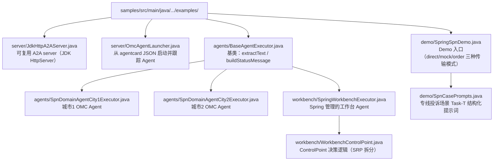

# workflow-exec-engine-java 架构改造要点

## 一、引擎职责边界

**引擎层 (`workflow-engine`) 只提供 workflow 执行调度能力，不包含任何 Agent server 代码。**

- 引擎依赖只保留 a2a-java SDK 客户端侧（`a2a-java-sdk-client`、`a2a-java-sdk-client-transport-rest`）
- 不依赖服务端侧（`a2a-java-sdk-server-common`、`a2a-java-sdk-transport-rest`）
- 之前错误地放在引擎里的 `WorkbenchAgentServer.java` 已删除
- 引擎提供：`WorkflowExecutor`、`ExecutePsop`、`LoadPsop`、`RegistryClient`、`DefaultWorkflowEngineClient`

## 二、Agent 全部放在 samples

每个 Agent 是独立的 A2A server（既是客户端也是服务端），通过 agentcard JSON 配置文件启动。

### 文件结构



**资源文件：**

- `samples/src/main/resources/agentcard/spn_domain_agent.json` — AgentCard 配置（标准格式，URL 带 /a2a/json 前缀）
- `samples/src/main/resources/agentcard/spn_domain_agent_city2.json`
- `samples/src/main/resources/agentcard/transport_workbench_agent.json`
- `samples/src/main/resources/spn_agent_credentials.json` — Bearer 认证配置

## 三、AgentCard URL 必须用标准格式

**不要改编排中心定义的 AgentCard JSON 格式，尤其是 URL 的路径前缀。**

现网 AgentCard 的 URL 格式是 `http://host:port/a2a/json`，路径前缀 `/a2a/json` 是标准做法。A2A
REST 端点实际是 `http://host:port/a2a/json/message:stream`。

`JdkHttpA2AServer` 必须从 AgentCard URL 提取路径前缀，在该前缀下注册路由：

```java
// 从 AgentCard URL 提取路径前缀
this.pathPrefix = extractPathPrefix(agentCard);
// 在前缀下注册（如 /a2a/json）
this.server.createContext(pathPrefix.isEmpty() ? "/" : pathPrefix, handler);
// handleExchange 里 strip 掉前缀再匹配端点
String path = fullPath.startsWith(pathPrefix) ? fullPath.substring(pathPrefix.length()) : fullPath;
```

## 四、Agent card 从配置文件加载，不依赖注册中心

**工作台执行工作流时，从 classpath 的 agentcard JSON 加载 agent card，不从注册中心 fetch。**

原因：注册中心可能残留 之前注册的旧 card（端口 8904、URL 不带前缀等），与 Java 版的 agent 不匹配。注册返回 409 duplicate
时注册中心不会更新，导致引擎拿到错误的 URL。

```java
private static List<Map<String, Object>> loadAgentCardsFromConfig() {
    // 从 agentcard/*.json 加载，确保 URL 指向我们自己的 Java agent
}
```

## 五、SSE 响应解析必须支持 a2a-java SDK 事件格式

a2a-java SDK 的 `RestHandler` 返回的 SSE 事件有 4 种格式，引擎客户端必须全部处理：

| SSE 事件 key     | 内容           | 提取方式                                                                    |
|------------------|----------------|-----------------------------------------------------------------------------|
| `task`           | 完整 Task 对象 | `task.artifacts[].parts[].text`                                             |
| `message`        | Message 事件   | `message.parts[].text`                                                      |
| `statusUpdate`   | 状态更新       | `statusUpdate.status.state` + `statusUpdate.parts[].text`                   |
| `artifactUpdate` | 产物更新       | `artifactUpdate.artifact.parts[].text` + `artifactUpdate.artifact.metadata` |

`extractTextFromResultMap` 必须处理三种来源：

- `artifacts`（复数，list 形式，task 响应中）
- `artifact`（单数，artifactUpdate 事件中）
- 顶层 `parts`（statusUpdate 事件中 status.message.parts）

## 六、Demo 用 sendMessage 接口，不要手写 HTTP

```java
// 正确：用引擎提供的 WorkflowEngineClient.sendMessage()
DefaultWorkflowEngineClient client = new DefaultWorkflowEngineClient(
                List.of(agentCard), null,
                WorkflowEngineClientConfig.builder().sslVerify(false).build());
SendMessageResult result = client.sendMessage("Transport Workbench Agent", taskText).join();

// 错误：手写 HttpClient + JSON 拼接（绕过了 A2A-T 协议处理）
```

`sendMessage` 内部自动处理：Task-T 消息封装、SSE 流式响应解析、Bearer 认证、协商循环等。

## 七、SSL 主机名验证

`jdk.internal.httpclient.disableHostnameVerification` 是 JVM 级、JDK 内部且可能被静态缓存的开关。SDK
和示例均不会修改它。该设置会影响同一 JVM 的其他 JDK `HttpClient`，不能用于 Demo、共享进程或
生产环境。测试证书也必须包含目标主机/IP 的正确 SAN；生产保持 `sslVerify=true`，需要私有 CA 时
配置 `caCertsPath`。`sslVerify=false` 仅放宽当前客户端实例的证书链校验，仍保留主机名校验。

## 八、SOLID 原则

- **SRP**：`WorkbenchControlPoint` 只管 DAG 内任务、汇聚、路由和协商决策；独立授权/订阅由
  `WorkbenchExtensionLifecycle` 管理；`SpringWorkbenchExecutor` 负责北向任务生命周期
- **DRY**：`BaseAgentExecutor` 提供共享的 `extractText` / `buildStatusMessage`，3 个 Agent executor 都继承它
- **无 Unicode 转义**：Java 源文件中的中文字符串直接用字面中文，不用 `\uXXXX`
    - 用 `apply_patch` 写文件（保持 UTF-8），不用 PowerShell here-string（会损坏中文）

## 九、PSOP 工作流定义

编排中心的 `psop_spn_cross_city_diagnosis.json` 已经正确定义：

- `merge_analysis` 节点分配给 `"Transport Workbench Agent"`，skill 为 `cross-city-fault-diagnosis`
- `layer=1`，`context_from=["diagnosis_city1", "diagnosis_city2"]`
- `merge_analysis` 是 `SelfLoop` 类型：工作台 Agent 通过 `WorkbenchControlPoint.onSelfTask` 本地汇总，不走 A2A-T 给自己发消息
- 只有 `diagnosis_city1`/`diagnosis_city2` 走 A2A-T 给 SPN Domain Agent
- 工作台 Agent 收到顶层任务时走 `handleTopLevelTask`：搜索 PSOP → 加载工作流 → 执行（merge_analysis 由引擎自环节点回调处理）

## 十、验证清单

- `mvn verify` 在已合法安装东信 SDK 的环境中通过
- `mvn -pl workflow-engine,spring-boot-starter -am verify` 在无供应商私有依赖的公共环境中通过
- `EmbeddedA2AServerTest` 验证：启动 server → sendMessage → 从 SSE 流提取诊断结果
- `SpnCrossCityE2ETest` 端到端：2 个 OMC Agent 启动 → 独立授权/订阅通道 → 双地市并行诊断 + 一次汇聚成功
- `SpringSpnDemo` 端到端（三种传输模式）：Spring 工作台 + 2 个 OMC Agent → Task-T → 跨城诊断工作流执行成功
